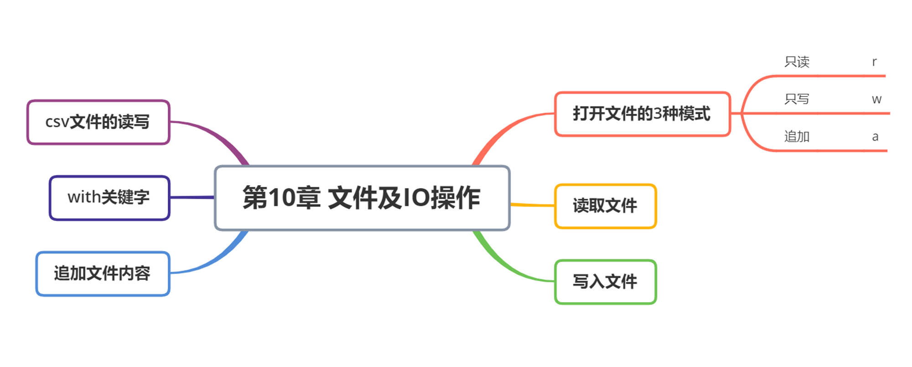

##  文件的基本概念

### 文件

文件是以计算机硬盘为载体存储在计算机上的信息集合，文件可以是文本文档、图片、程序等等。计算机文件基本上分为二种：二进制文件（没有统一的字符编码）和纯文本文件（有统一的编码，可以被看做存储在磁盘上的长字符串）。


**纯文本文件**编码格式常见的有 ASCII、ISO-8859-1、GB2312、GBK、UTF-8、UTF-16 等。


**二进制文件**与文本文件的一个最主要的区别在于是否有统一的字符编码格式，二进制文件顾名思义是直接由0与1组成，无统一的字符编码。如图片文件（jpg、png），视频文件（avi）等。

### 绝对路径与相对路径

在 Python 中，路径可以分为**绝对路径**和**相对路径**，它们用于访问文件或目录。

------

#### **1. 绝对路径 (Absolute Path)**

**定义**：
 绝对路径是从根目录（`C:\` 在 Windows 或 `/` 在 Linux/macOS）开始的完整路径，它唯一地标识文件或目录的位置。

**特点**：

- **不依赖当前工作目录**，无论从哪里运行 Python 代码，绝对路径都不会改变。
- **适用于跨目录访问文件**，确保 Python 代码在不同环境下都能正确找到目标文件。

**示例**：

```python
# Windows 绝对路径
file_path = "C:\\Users\\Admin\\Desktop\\file.txt"

# Linux/macOS 绝对路径
file_path = "/home/user/Desktop/file.txt"
```

Python 处理路径时，建议使用 **`r"..."`（原始字符串）** 或 `os.path.join()` 来避免转义问题：

```python
import os

# Windows
file_path = os.path.join("C:", "Users", "Admin", "Desktop", "file.txt")

# Linux/macOS
file_path = os.path.join("/", "home", "user", "Desktop", "file.txt")
```


#### **2. 相对路径 (Relative Path)**

**定义**：
 相对路径是基于**当前工作目录**（Current Working Directory, CWD）的路径。

**特点**：

- **依赖当前工作目录**，如果工作目录改变，路径可能失效。
- **更灵活**，适用于项目内部访问文件，而不需要硬编码完整路径。

**示例**：

```python
# 相对路径：相对于当前目录
file_path = "data/file.txt"

# 相对路径：上一级目录
file_path = "../data/file.txt"
```

获取当前工作目录：

```python
import os
print(os.getcwd())  # 打印当前工作目录
```

------

#### **3. 绝对路径 vs 相对路径**

| 对比项       | 绝对路径               | 相对路径             |
| ------------ | ---------------------- | -------------------- |
| 依赖工作目录 | 否                     | 是                   |
| 可移植性     | 差（不同设备可能不同） | 好（相对项目更灵活） |
| 适用场景     | 访问固定位置文件       | 访问项目内文件       |

------

#### **4. 获取绝对路径**

即使提供的是相对路径，我们可以使用 `os.path.abspath()` 获取绝对路径：

```python
import os

relative_path = "data/file.txt"
absolute_path = os.path.abspath(relative_path)
print(absolute_path)  # 输出完整的绝对路径
```

如果要确保文件路径基于 Python 文件所在目录，而不是当前工作目录，可以使用 `__file__`：

```python
import os

# 获取当前脚本所在目录
script_dir = os.path.dirname(os.path.abspath(__file__))

# 拼接路径
file_path = os.path.join(script_dir, "data/file.txt")
print(file_path)
```

------

#### **5. 处理路径的常用模块**

Python 提供了 `os` 和 `pathlib` 来处理路径：

```python
from pathlib import Path

# 获取当前目录
current_dir = Path.cwd()
print(current_dir)

# 获取文件的绝对路径
file_path = Path("data/file.txt").resolve()
print(file_path)
```

------

##### **总结**

- **绝对路径**：适用于跨项目访问，保证路径稳定，但可移植性差。
- **相对路径**：适用于项目内文件访问，可移植性好，但依赖工作目录。
- **`os.path` 和 `pathlib`**：推荐 `pathlib` 处理路径，更现代、可读性更强。

如果你在开发一个跨平台的项目，推荐使用 `pathlib.Path` 处理路径，以确保代码的可移植性！

## 文件的读写

### 读取文件的步骤

打开文件

读取文件内容

关闭文件

### 打开文件的模式

| mode | 解释                                                         |
| ---- | ------------------------------------------------------------ |
| r    | 只读【默认模式，文件必须存在，不存在则抛出异常】             |
| w    | 只写，写之前会清空文件的内容，如果文件不存在，会创建新文件   |
| a    | 追加的方式，在原本内容中继续写，如果文件不存在，则会创建新文件 |
| r+   | 可读可写                                                     |
| w+   | 打开一个文件用于读写。如果该文件已存在则将其覆盖。如果该文件不存在，创建新文件。 |
| a+   | 打开一个文件用于读写。如果该文件已存在，文件指针将会放在文件的结尾。文件打开时会是追加模式。如果该文件不存在，创建新文件用于读写。 |
| b    | rb、wb、ab、rb+、wb+、ab+意义和上面一样，用于二进制文件操作  |


### 文件对象的方法

本节中剩下的例子假设已经创建了一个称为 f 的文件对象。

#### f.read()

为了读取一个文件的内容，调用 f.read(size), 这将读取一定数目的数据, 然后作为字符串或字节对象返回。

size 是一个可选的数字类型的参数。 当 size 被忽略了或者为负, 那么该文件的所有内容都将被读取并且返回。

以下实例假定文件 foo.txt 已存在（上面实例中已创建）：

```python
#!/usr/bin/python3

# 打开一个文件
f = open("/tmp/foo.txt", "r")

str = f.read()
print(str)

# 关闭打开的文件
f.close()
```

执行以上程序，输出结果为：

```
Python 是一个非常好的语言。
是的，的确非常好!!
```

#### f.readline()

f.readline() 会从文件中读取单独的一行。换行符为 '\n'。f.readline() 如果返回一个空字符串, 说明已经已经读取到最后一行。

```python
#!/usr/bin/python3

# 打开一个文件
f = open("/tmp/foo.txt", "r")

str = f.readline()
print(str)

# 关闭打开的文件
f.close()
```

执行以上程序，输出结果为：

```
Python 是一个非常好的语言。
```

#### f.readlines()

f.readlines() 将返回该文件中包含的所有行。

如果设置可选参数 sizehint, 则读取指定长度的字节, 并且将这些字节按行分割。

```python
#!/usr/bin/python3

# 打开一个文件
f = open("/tmp/foo.txt", "r")

str = f.readlines()
print(str)

# 关闭打开的文件
f.close()
```

执行以上程序，输出结果为：

```
['Python 是一个非常好的语言。\n', '是的，的确非常好!!\n']
```

另一种方式是迭代一个文件对象然后读取每行:

```python
#!/usr/bin/python3

# 打开一个文件
f = open("/tmp/foo.txt", "r")

for line in f:
    print(line, end='')

# 关闭打开的文件
f.close()
```

执行以上程序，输出结果为：

```
Python 是一个非常好的语言。
是的，的确非常好!!
```

这个方法很简单, 但是并没有提供一个很好的控制。 因为两者的处理机制不同, 最好不要混用。

#### f.write()

f.write(string) 将 string 写入到文件中, 然后返回写入的字符数。

```python
#!/usr/bin/python3

# 打开一个文件
f = open("/tmp/foo.txt", "w")

num = f.write( "Python 是一个非常好的语言。\n是的，的确非常好!!\n" )
print(num)
# 关闭打开的文件
f.close()
```

执行以上程序，输出结果为：

```
29
```

如果要写入一些不是字符串的东西, 那么将需要先进行转换:

```python
#!/usr/bin/python3

# 打开一个文件
f = open("/tmp/foo1.txt", "w")

value = ('www.runoob.com', 14)
s = str(value)
f.write(s)

# 关闭打开的文件
f.close()
```

执行以上程序，打开 foo1.txt 文件：

```
$ cat /tmp/foo1.txt 
('www.runoob.com', 14)
```

#### f.tell()

f.tell() 用于返回文件当前的读 / 写位置（即文件指针的位置）。文件指针表示从文件开头开始的字节数偏移量。f.tell() 返回一个整数，表示文件指针的当前位置。

#### f.seek()

如果要改变文件指针当前的位置, 可以使用 `f.seek(offset, from_what)` 函数。

f.seek(offset, whence) 用于移动文件指针到指定位置。

offset 表示相对于 whence 参数的偏移量，from_what 的值, 如果是 0 表示开头, 如果是 1 表示当前位置, 2 表示文件的结尾，例如：

- seek(x,0) ： 从起始位置即文件首行首字符开始移动 x 个字符
- seek(x,1) ： 表示从当前位置往后移动 x 个字符
- seek(-x,2)：表示从文件的结尾往前移动 x 个字符

from_what 值为默认为 0，即文件开头。下面给出一个完整的例子：

```
>>> f = open('/tmp/foo.txt', 'rb+')
>>> f.write(b'0123456789abcdef')
>>> f.seek(5)     # 移动到文件的第六个字节
>>> f.read(1)
b'5'
>>> f.seek(-3, 2) # 移动到文件的倒数第三字节
>>> f.read(1)
b'd'
```


##### f.close()

在文本文件中 (那些打开文件的模式下没有 b 的), 只会相对于文件起始位置进行定位。

当你处理完一个文件后, 调用 f.close() 来关闭文件并释放系统的资源，如果尝试再调用该文件，则会抛出异常。

```
>>> f.close()
>>> f.read()
Traceback (most recent call last):
  File "", line 1, in ?
ValueError: I/O operation on closed file
```

当处理一个文件对象时, 使用 with 关键字是非常好的方式。在结束后, 它会帮你正确的关闭文件。 而且写起来也比 try - finally 语句块要简短:

```
>>> with open('/tmp/foo.txt', 'r') as f:
...     read_data = f.read()
>>> f.closed
True
```

文件对象还有其他方法, 如 isatty() 和 trucate(), 但这些通常比较少用。

#### pickle 模块

python 的 pickle 模块实现了基本的数据序列和反序列化。

通过 pickle 模块的序列化操作我们能够将程序中运行的对象信息保存到文件中去，永久存储。

通过 pickle 模块的反序列化操作，我们能够从文件中创建上一次程序保存的对象。

基本接口：

```
pickle.dump(obj, file, [,protocol])
```

有了 pickle 这个对象, 就能对 file 以读取的形式打开:

```
x = pickle.load(file)
```

**注解：**从 file 中读取一个字符串，并将它重构为原来的 python 对象。

**file:** 类文件对象，有 read() 和 readline() 接口。

```
#!/usr/bin/python3
import pickle

# 使用pickle模块将数据对象保存到文件
data1 = {'a': [1, 2.0, 3, 4+6j],
         'b': ('string', u'Unicode string'),
         'c': None}

selfref_list = [1, 2, 3]
selfref_list.append(selfref_list)

output = open('data.pkl', 'wb')

# Pickle dictionary using protocol 0.
pickle.dump(data1, output)

# Pickle the list using the highest protocol available.
pickle.dump(selfref_list, output, -1)

output.close()
#!/usr/bin/python3
import pprint, pickle

#使用pickle模块从文件中重构python对象
pkl_file = open('data.pkl', 'rb')

data1 = pickle.load(pkl_file)
pprint.pprint(data1)

data2 = pickle.load(pkl_file)
pprint.pprint(data2)

pkl_file.close()
```


### 文件的读取

```python
import os
# 打开文件
# f = open('test.txt')  # 相对路径
path = os.getcwd()
filename = path + '/test.txt'
f = open(filename, mode='r', encoding='utf-8')  # 绝对路径
# # 读取文件
# context = f.read(5) # 读取指定长度的字符串
# print(context)
# context = f.readline() # 读取一行字符串
# print(context)
context = f.readlines() # 读取所有行字符串
print(context)
# # 关闭文件
f.close()
```


### 文件的写出

```python
# 打开文件
f = open('test2.txt',mode='w',encoding='utf-8')
# 写入文件内容
f.write('你好，我是mia\n')
f.write('你是谁\n')
context = ['你好，我是mia','你是谁']
for i in context:
    f.write(i+'\n')
# 关闭文件
f.close()


f = open('test2.txt',mode='r', encoding='utf-8')  # 相对路径
context = f.read()
print(context)
f.close()
```

### 文件追加

```python
# 打开文件
f = open('test3.txt',mode='a',encoding='utf-8')
# 写入文件
f.write('hello\n')
a=['a','vb\n','c\n']
f.writelines(a)
# 关闭文件
f.close()
```

## 日记本

```py
# -*- coding: utf-8 -*-


def write_txt():
    date = input('请输入今天的日期：')
    text = input('请输入日记内容：')
    filename = '日记本.txt'
    with open(filename, mode='a', encoding='utf-8') as f:
        f.write('pyrjb\n') # 添加分割符
        f.write(date + '\n')
        f.write(text + '\n')
    return True


def read_txt(day='-1'):
    filename = '日记本.txt'
    with open(filename, mode='r', encoding='utf-8') as f:
        context = f.read()

    if day != '-1':
        lista = context.split('pyrjb\n') # 分割出每个日记
        for i in lista:
            if i[:10] == day:
                print(i)
                return True
        return False
    else:
        context = context.replace('pyrjb\n', '') # 去掉分割符
        print(context)

    return True


def menu():
    print('*' * 30)
    print('''欢迎使用python日记本系统
    1：记日记
    2：阅读日记
    3：退出系统''')
    print('*' * 30)


def quit():
    print('欢迎下次使用！再见！')


def main():
    menu()
    while True:
        op = input('请输入你的选择：')
        if op == '1':
            if write_txt():
                print('日记保存成功！')
        elif op == '2':
            day = input('请输入你查询的日期(查询全部请输入-1):')
            if read_txt(day):
                print('日记已加载完毕！')
            else:
                print('未查询到日记信息，请重试！')
        elif op == '3':
            quit()
            break
        else:
            print('请重新选择')

```


## with语句

在 Python 中，`with` 语句用于简化资源管理，尤其是在需要打开和关闭资源（如文件、网络连接、线程锁等）时。使用 `with` 语句，可以确保在代码块结束后资源自动释放，即使中间发生异常，也会调用资源的清理方法（通常是 `__exit__` 方法）。

```python
with open('test.txt',mode='r',encoding='utf-8') as f:
    context = f.read()
    print(context)
print('hello')
```


## csv的读写

```python
import csv, random


def random_char(upper=True):
    if upper:
        t = random.randint(ord('A'), ord('Z'))
        return chr(t)
    else:
        t = random.randint(ord('a'), ord('z'))
        return chr(t)


def random_string(length):
    s = ''
    for i in range(length):
        s += random_char(random.choice([True, False]))
    return s

def random_info(n=100):
    subjects = ['python', 'java', 'C++', 'html']
    names = []
    for i in range(n // len(subjects)):
        name = random_string(random.randint(3, 6))
        names.append(name)
    for i in range(n):
        subject = random.choice(subjects)
        score = random.randint(50, 100)
        name = random.choice(names)
        for j in lista:
            if j[0] == name and j[1] == subject:
                break
        else:
            lista.append([name, subject, score])


lista = []


# 读取csv 计算平均值
def average():
    with open('data.csv', mode='r', encoding='utf-8') as f:
        cf = csv.reader(f)
        head = next(cf)  # 获取表头
        scores = []
        for i in cf:
            scores.append(int(i[2]))
        return sum(scores) / len(scores)


# 生成数据
def make_datas():
    with open('data.csv', mode='a', encoding='utf-8') as f:
        cf = csv.writer(f)
        random_info()
        cf.writerows(lista)


make_datas()
# result = average()
# print('大家的平均分是',round(result,2))

```

## 本章总结

思维导图



### 单词

| 单词   | 释义 |
| ------ | ---- |
| file   | 文件 |
| with   | 和   |
| open   | 打开 |
| read   | 读   |
| write  | 写   |
| append | 添加 |
| close  | 关闭 |

###  小试牛刀

关于Python文件打开模式的描述，以下选项中描述错误的是

A. 覆盖写模式w 

B. 追加写模式a 

C. 创建写模式n 

D. 只读模式r

答案：C


以下选项中，不是Python对文件的打开模式的是

A. 'w' 

B. '+' 

C. 'c'

D. 'r'

答案：C


以下选项中不是Python文件读操作方法的是

A. readline 

B. readall 

C. readtext 

D. read

答案：C


Python 文件只读打开模式是

A. w 

B. x

C. b 

D. r

答案：D


以下关于文件的描述，错误的是

A. 二进制文件和文本文件的操作步骤都是“打开-操作-关闭”

B. open() 打开文件之后，文件的内容并没有在内存中

C. open()只能打开一个已经存在的文件

D. 文件读写之后，要调用close()才能确保文件被保存在磁盘中了


答案：C


5. 下列代码哪个可以用来接收输入的内容（  ）。

A.a = input

B.a = input()

C. a = print

D. a = print()

答案：A

