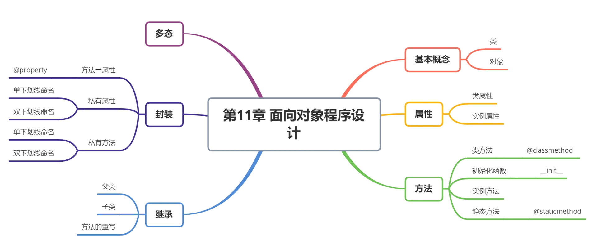

## 面向对象的基本概念

在面向对象编程（OOP）中，**类**和**实例（对象）**是两个核心概念，它们定义了如何组织和使用数据和方法。

### **1. 类（Class）**

类是对象的模板或蓝图，定义了一组属性（数据）和方法（行为）。它描述了某种事物的特性和功能，但本身并不代表具体的事物。

**示例（Python 代码）：**

```python
class Car:
    def __init__(self, brand, model):
        self.brand = brand  # 品牌
        self.model = model  # 型号
    
    def start(self):
        print(f"{self.brand} {self.model} 正在启动...")
```

这里，`Car` 类定义了一种汽车的通用结构，具有 `brand` 和 `model` 属性，以及 `start()` 方法。

------

### **2. 实例（对象，Instance）**

对象是类的具体实现，代表一个真实的个体。一个类可以创建多个对象，每个对象都有自己独立的数据。

**示例（创建实例）：**

```python
my_car = Car("Toyota", "Camry")  # 创建一个 Toyota Camry 的实例
my_car.start()  # 调用实例方法
```

输出：

```nginx
Toyota Camry 正在启动...
```

`my_car` 是 `Car` 类的一个具体实例，拥有自己的 `brand` 和 `model` 属性，并可以使用 `start()` 方法。

------

### **类和实例的关系**

- **类是抽象的**，定义了一种类型的属性和行为。
- **实例是具体的**，是类的实际应用，拥有具体的数据和功能。
- **类就像一个模具，实例是根据模具制造出来的产品**。


##  类和实例

### 类的定义

+ class：表明这是一个类
+ ClassName：类的名字
+ ()：父类集合的开始和结束
+ object：父类的名字，定义的类继承自父类，可以不写，默认是object。object是所有类的直接或间接父类

```py
class ClassName:
    <statement-1>
    .
    .
    .
    <statement-N>
```

### 类的实例化（创建对象）

•`实例名 = 类()` 的方式实例化对象，为类创建一个实例

```python
class Player(object): # object 基类
    pass

tom = Player()  # 类的实例化（创建对象）
print(type(tom)) # <class '__main__.Player'>
print(isinstance(tom,object)) # True
print(isinstance(tom,Player)) # True
```


## 实例的属性

### **Python 中的实例属性**

**实例属性（Instance Attributes）** 是绑定到特定实例的变量，每个实例都有自己独立的一份数据，不会相互影响。

------

### **定义实例属性**

实例属性通常在 `__init__` 方法（构造函数）中定义，并通过 `self` 绑定到当前实例：

```python
class Person:
    def __init__(self, name, age):  # 构造函数
        self.name = name  # 实例属性
        self.age = age    # 实例属性

# 创建实例
p1 = Person("Alice", 25)
p2 = Person("Bob", 30)

# 访问实例属性
print(p1.name)  # 输出: Alice
print(p2.age)   # 输出: 30
```

- `self.name` 和 `self.age` 是 **实例属性**，它们属于 `p1` 和 `p2`，而不是 `Person` 类本身。
- 每个实例都有自己的 `name` 和 `age`，它们互不影响。

------

### **修改实例属性**

你可以随时修改实例属性的值：

```python
p1.age = 26  # 修改实例属性
print(p1.age)  # 输出: 26
```

这只会影响 `p1`，不会影响 `p2`：

```python
print(p2.age)  # 仍然是 30
```

------

### **动态添加实例属性**

Python 允许你在对象创建后再动态添加新的实例属性：

```python
p1.gender = "Female"  # 给 p1 添加新属性
print(p1.gender)  # 输出: Female

# 但 p2 没有 gender 属性
# print(p2.gender)  # ❌ 报错: 'Person' object has no attribute 'gender'
```

- `p1` 有 `gender` 属性，但 `p2` 没有。
- 这就是 **实例属性和类属性的区别**：类属性是所有实例共享的，而实例属性是独立的。

------

###  `__dict__` 查看实例的所有属性

每个实例都有一个 `__dict__` 属性，它存储了该实例的所有属性：

```python
print(p1.__dict__)  # {'name': 'Alice', 'age': 26, 'gender': 'Female'}
print(p2.__dict__)  # {'name': 'Bob', 'age': 30}
```

- 这可以用来调试或检查对象的当前状态。

------

### **让实例属性只能用类定义**

为了避免随意添加属性，可以使用 `__slots__`：

```python
class Student:
    __slots__ = ["name", "age"]  # 只允许这两个属性

    def __init__(self, name, age):
        self.name = name
        self.age = age

s1 = Student("Tom", 20)
s1.name = "Jerry"  # ✅ 允许
# s1.gender = "Male"  # ❌ 报错: 'Student' object has no attribute 'gender'
```

- `__slots__` 限制了 **只能有 `name` 和 `age` 属性**，不能动态添加 `gender`。

------

### **总结**

- **实例属性** 通过 `self` 绑定到实例，每个实例都有自己的一份数据。
- **可以修改和动态添加实例属性**，但不会影响其他实例。
- **`__dict__` 可以查看实例属性**，但 `__slots__` 可以防止随意添加新属性。
- **实例属性和类属性的区别**：类属性是共享的，而实例属性是独立的。

### 课堂案例

```python
class Player(object):
    def __init__(self,name,age,city):  # 初始化函数（构造函数）
        self.name = name
        self.age = age
        self.city = city

mia = Player('mia',24,'上海')
mia.city = '杭州'
tom = Player('tom',34,'重庆')
tom.height = 180  # 添加属性
tom.age = 32
print(tom.__dict__) # 获取实例（对象）的所有属性

```

```python
# 武器： 名字 攻击值 等级
class weapon(object):
    def __init__(self,name,damage,level):
        self.name = name
        self.damage = damage
        self.level = level

gun = weapon('magic',1000,3)
print(gun.__dict__)
```

## 类属性

**类属性（Class Attributes）** 是绑定到类本身的属性，而不是某个特定的实例。所有实例共享同一个类属性，而实例属性是每个实例独有的。

------

### **1. 定义和访问类属性**

```python
class Dog:
    species = "Canis familiaris"  # 这是类属性，所有实例共享

    def __init__(self, name, age):
        self.name = name  # 这是实例属性，每个实例独立
        self.age = age

# 访问类属性
print(Dog.species)  # ✅ 直接通过类访问: Canis familiaris

# 通过实例访问类属性
dog1 = Dog("Buddy", 3)
dog2 = Dog("Max", 5)

print(dog1.species)  # ✅ 通过实例访问: Canis familiaris
print(dog2.species)  # ✅ 通过实例访问: Canis familiaris
```

- `species` 是 **类属性**，它属于 `Dog` 类，而不是某个 `Dog` 实例。
- **所有实例共享** `species`，访问时优先查找实例属性，如果实例没有该属性，则会使用类属性。

------

### **2. 修改类属性**

**通过类名修改类属性**，所有实例都会受到影响：

```python
Dog.species = "Wolf"

print(dog1.species)  # 输出: Wolf
print(dog2.species)  # 输出: Wolf
```

- 直接修改 `Dog.species`，会影响所有实例。

**但如果在实例上修改，它会创建一个新的实例属性，而不会影响类属性**：

```python
dog1.species = "Husky"  # 这只会影响 dog1，不会影响 dog2 或 Dog 类
print(dog1.species)  # 输出: Husky
print(dog2.species)  # 仍然是: Wolf
print(Dog.species)   # 仍然是: Wolf
```

- `dog1.species = "Husky"` **在 `dog1` 上创建了一个实例属性**，而 `dog2` 仍然使用 `Dog` 的类属性。

------

### **3. 使用 `@classmethod` 修改类属性**

如果要在方法中修改类属性，使用 `@classmethod`：

```python
class Cat:
    species = "Feline"

    @classmethod
    def set_species(cls, new_species):
        cls.species = new_species  # 修改类属性

# 修改类属性
Cat.set_species("Big Cat")

c1 = Cat()
c2 = Cat()
print(c1.species)  # 输出: Big Cat
print(c2.species)  # 输出: Big Cat
```

- `@classmethod` 让 `set_species` 作用于 `Cat` 类，而不是某个实例。

------

### **4. 类属性 vs. 实例属性**

| 属性类型     | 定义位置      | 作用范围       | 共享性       | 访问方式                       |
| ------------ | ------------- | -------------- | ------------ | ------------------------------ |
| **实例属性** | `self.属性名` | 只属于某个实例 | 每个实例独立 | `self.属性名`                  |
| **类属性**   | `类名.属性名` | 属于整个类     | 所有实例共享 | `类名.属性名` 或 `实例.属性名` |

示例：

```python
class Animal:
    species = "Mammal"  # 类属性

    def __init__(self, name):
        self.name = name  # 实例属性

a1 = Animal("Dog")
a2 = Animal("Cat")

print(a1.name, a1.species)  # 输出: Dog Mammal
print(a2.name, a2.species)  # 输出: Cat Mammal

# 修改类属性（影响所有实例）
Animal.species = "Reptile"
print(a1.species)  # 输出: Reptile
print(a2.species)  # 输出: Reptile

# 在实例上修改，不影响其他实例
a1.species = "Bird"  # 只影响 a1
print(a1.species)  # 输出: Bird
print(a2.species)  # 输出: Reptile
```

- **类属性修改后，所有实例都会受影响**。
- **如果在实例上赋值，会创建实例属性，实例属性会覆盖类属性**。

------

### **5. 什么时候用类属性？**

类属性适用于：

1. **所有实例共享的数据**（例如：所有狗的物种都是 `Canis familiaris`）。
2. **定义默认值**，可以被子类或实例修改（例如：所有 `Vehicle` 默认是 `land`）。
3. **计数、日志等全局共享的状态**。

示例：**计算创建的实例数量**

```python
class Counter:
    count = 0  # 类属性，所有实例共享

    def __init__(self):
        Counter.count += 1  # 每次创建实例时递增

c1 = Counter()
c2 = Counter()
c3 = Counter()

print(Counter.count)  # 输出: 3
```

- `count` 是 **类属性**，它在所有实例之间共享，并记录创建的实例数量。

------

### **6. 总结**

- **类属性** 属于类，所有实例共享。
- **实例属性** 只属于某个实例，互不影响。
- **修改类属性**：
  - **使用 `类名.属性`**（影响所有实例）。
  - **在实例上修改只会创建新的实例属性**，不会影响类属性。
- **使用 `@classmethod` 统一修改类属性**，而不是 `self`。


```python
class Player(object):
    numbers = 0  # 类属性

    def __init__(self, name, age, city):  # 初始化函数（构造函数）
        self.name = name  # 实例属性
        self.age = age
        self.city = city
        Player.numbers += 1  # 类属性修改 统计实例的个数


mia = Player('mia', 24, '上海')
print(mia.__dict__) # {'name': 'mia', 'age': 24, 'city': '上海'} 不显示类属性
print('欢迎荣耀王者的第 %d 个玩家注册！' % Player.numbers)  # 欢迎荣耀王者的第 1 个玩家注册！
tom = Player('tom', 32, '重庆')
print('欢迎荣耀王者的第 %d 个玩家注册！' % Player.numbers) # 欢迎荣耀王者的第 2 个玩家注册！
```

综合案例：

```python
class weapon(object):
    numbers = 0
    max_damage = 10000
    levels = ['青铜', '白银', '黄金', '钻石', '王者']

    def __init__(self, name, damage, level):
        self.name = name
        self.damage = damage
        self.level = level
        weapon.numbers += 1
        if damage > weapon.max_damage:
            raise Exception('最大的伤害值是10000，请重试！')
        if level not in weapon.levels:
            raise Exception('段位设置错误！')


try:
    gun = weapon('magic', 10000, '王者')
    print(weapon.numbers)
    arrow = weapon('arrow', 450, '青铜')
    print(weapon.numbers)
except Exception as e:
    print(e)

```


## 实例方法

**实例方法** 是定义在类中、用于操作实例的函数。它们的第一个参数通常是 `self`，表示当前实例。实例方法可以访问和修改 **实例属性**，也可以调用其他 **实例方法**。

------

### **1. 定义和使用实例方法**

```python
class Person:
    def __init__(self, name, age):  # 构造函数
        self.name = name  # 实例属性
        self.age = age

    def introduce(self):  # 实例方法
        return f"My name is {self.name} and I am {self.age} years old."

# 创建实例
p1 = Person("Alice", 25)
p2 = Person("Bob", 30)

# 调用实例方法
print(p1.introduce())  # 输出: My name is Alice and I am 25 years old.
print(p2.introduce())  # 输出: My name is Bob and I am 30 years old.
```

- `introduce` 是 **实例方法**，它通过 `self` 访问 **实例属性** `name` 和 `age`。
- **实例方法只能通过实例调用**，不能直接用类调用。

------

### **2. 实例方法可以修改实例属性**

```python
class Car:
    def __init__(self, brand, speed):
        self.brand = brand
        self.speed = speed

    def accelerate(self, increase):
        self.speed += increase
        print(f"{self.brand} is now going at {self.speed} km/h.")

# 创建实例
car1 = Car("Toyota", 60)
car2 = Car("BMW", 80)

# 调用实例方法修改实例属性
car1.accelerate(20)  # 输出: Toyota is now going at 80 km/h.
car2.accelerate(30)  # 输出: BMW is now going at 110 km/h.
```

- `accelerate` 方法修改 `self.speed`，但 **每个实例的 `speed` 独立，不会影响其他实例**。

------

### **3. 实例方法调用其他实例方法**

```python
class BankAccount:
    def __init__(self, owner, balance):
        self.owner = owner
        self.balance = balance

    def deposit(self, amount):
        self.balance += amount
        print(f"Deposited {amount}. New balance: {self.balance}")

    def withdraw(self, amount):
        if self.balance >= amount:
            self.balance -= amount
            print(f"Withdrew {amount}. New balance: {self.balance}")
        else:
            print("Insufficient funds.")

    def show_balance(self):
        return f"{self.owner}'s balance: {self.balance}"

    def transfer(self, other_account, amount):
        if self.balance >= amount:
            self.withdraw(amount)  # 调用当前实例的方法
            other_account.deposit(amount)  # 调用另一个实例的方法
            print(f"Transferred {amount} to {other_account.owner}")
        else:
            print("Insufficient funds for transfer.")

# 创建两个账户
account1 = BankAccount("Alice", 500)
account2 = BankAccount("Bob", 300)

# 账户操作
account1.deposit(200)  # 存款
account1.withdraw(100)  # 取款
account1.transfer(account2, 200)  # 转账

# 查看余额
print(account1.show_balance())  # 输出: Alice's balance: 400
print(account2.show_balance())  # 输出: Bob's balance: 500
```

- `transfer` 方法调用 `withdraw` 和 `deposit` 方法来完成转账。

------

### **5. 什么时候使用实例方法？**

**使用实例方法的典型场景：**

1. **访问或修改实例属性**（如 `self.balance`）。
2. **执行与某个实例相关的逻辑**（如 `accelerate` 方法）。
3. **操作多个实例之间的交互**（如 `transfer` 方法）。

如果方法 **不需要访问实例属性**：

- **使用 `@classmethod`** 访问类属性。
- **使用 `@staticmethod`** 作为工具函数。

------

### **6. 总结**

✅ **实例方法**：

- 通过 `self` 访问实例属性。
- **不能直接用类调用**，只能通过实例调用。
- 可以修改实例属性、调用其他实例方法。

✅ **实例方法 vs. 类方法 vs. 静态方法**：

- **实例方法** (`self`) 访问和操作 **实例属性**。
- **类方法** (`@classmethod`) 访问和操作 **类属性**。
- **静态方法** (`@staticmethod`) 既不访问实例，也不访问类属性，仅仅是工具函数。

你是想了解基础概念，还是有具体的代码想优化？😃


```python
class Person:
    def __init__(self, name, age):
        self.name = name  # 实例属性
        self.age = age    # 实例属性

    def introduce(self):  # 实例方法
        print(f"My name is {self.name} and I am {self.age} years old.")

# 创建实例
p1 = Person("Alice", 25)
p2 = Person("Bob", 30)

# 调用实例方法
p1.introduce()  # 输出: My name is Alice and I am 25 years old.
p2.introduce()  # 输出: My name is Bob and I am 30 years old.

```

- `introduce` 是 **实例方法**，它使用 `self` 访问实例属性 `self.name` 和 `self.age`。
- 只能通过实例（如 `p1`、`p2`）调用，而不能通过类直接调用 `Person.introduce()`（除非传入实例）。


## 类方法

**类方法** 是绑定到类的，而不是某个特定实例的方法。它们的第一个参数是 `cls`，代表类本身，可以用来 **访问和修改类属性**。

------

### **1. 定义和调用类方法**

**使用 `@classmethod` 装饰器定义类方法**，第一个参数必须是 `cls`（类本身）。

```python
class Dog:
    species = "Canis familiaris"  # 类属性

    def __init__(self, name):
        self.name = name  # 实例属性

    @classmethod
    def change_species(cls, new_species):
        cls.species = new_species  # 修改类属性

# 通过类调用类方法
Dog.change_species("Canis lupus")
print(Dog.species)  # 输出: Canis lupus

# 通过实例调用（不推荐，但可以）
dog1 = Dog("Buddy")
dog1.change_species("Canis gold")
print(Dog.species)  # 输出: Canis gold
```

- `change_species` 是 **类方法**，它 **修改的是类属性 `species`，影响所有实例**。
- **可以用类名调用**（推荐），也可以用实例调用（但一般不这样做）。

------

### **2. 类方法 vs. 实例方法 vs. 静态方法**

| 方法类型     | 第一个参数 | 访问实例属性 | 访问类属性    | 通过实例调用 | 通过类调用 |
| ------------ | ---------- | ------------ | ------------- | ------------ | ---------- |
| **实例方法** | `self`     | ✅            | ✅（但不推荐） | ✅            | ❌          |
| **类方法**   | `cls`      | ❌            | ✅             | ✅            | ✅          |
| **静态方法** | 无         | ❌            | ❌             | ✅            | ✅          |

示例：

```python
class Example:
    class_attr = "I am a class attribute"

    def instance_method(self):
        print("Instance method:", self.class_attr)

    @classmethod
    def class_method(cls):
        print("Class method:", cls.class_attr)

    @staticmethod
    def static_method():
        print("Static method: No access to class or instance attributes")

# 直接调用
Example.class_method()  # ✅ Class method: I am a class attribute
Example.static_method() # ✅ Static method: No access to class or instance attributes

# 通过实例调用
e = Example()
e.class_method()  # ✅ Class method: I am a class attribute
e.static_method() # ✅ Static method: No access to class or instance attributes
```

- **类方法 (`@classmethod`)** 访问和修改类属性，但不能访问实例属性。
- **静态方法 (`@staticmethod`)** 不能访问类属性或实例属性，只是普通函数放在类里。

------

### **3. 什么时候用类方法？**

#### **✅ 用于修改类属性**

```python
class Car:
    total_cars = 0  # 共享的类属性

    def __init__(self, brand):
        self.brand = brand
        Car.total_cars += 1  # 修改类属性

    @classmethod
    def set_total_cars(cls, count):
        cls.total_cars = count  # 修改类属性

# 修改类属性
Car.set_total_cars(100)
print(Car.total_cars)  # 输出: 100
```

- `set_total_cars` 直接修改 `total_cars`，影响所有实例。

------

#### **✅ 用于创建不同的实例**

可以使用 `@classmethod` 作为 **工厂方法** 创建实例：

```python
class Person:
    def __init__(self, name, age):
        self.name = name
        self.age = age

    @classmethod
    def from_string(cls, data_str):
        name, age = data_str.split("-")
        return cls(name, int(age))  # 创建新实例

# 用类方法创建实例
p = Person.from_string("Alice-25")
print(p.name, p.age)  # 输出: Alice 25
```

- **`from_string` 作为工厂方法**，可以用 `"Alice-25"` 这样的字符串创建 `Person` 实例。

------

### **4. 结论**

✅ **类方法 (`@classmethod`)：**

- 第一个参数是 `cls`，代表类本身。
- **访问和修改类属性，而不是实例属性**。
- **推荐用类调用，而不是实例调用**。
- 适用于：
  1. **修改类属性**（如 `set_total_cars`）。
  2. **工厂方法**（如 `from_string`）。


## 静态方法

**静态方法（`@staticmethod`）** 是类中的方法，但**它既不访问实例属性，也不访问类属性**，更像是放在类中的普通函数。

------

### **1. 定义和使用静态方法**

**使用 `@staticmethod` 装饰器定义静态方法**：

```python
class MathUtils:
    @staticmethod
    def add(x, y):
        return x + y

    @staticmethod
    def multiply(x, y):
        return x * y

# 通过类调用
print(MathUtils.add(3, 5))  # 输出: 8
print(MathUtils.multiply(4, 6))  # 输出: 24

# 通过实例调用（不推荐，但可以）
math_obj = MathUtils()
print(math_obj.add(2, 7))  # 输出: 9
```

- `add` 和 `multiply` **不访问实例属性或类属性**，只是工具函数，所以用 `@staticmethod` 定义。
- **静态方法既可以用类名调用，也可以用实例调用**（但推荐用类名）。

------

### **3. 什么时候用静态方法？**

#### ✅ **1. 作为工具函数（不依赖类和实例）**

```python
class MathUtils:
    @staticmethod
    def is_even(n):
        return n % 2 == 0

# 直接调用
print(MathUtils.is_even(10))  # 输出: True
print(MathUtils.is_even(15))  # 输出: False
```

- `is_even` 只是个数学运算，**不需要实例或类属性**，适合用静态方法。

------

#### ✅ **2. 逻辑分离，让类更清晰**

```python
class TemperatureConverter:
    @staticmethod
    def celsius_to_fahrenheit(celsius):
        return celsius * 9/5 + 32

    @staticmethod
    def fahrenheit_to_celsius(fahrenheit):
        return (fahrenheit - 32) * 5/9

print(TemperatureConverter.celsius_to_fahrenheit(30))  # 输出: 86.0
print(TemperatureConverter.fahrenheit_to_celsius(98))  # 输出: 36.666...
```

- **静态方法把温度转换逻辑封装到类中**，而不需要 `self` 或 `cls`。

------

#### ✅ **3. 限制实例方法的访问**

```python
class Security:
    @staticmethod
    def hash_password(password):
        return "hashed_" + password  # 简单模拟加密

    def __init__(self, password):
        self.password = Security.hash_password(password)  # 通过静态方法处理

# 创建用户
user = Security("mypassword")
print(user.password)  # 输出: hashed_mypassword
```

- `hash_password` 作为静态方法，不暴露在实例中，**确保安全性**。

------

### **4. 结论**

✅ **静态方法（`@staticmethod`）：**

- **没有 `self` 或 `cls`**，不访问实例属性或类属性。
- **可以用类名调用（推荐）或实例调用**。
- 适用于：
  1. **工具函数**（如 `is_even`）。
  2. **逻辑分离**（如 `TemperatureConverter`）。
  3. **辅助类方法或实例方法**（如 `hash_password`）。


### 静态方法 vs. 实例方法 vs. 类方法**

| 方法类型     | 第一个参数 | 访问实例属性 | 访问类属性    | 通过实例调用 | 通过类调用 |
| ------------ | ---------- | ------------ | ------------- | ------------ | ---------- |
| **实例方法** | `self`     | ✅            | ✅（但不推荐） | ✅            | ❌          |
| **类方法**   | `cls`      | ❌            | ✅             | ✅            | ✅          |
| **静态方法** | 无         | ❌            | ❌             | ✅            | ✅          |

示例：

```python
class Example:
    class_attr = "I am a class attribute"

    def instance_method(self):
        print("Instance method:", self.class_attr)

    @classmethod
    def class_method(cls):
        print("Class method:", cls.class_attr)

    @staticmethod
    def static_method():
        print("Static method: No access to class or instance attributes")

# 直接调用
Example.class_method()  # ✅ Class method: I am a class attribute
Example.static_method() # ✅ Static method: No access to class or instance attributes

# 通过实例调用
e = Example()
e.class_method()  # ✅ Class method: I am a class attribute
e.static_method() # ✅ Static method: No access to class or instance attributes
```

- **实例方法 (`self`)** 访问实例属性。
- **类方法 (`@classmethod`)** 访问类属性。
- **静态方法 (`@staticmethod`)** **不能访问实例和类属性**，只是普通函数放在类里。


## 类的继承

继承是面向对象编程（OOP）中的一个核心概念，它允许我们创建一个新类（子类/派生类），这个新类可以继承一个或多个现有类（父类/基类/超类）的属性（Attributes）和方法（Methods）。

### **为什么使用继承？**

1. **代码重用（Code Reusability）**：子类可以直接使用父类中已经定义好的属性和方法，无需重复编写相同的代码。
2. **可扩展性（Extensibility）**：子类可以在继承父类功能的基础上，添加自己特有的新功能或修改（重写）父类的功能，使得代码更易于扩展。
3. **逻辑层次（Logical Hierarchy）**：继承可以很好地模拟现实世界中的 "is-a" （是一个）关系，构建清晰的类层次结构（例如：`Dog` is an `Animal`，`Car` is a `Vehicle`）。
4. **多态（Polymorphism）**：虽然不是继承本身，但继承是实现多态的基础。不同子类的对象可以响应相同的方法调用，但表现出不同的行为。

### **基本语法**

在 Python 中，定义一个继承自其他类的子类，语法非常简单：

```Python
class ParentClass:
    # 父类的属性和方法
    pass

class ChildClass(ParentClass): # 将父类名写在括号里
    # 子类可以添加新的属性和方法，或者重写父类的方法
    pass
```

### **简单示例**

```Python
# 定义父类 Animal
class Animal:
    def __init__(self, name):
        self.name = name
        print(f"创建了一个动物，名字是 {self.name}")

    def speak(self):
        # 这个方法在父类中可能没有具体实现，或者提供一个通用的实现
        raise NotImplementedError("子类必须实现这个方法")

    def move(self):
        print(f"{self.name} 移动了。")

# 定义子类 Dog，继承自 Animal
class Dog(Animal):
    def speak(self): # 重写 (Override) 父类的 speak 方法
        return f"{self.name} 说：汪汪！"

# 定义子类 Cat，继承自 Animal
class Cat(Animal):
    def speak(self): # 重写 (Override) 父类的 speak 方法
        return f"{self.name} 说：喵喵~"

    def purr(self): # 子类添加自己的方法
        print(f"{self.name} 发出了呼噜声。")

# --- 使用 ---
my_dog = Dog("旺财")
my_cat = Cat("咪咪")

my_dog.move()      # 调用继承自 Animal 的 move 方法
print(my_dog.speak())  # 调用 Dog 重写的 speak 方法

my_cat.move()      # 调用继承自 Animal 的 move 方法
print(my_cat.speak())  # 调用 Cat 重写的 speak 方法
my_cat.purr()      # 调用 Cat 自己定义的 purr 方法

# 尝试调用 Animal 的 speak 方法会报错（因为我们用了 raise NotImplementedError）
# generic_animal = Animal("未知生物")
# generic_animal.speak() # 会引发 NotImplementedError
```

### **关键概念**

1. **方法重写（Method Overriding）**：

   - 如果子类定义了一个与父类同名的方法，那么子类的这个方法就会覆盖掉父类的同名方法。当通过子类实例调用该方法时，执行的是子类中的版本。
   - 在上面的例子中，`Dog` 和 `Cat` 都重写了 `Animal` 的 `speak` 方法。

2. **`super()` 函数**：

   - 有时，在子类中重写方法时，我们可能还想调用父类中被覆盖的那个版本的功能，而不是完全替代它。这时就可以使用 `super()` 函数。
   - `super()` 返回一个临时的父类对象，允许你调用父类的方法。
   - 最常见的用途是在子类的 `__init__` 方法中调用父类的 `__init__` 方法，以确保父类的初始化逻辑也得到执行。

   ```Python
   class Parent:
       def __init__(self, name):
           print("父类 Parent 的 __init__ 被调用")
           self.name = name
   
       def greet(self):
           print(f"来自 Parent 的问候：{self.name}")
   
   class Child(Parent):
       def __init__(self, name, age):
           print("子类 Child 的 __init__ 被调用")
           # 使用 super() 调用父类的 __init__ 方法
           super().__init__(name)
           # 添加子类自己的初始化逻辑
           self.age = age
           print(f"子类 Child 完成初始化，年龄为 {self.age}")
   
       def greet(self): # 重写 greet 方法
           print(f"来自 Child 的问候开始...")
           # 使用 super() 调用父类的 greet 方法
           super().greet()
           print(f"...Child 的问候结束，年龄：{self.age}")
   
   # --- 使用 ---
   c = Child("小明", 10)
   print(c.name) # '小明' (继承自父类并由 super().__init__ 初始化)
   print(c.age)  # 10 (子类自己初始化)
   c.greet()
   ```

   **注意：** 如果子类定义了自己的 `__init__` 方法，而没有显式调用 `super().__init__(...)`，那么父类的 `__init__` 方法 **不会** 被自动执行。

3. **多重继承（Multiple Inheritance）**：

   - Python 允许一个子类继承自多个父类。
   - 语法：`class Subclass(Base1, Base2, Base3, ...):`
   - 当多个父类中有同名方法时，Python 会按照特定的顺序（称为 **MRO - Method Resolution Order，方法解析顺序**）来查找并调用方法。通常是从左到右，深度优先的原则。可以使用 `ClassName.mro()` 或 `ClassName.__mro__` 查看一个类的 MRO。
   - 多重继承虽然强大，但也可能引入复杂性（例如著名的“菱形问题” Diamond Problem），需要谨慎使用。

   

   ```Python
   class A:
       def ping(self):
           print("Ping from A")
   
   class B:
       def ping(self):
           print("Ping from B")
       def pong(self):
           print("Pong from B")
   
   class C(A, B): # 继承自 A 和 B
       pass
   
   class D(B, A): # 继承自 B 和 A
       pass
   
   # --- 使用 ---
   c_instance = C()
   c_instance.ping() # 输出: Ping from A (因为 A 在 B 前面)
   c_instance.pong() # 输出: Pong from B
   
   d_instance = D()
   d_instance.ping() # 输出: Ping from B (因为 B 在 A 前面)
   
   print(C.mro()) # 查看 C 的方法解析顺序
   # 输出类似: [<class '__main__.C'>, <class '__main__.A'>, <class '__main__.B'>, <class 'object'>]
   
   print(D.mro()) # 查看 D 的方法解析顺序
   # 输出类似: [<class '__main__.D'>, <class '__main__.B'>, <class '__main__.A'>, <class 'object'>]
   ```

   **注意：** 所有 Python 类（在新式类模型中，即 Python 3.x 默认）最终都隐式地继承自 `object` 基类。

### **总结**

继承是 Python OOP 的强大特性，它通过允许子类获取父类的属性和方法，促进了代码重用和结构化。通过方法重写和 `super()` 函数，子类可以定制或扩展继承来的功能。理解继承、重写和 `super()` 的用法对于编写结构良好、可维护的面向对象 Python 代码至关重要。同时，也要了解多重继承及其潜在的复杂性。


## 多态

多态是面向对象编程的又一个核心概念，它源于希腊语，意为“多种形态”。在编程中，多态指的是 **不同的对象能够响应相同的消息（即方法调用），但表现出不同的行为或形态**。

> 简单来说，多态允许我们以一种统一的方式来处理**不同类型的对象**，只要它们共享一个共同的接口（即具有**相同名称的方法**）。

### **为什么使用多态？**

1. **灵活性和可扩展性（Flexibility and Extensibility）**：你可以编写一段通用的代码来处理满足特定接口（有某个方法）的对象，而无需关心这些对象的具体类型。当你需要添加新的、符合该接口的类时，现有代码无需修改就能与之协作。
2. **简化代码（Simplicity）**：避免了大量基于对象类型的 `if/elif/else` 判断。你只需调用那个共同的方法，具体的执行逻辑由对象自身决定。
3. **提高可读性（Readability）**：代码更关注对象的“能力”（能调用什么方法），而不是它的“身份”（具体是什么类）。

### **Python 中的多态：鸭子类型（Duck Typing）**

Python 实现多态的方式非常具有特色，主要依赖于所谓的 **鸭子类型（Duck Typing）** 哲学。

> “If it walks like a duck and quacks like a duck, then it must be a duck.”
>
> （如果它走起来像鸭子，叫起来也像鸭子，那它就是只鸭子。）

这意味着 Python **不关心对象的具体类型是什么**，而是关心它 **是否具有你试图调用的方法或属性**。只要对象有那个方法，你就可以调用它。

- **不强制要求继承**：与其他一些语言（如 Java、C++）不同，Python 的多态不一定需要通过继承来建立。两个完全不相关的类，只要它们有同名的方法，就可以在期望该方法的上下文中被多态地使用。
- **关注接口而非类型**：多态的核心在于对象是否实现了预期的“接口”（即方法集合），而不是它是否属于某个特定的类或继承自某个特定的基类。

### **示例**

```Python
# 定义几个有 'speak' 方法的类，它们之间没有继承关系
class Dog:
    def speak(self):
        return "汪汪！"

class Cat:
    def speak(self):
        return "喵喵~"

class Duck:
    def speak(self):
        return "嘎嘎！"

# 一个“外星生物”类，也有 speak 方法
class Alien:
    def make_noise(self): # 注意：方法名不同
        return "滋滋滋..."
    def speak(self):
        return "你好，地球人！"

# 定义一个函数，它接受任何有 'speak' 方法的对象
def make_it_speak(entity):
    # 这里不关心 entity 是 Dog, Cat, Duck 还是 Alien
    # 只要它有 speak() 方法，就能调用
    try:
        print(entity.speak())
    except AttributeError:
        print(f"这个对象没有 'speak' 方法！")

# --- 使用 ---
my_dog = Dog()
my_cat = Cat()
my_duck = Duck()
my_alien = Alien()

print("--- 让它们说话 ---")
make_it_speak(my_dog)    # 输出: 汪汪！
make_it_speak(my_cat)    # 输出: 喵喵~
make_it_speak(my_duck)   # 输出: 嘎嘎！
make_it_speak(my_alien)  # 输出: 你好，地球人！

# 尝试传递一个没有 speak 方法的对象
class Car:
    def drive(self):
        print("汽车行驶中...")

my_car = Car()
make_it_speak(my_car)    # 输出: 这个对象没有 'speak' 方法！
```

在这个例子中：

1. `Dog`, `Cat`, `Duck`, `Alien` 类都有一个名为 `speak` 的方法。
2. `make_it_speak` 函数接受一个参数 `entity`。它并不检查 `entity` 是什么类型，只是尝试调用 `entity.speak()`。
3. 只要传递给 `make_it_speak` 的对象（无论其类型）有一个 `speak` 方法，这个函数就能正常工作，并且每个对象会执行自己版本的 `speak` 方法，这就是多态。
4. 如果传递的对象（如 `my_car`）没有 `speak` 方法，Python 会在运行时引发 `AttributeError`（我们用 `try...except` 捕获了它）。

### **多态与继承的关系**

虽然 Python 的鸭子类型使得继承不是实现多态的*必要*条件，但继承是**创建和组织**支持多态的类的一种非常**常见和自然**的方式。

通过定义一个基类（父类），并在其中声明（或实现）一个通用的方法（接口），然后让多个子类继承这个基类并各自**重写（Override）**该方法，可以清晰地建立起一组具有多态性的类。

```Python
class Animal:
    def speak(self):
        # 可以提供默认行为或强制子类实现
        raise NotImplementedError("子类必须实现 speak 方法")

class Horse(Animal):
    def speak(self):
        return "嘶嘶！"

class Cow(Animal):
    def speak(self):
        return "哞哞！"

# 同样使用之前的 make_it_speak 函数
make_it_speak(Horse()) # 输出: 嘶嘶！
make_it_speak(Cow())   # 输出: 哞哞！
```

在这个继承的例子中，`Horse` 和 `Cow` 都遵循了 `Animal` 定义的 `speak` 接口（通过重写），因此它们可以被 `make_it_speak` 这样的函数多态地处理。

### **其他形式的多态**

- **函数多态**：像内置的 `len()` 函数，可以作用于字符串、列表、元组、字典等多种类型的对象，返回它们的长度。`len()` 对不同类型的对象执行不同的内部逻辑，这也是多态。
- **操作符多态（操作符重载）**：同一个操作符（如 `+`）可以用于整数/浮点数的加法，也可以用于字符串/列表的连接。这是通过在类中定义特殊方法（如 `__add__`）来实现的。

### **总结**

Python 中的多态主要通过“鸭子类型”实现，关注对象的行为（是否有某个方法）而非其类型。这使得代码更加灵活和可扩展。虽然不强制要求，但继承是组织和实现多态的一种常用且有效的方式。多态允许我们编写更通用、简洁的代码来处理不同但具有相似接口的对象。


## 封装

封装是面向对象编程（OOP）的三大基本特性之一（另外两个是继承和多态）。它的核心思想是：

1. **捆绑（Bundling）**：将数据（属性/Attributes）和操作这些数据的方法（Methods）捆绑在一个单元（即类 Class / 对象 Object）中。
2. **信息隐藏（Information Hiding / Access Control）**：隐藏对象内部的复杂细节和状态（数据），只对外暴露有限的、必要的接口（通常是公有方法），以供外部访问或修改。这可以保护对象内部数据不被随意、错误地修改，保证数据的完整性和安全性。

### **为什么使用封装？**

1. **数据保护与完整性 (Data Protection & Integrity)**：防止外部代码直接、随意地访问或修改对象内部的重要数据。所有的数据修改都必须通过对象提供的特定方法（例如 setter 方法）来进行，这些方法可以加入验证逻辑，确保数据的有效性。
2. **模块化与降低耦合 (Modularity & Reduced Coupling)**：对象成为一个独立的、自包含的单元。对象的内部实现细节可以被隐藏起来，外部代码只需要知道如何通过其公共接口与之交互即可，而不需要关心其内部是如何工作的。这使得修改对象的内部实现（只要不改变公共接口）不会影响到使用该对象的其他代码。
3. **提高可维护性 (Maintainability)**：当相关的数据和操作逻辑被组织在一起时，代码更容易理解、调试和维护。
4. **隐藏复杂性 (Hiding Complexity)**：向外部隐藏对象内部的复杂逻辑，只提供简单的接口供使用。

### **Python 中的封装实现**

与其他一些语言（如 Java、C++）不同，Python **没有提供严格的 `private`, `protected`, `public` 访问修饰符关键字** 来强制实现封装。Python 的封装更多地依赖于 **程序员之间的约定（Conventions）** 和一些语言特性（如名称修饰和属性装饰器）。

1. **公开成员 (Public Members)**：

   - 默认情况下，Python 类中的所有属性和方法都是公开的。

   - 可以从类的内部或外部直接访问。

   - 示例：

     ```Python
     class MyClass:
         def __init__(self, value):
             self.public_var = value # 公开属性
     
         def public_method(self):   # 公开方法
             print(f"公共方法被调用，值为: {self.public_var}")
     
     obj = MyClass(10)
     print(obj.public_var)        # 直接访问公开属性
     obj.public_var = 20          # 直接修改公开属性
     print(obj.public_var)
     obj.public_method()          # 调用公开方法
     ```

2. **“受保护”成员 (Protected Members - Convention)**：

   - 以 **单个下划线 `_` 开头** 的属性或方法（例如 `_protected_var`, `_protected_method`）。

   - 这 **仅仅是一个约定**，用来提示其他程序员：“这个成员意图用于类的内部或其子类，不建议在外部直接访问。”

   - Python 解释器 **不会** 阻止外部访问这些成员。它完全依赖于程序员自觉遵守这个约定。

   - 示例：

     ```Python
     class MyClass:
         def __init__(self, value):
             self._protected_var = value # 约定为受保护的属性
     
         def _protected_method(self): # 约定为受保护的方法
             print(f"受保护的方法被调用，值为: {self._protected_var}")
     
         def access_protected(self):
             print("在类内部访问受保护成员:")
             print(self._protected_var)
             self._protected_method()
     
     obj = MyClass(30)
     obj.access_protected()
     
     # 虽然不推荐，但外部仍然可以直接访问
     print("\n在外部访问受保护成员 (不推荐):")
     print(obj._protected_var)
     obj._protected_method()
     obj._protected_var = 40 # 仍然可以修改
     print(obj._protected_var)
     ```

3. **“私有”成员 (Private Members - Name Mangling)**：

   - 以 **双下划线 `__` 开头** 的属性或方法（例如 `__private_var`, `__private_method`)，并且结尾**没有**双下划线。

   - 这会触发 Python 的 **名称修饰（Name Mangling）** 机制。Python 解释器会自动将这些名称重命名为 `_ClassName__memberName` 的形式（例如 `_MyClass__private_var`）。

   - **主要目的**：是为了 **避免在子类中意外覆盖父类的“私有”成员**，而不是为了实现真正的私有性。

   - 虽然不能通过 `obj.__private_var` 的方式直接访问，但 **仍然可以通过其被修饰后的名称 `obj._ClassName__private_var` 来访问**，所以它并不是真正意义上的私有。

   - 示例：

     ```Python
     class MyClass:
         def __init__(self, value):
             self.__private_var = value # "私有"属性
     
         def __private_method(self):   # "私有"方法
             print(f"私有方法被调用，值为: {self.__private_var}")
     
         def access_private(self):
             print("在类内部访问私有成员:")
             print(self.__private_var)
             self.__private_method()
     
     obj = MyClass(50)
     obj.access_private()
     print(obj.__dict__) # {'_MyClass__private_var': 50}
     
     print("\n尝试在外部访问私有成员:")
     try:
         print(obj.__private_var) # 这会引发 AttributeError
     except AttributeError as e:
         print(f"直接访问失败: {e}")
     
     try:
         obj.__private_method()   # 这也会引发 AttributeError
     except AttributeError as e:
         print(f"直接调用失败: {e}")
     
     # 通过名称修饰后的名字仍然可以访问 (不推荐)
     print("\n通过名称修饰后的名字访问 (不推荐):")
     print(obj._MyClass__private_var)
     obj._MyClass__private_method()
     obj._MyClass__private_var = 60 # 仍然可以修改
     print(obj._MyClass__private_var)
     ```


### 私有成员的访问

#### **使用 Getter 和 Setter 方法**

由于私有属性不能在外部直接访问，通常会提供 **getter（访问）** 和 **setter（修改）** 方法。

```python
class Person:
    def __init__(self, name, age):
        self.name = name
        self.__age = age

    def get_age(self):  # 获取私有属性
        return self.__age

    def set_age(self, age):  # 设置私有属性
        if age > 0:
            self.__age = age
        else:
            print("Age must be positive")

p = Person("David", 28)
print(p.get_age())  # 28
p.set_age(30)
print(p.get_age())  # 30
```


#### **使用属性装饰器 (`@property`) 实现受控访问 (The Pythonic Way)**：

- 这是一种更 Pythonic（符合 Python 风格）的方式来实现对属性访问的控制，类似于其他语言中的 getter 和 setter 方法，但使用起来更简洁。

  - `@property`：将一**个方法变成一个只读属性**。
  - `@attribute_name.setter`：为该属性创建一个 setter 方法，用于在赋值时进行控制或验证。
  - `@attribute_name.deleter`：为该属性创建一个 deleter 方法，用于在使用 `del` 关键字时执行特定操作。

- 示例：

  ```Python
  
  class BankAccount:
      def __init__(self, initial_balance=0):
          # 使用单下划线表示这是一个“内部”变量
          if initial_balance < 0:
               raise ValueError("初始余额不能为负")
          self._balance = initial_balance
  
      # Getter: 使用 @property，方法名通常与内部变量名去掉下划线后相同
      @property
      def balance(self):
          """获取账户余额 (只读属性)"""
          print("Getter for balance called")
          return self._balance
  
      # Setter: 使用 @balance.setter
      @balance.setter
      def balance(self, value):
          """设置账户余额，带验证"""
          print(f"Setter for balance called with value {value}")
          if not isinstance(value, (int, float)):
              raise TypeError("余额必须是数字")
          if value < 0:
              raise ValueError("余额不能设置为负数")
          self._balance = value # 验证通过后才修改内部变量
  
      # Deleter (可选): 使用 @balance.deleter
      @balance.deleter
      def balance(self):
          """处理删除余额的操作 (例如，清零或标记账户)"""
          print("Deleter for balance called")
          print("不允许直接删除余额属性，将其清零。")
          self._balance = 0
  
  # --- 使用 ---
  
  account = BankAccount(100)
  
  # 访问余额 (像访问属性一样，实际调用了 getter 方法)
  print(f"当前余额: {account.balance}") # 输出: Getter for balance called \n 当前余额: 100
  
  # 修改余额 (像给属性赋值一样，实际调用了 setter 方法)
  account.balance = 200
  print(f"修改后余额: {account.balance}") # 输出: Setter for balance called... \n Getter for balance called... \n 修改后余额: 200
  
  # 尝试设置无效值
  try:
      account.balance = -50
  except ValueError as e:
      print(f"设置无效值失败: {e}") # 输出: Setter for balance called... \n 设置无效值失败: 余额不能设置为负数
  
  # 尝试删除余额 (调用 deleter)
  del account.balance # 输出: Deleter for balance called...
  print(f"删除后余额: {account.balance}") # 输出: Getter for balance called... \n 删除后余额: 0
  
  # 尝试直接访问内部变量 (虽然可以，但不推荐)
  print(f"直接访问内部变量 (不推荐): {account._balance}") # 输出: 直接访问内部变量 (不推荐): 0
  account._balance = -1000 # 直接修改会绕过 setter 的验证逻辑！
  print(f"绕过 setter 修改后: {account._balance}") # 输出: 绕过 setter 修改后: -1000
  
  
  ```

  

**总结**

- 封装是将数据和操作数据的方法捆绑在一起，并隐藏内部细节、控制外部访问的过程。
- Python 主要通过**约定**（单下划线 `_` 表示保护，双下划线 `__` 表示名称修饰以防命名冲突）和**属性装饰器 (`@property`, `@setter`, `@deleter`)** 来实现封装的目标。
- Python 不强制实现严格的私有性，更倾向于“我们都是成年人”（We are all consenting adults here）的哲学，相信程序员会遵守约定。
- 使用 `@property` 及其相关的 setter/deleter 是在 Python 中实现数据验证和受控访问的首选方式，它提供了清晰、简洁的语法，同时达到了封装的核心目的。


## 魔方方法


Python 中的**魔法方法（Magic Methods）**，也称为**双下划线方法（Dunder Methods）**，是特殊的方法，通常以 `__`（双下划线）开头和结尾。它们可以重载运算符、定义类的行为，使类更像 Python 内置对象。

### **1. 魔法方法分类**

#### （1）**初始化与表示**

| 方法                            | 作用                                         |
| ------------------------------- | -------------------------------------------- |
| `__init__(self, ...)`           | 构造方法，创建对象时自动调用                 |
| `__new__(cls, ...)`             | 创建实例，通常与 `__init__` 配合使用         |
| `__del__(self)`                 | 析构方法，对象销毁时调用                     |
| `__repr__(self)`                | 返回对象的**官方**字符串表示，用于 `repr()`  |
| `__str__(self)`                 | 返回对象的**可读**字符串表示，用于 `print()` |
| `__format__(self, format_spec)` | 格式化对象，用于 `format()`                  |

```python
class Person:
    def __init__(self, name, age):
        self.name = name
        self.age = age

    def __repr__(self):
        return f"Person('{self.name}', {self.age})"

    def __str__(self):
        return f"My name is {self.name} and I am {self.age} years old."

p = Person("Alice", 25)
print(repr(p))  # Person('Alice', 25)
print(str(p))   # My name is Alice and I am 25 years old.
```

------

#### （2）**运算符重载**

| 方法                        | 作用              |
| --------------------------- | ----------------- |
| `__add__(self, other)`      | `+` 运算符重载    |
| `__sub__(self, other)`      | `-` 运算符重载    |
| `__mul__(self, other)`      | `*` 乘法重载      |
| `__truediv__(self, other)`  | `/` 除法重载      |
| `__floordiv__(self, other)` | `//` 整除重载     |
| `__mod__(self, other)`      | `%` 取模重载      |
| `__pow__(self, other)`      | `**` 幂运算重载   |
| `__eq__(self, other)`       | `==` 比较重载     |
| `__ne__(self, other)`       | `!=` 比较重载     |
| `__lt__(self, other)`       | `<` 小于比较      |
| `__le__(self, other)`       | `<=` 小于等于比较 |
| `__gt__(self, other)`       | `>` 大于比较      |
| `__ge__(self, other)`       | `>=` 大于等于比较 |

```python
class Vector:
    def __init__(self, x, y):
        self.x = x
        self.y = y

    def __add__(self, other):
        return Vector(self.x + other.x, self.y + other.y)

    def __eq__(self, other):
        return self.x == other.x and self.y == other.y

    def __repr__(self):
        return f"Vector({self.x}, {self.y})"

v1 = Vector(2, 3)
v2 = Vector(1, 5)
print(v1 + v2)  # Vector(3, 8)
print(v1 == v2)  # False
```

------

#### （3）**容器类相关**

| 方法                            | 作用                         |
| ------------------------------- | ---------------------------- |
| `__len__(self)`                 | `len(obj)`，返回对象长度     |
| `__getitem__(self, key)`        | `obj[key]`，获取元素         |
| `__setitem__(self, key, value)` | `obj[key] = value`，设置元素 |
| `__delitem__(self, key)`        | `del obj[key]`，删除元素     |
| `__contains__(self, item)`      | `item in obj`，成员检查      |

```python
class MyList:
    def __init__(self, items):
        self.items = list(items)

    def __len__(self):
        return len(self.items)

    def __getitem__(self, index):
        return self.items[index]

    def __setitem__(self, index, value):
        self.items[index] = value

    def __delitem__(self, index):
        del self.items[index]

    def __contains__(self, item):
        return item in self.items

ml = MyList([10, 20, 30])
print(len(ml))  # 3
print(ml[1])    # 20
ml[1] = 99
print(ml[1])    # 99
del ml[1]
print(ml.items)  # [10, 30]
print(10 in ml)  # True
```

------

#### （4）**可调用对象**

| 方法                              | 作用                   |
| --------------------------------- | ---------------------- |
| `__call__(self, *args, **kwargs)` | 让实例像函数一样被调用 |

```python
class Counter:
    def __init__(self):
        self.count = 0

    def __call__(self):
        self.count += 1
        return self.count

c = Counter()
print(c())  # 1
print(c())  # 2
print(c())  # 3
```

------

#### （5）**上下文管理**

| 方法                                             | 作用                   |
| ------------------------------------------------ | ---------------------- |
| `__enter__(self)`                                | 进入 `with` 语句时调用 |
| `__exit__(self, exc_type, exc_value, traceback)` | 退出 `with` 语句时调用 |

```python
class MyFile:
    def __init__(self, filename, mode):
        self.filename = filename
        self.mode = mode

    def __enter__(self):
        self.file = open(self.filename, self.mode)
        return self.file

    def __exit__(self, exc_type, exc_value, traceback):
        self.file.close()

with MyFile("test.txt", "w") as f:
    f.write("Hello, world!")
```

------

### **6. 总结**

- **魔法方法可以重载运算符、定义容器行为、实现自定义类的特殊功能**。
- **尽量让类行为符合 Python 语言的直觉（比如 `len()`、`+` 运算）**，提高可读性和可维护性。
- **注意 `__enter__` 和 `__exit__` 可用于上下文管理，推荐用于文件、数据库等资源管理**。

这些魔法方法能让 Python 类变得更加**优雅**和**强大**，理解它们能帮助你写出更 Pythonic 的代码！ 🚀


## 本章总结

### 思维导图总结



| 方法/装饰器     | 功能描述                   |
| --------------- | -------------------------- |
| `__dict__`      | 查看实例的所有属性         |
| `dir() `        | 查看实例的所有属性和方法   |
| `__init__() `   | 类的初始化函数             |
| `@classmethod`  | 装饰器，表示类方法         |
| `@staticmethod` | 装饰器，表示静态方法       |
| `@property`     | 装饰器，把方法变成属性访问 |
| `@属性.setter`  | 装饰器，设置私有属性的值   |


### 单词

| 单词     | 释义       |
| -------- | ---------- |
| class    | 类         |
| dict     | 字典       |
| dir      | 目录       |
| property | 属性；特性 |
| static   | 静态的     |
| init     | 初始化     |
| abstract | 抽象的     |
| method   | 方法       |
| set      | 设置       |
| get      | 获取       |
| super    | 非常的     |
| self     | 自己的     |


### 小试牛刀

在Python中，哪个关键字用于定义一个类？

A. class 

B. function 

C. def 

D. type

答案：A


下列关于Python类中的方法的描述，哪一个是错误的？

A.实例方法是与类的实例绑定的方法，需要通过实例来调用。

B.类方法是与类本身绑定的方法，可以使用类名直接调用。

C.静态方法既不与实例绑定，也不与类绑定，它只是一个普通的函数。

D.所有类的方法都必须显式地定义self参数来代表类的实例。

答案：D


在Python中，如果一个类没有显式地定义__init__方法，那么当创建该类的实例时，Python会做什么？

A.抛出一个错误，因为必须定义__init__方法。 

B.隐式地定义一个__init__方法，该方法什么都不做。

C.隐式地定义一个__init__方法，该方法将实例的所有属性初始化为None。 

D.隐式地定义一个__init__方法，该方法将实例的所有属性初始化为空。

答案：B

下列关于Python中的继承的描述，哪一个是正确的？ 

A.在Python中，一个类只能继承自一个父类。

B.Python支持多重继承，即一个类可以继承自多个父类。

C.Python中的继承是按照深度优先的顺序进行的。

D.在Python中，子类的属性会覆盖父类的同名属性。

答案：B

下列哪个选项不是Python中特殊方法（魔法方法）的例子？

A.init

B.str 

C.add 

D.import

答案：D


在Python中，self参数在类的方法中代表什么？ 

A.类的实例 

B.类本身 

C.父类 

D.方法的返回值

答案：A


Python中的super()函数用于什么目的？ 

A. 调用父类的构造函数 

B. 调用父类的任意方法 

C. 获取父类实例 

D. 访问父类的属性

答案：B


Python中的@property装饰器用于什么目的？ 

A. 定义一个类的实例方法 

B. 定义一个类的类方法 

C. 将一个方法转换为属性的getter方法 

D. 将一个方法转换为属性的setter方法

答案：C


Python中的@classmethod装饰器用于什么目的？ 

A. 将一个方法转换为属性的getter方法 

B. 将一个方法转换为属性的setter方法 

C. 定义一个类的类方法 

D. 定义一个类的静态方法

答案C


Python中的@property装饰器用于什么目的？ 

A. 定义一个类的实例方法 

B. 定义一个类的类方法 

C. 将一个方法转换为属性的getter方法 

D. 将一个方法转换为属性的setter方法

答案：C

