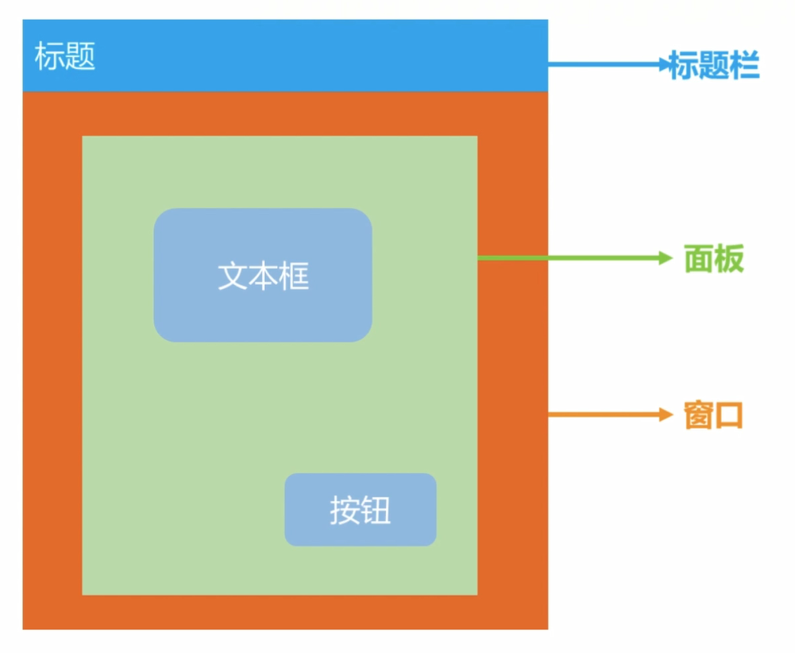
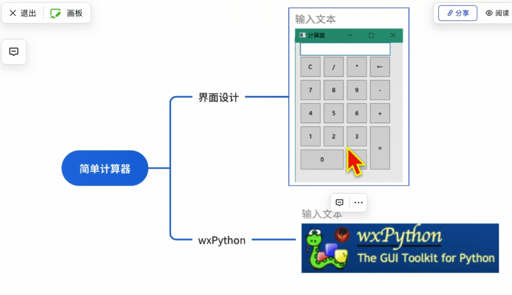

## wxpython


WxPython是基于C++编写的WxWidgets库的Python封装，它提供了许多GUI部件，如按钮、文本框、标签、复选框、单选按钮、列表框、菜单和滚动条等，同时也支持用户自定义部件。WxPython还提供了可扩展的事件处理机制和数据绑定功能，方便开发者管理和处理用户操作和数据。




下面是一份较为全面的 wxPython 入门使用教程，涵盖安装、基本结构、常用控件与布局、事件处理，以及一个完整示例。

### 一、安装与环境配置

1. **安装 Python**
    确保已安装 Python（建议 3.6 及以上版本）。可以在终端执行：

   ```bash
   python --version
   ```

2. **安装 wxPython**
    使用 pip 安装官方发布版：

   ```bash
   pip install wxPython
   ```

   如果在国内网络较慢，可考虑使用清华源：

   ```bash
   pip install -i https://pypi.tuna.tsinghua.edu.cn/simple wxPython
   ```

3. **验证安装**
   输入`pip list`查看按照列表 
   或者在 Python 交互环境中输入：

   ```python
   import wx
   print(wx.version())
   ```

   如能正确输出版本号，即安装成功。

------

### 二、基本结构

在开始使用 wxPython 构建 GUI 应用程序之前，理解其一些核心概念至关重要。这些概念包括窗口（Frame）、面板（Panel）和控件（Widget），以及事件处理机制。

- **窗口 (Frame)**：`wx.Frame` 是应用程序的主要窗口，它是一个顶层窗口，由操作系统管理，通常具有标题栏、边框，并且可以调整大小、移动和关闭. 它是其他控件（如面板、工具栏和状态栏）的容器。`wx.Frame` 提供了应用程序的基本框架. 开发者可以通过继承 `wx.Frame` 类来创建自定义的主窗口，并在其中添加所需的功能和用户界面元素. 存在一些常见的窗口样式，例如 `wx.DEFAULT_FRAME_STYLE` 和 `wx.STAY_ON_TOP`，但它们在不同操作系统上的行为和限制可能有所不同.  

  

- **面板 (Panel)**：`wx.Panel` 通常放置在 `wx.Frame` 中，用于帮助组织和管理其他控件. 它提供了一个可以在其上放置和使用布局管理器（Sizers）来定位和排列控件的表面. 使用 `wx.Panel` 对于实现正确的 Tab 键导航至关重要，并且有助于将用户界面的不同功能区域划分为逻辑组. 此外，通过处理绘制事件，`wx.Panel` 还可以用于自定义绘图. 在 Windows 操作系统中，为了获得正确的背景颜色和处理 Tab 键遍历，通常需要使用 `wx.Panel`.  

  

- **控件 (Widget)**：控件是用户界面中用户可以与之交互的各个元素，例如按钮 (`wx.Button`)、文本输入框 (`wx.TextCtrl`)、标签 (`wx.StaticText`) 和复选框 (`wx.CheckBox`) 等. wxPython 提供了丰富的内置控件集合，可以满足各种常见的 GUI 元素需求. 开发者还可以通过继承现有控件或直接在面板上绘制来创建自定义控件. 控件是构建应用程序交互式用户界面的基本组成部分，它们允许用户输入数据、触发操作和查看信息.  

  

- **事件处理机制**：wxPython 应用程序遵循事件驱动的编程模型，应用程序的流程很大程度上由用户交互（例如鼠标点击、按键）或系统生成的事件决定. 这与按顺序执行的控制台应用程序形成对比。事件是 `wx.Event` 类的派生对象，它们封装了应用程序中特定事件发生的信息（例如，按钮被点击，文本输入框中的文本已更改）. 事件处理器是设计为在特定类型的事件发生在特定控件上时执行的方法或函数。`Bind()` 方法从 `wx.EvtHandler` 类继承而来，用于在控件上的特定事件类型和相应的事件处理方法之间建立连接. 例如：`self.button.Bind(wx.EVT_BUTTON, self.OnButtonClick)`。`Bind()` 方法是使 GUI 具有交互性的核心机制，它将用户操作链接到应用程序逻辑. 许多事件（特别是来自按钮等控件的命令事件）如果没有被发起事件的控件处理，则可以向上冒泡到父窗口层次结构中。这允许父容器（如面板或框架）处理来自其子控件的事件. `event.Skip()` 方法在事件处理器中使用，以允许事件继续传播。理解事件传播对于设计高效且灵活的事件处理策略至关重要，尤其是在复杂的 GUI 布局中. wxPython 中存在不同类型的事件，例如基本事件（在发起事件的窗口本地）和命令事件（可以传播）. 此外，还可以创建自定义事件以实现更复杂的组件间通信.  

  


一个最简单的 wxPython 应用通常包括三部分：

1. **App 对象**
    整个程序的入口，管理主事件循环。
2. **Frame（主窗口）**
    顶层窗口，承载各种控件。
3. **控件（Widget/Control）**
    如按钮、文本框、列表等。

```python
import wx

class MyFrame(wx.Frame):
    def __init__(self):
        super().__init__(None, title="Hello wxPython", size=(300,200))
        panel = wx.Panel(self)
        btn = wx.Button(panel, label="点击我", pos=(100,50))
        btn.Bind(wx.EVT_BUTTON, self.on_click)

    def on_click(self, event):
        wx.MessageBox("你点击了按钮！", "提示")

if __name__ == "__main__":
    app = wx.App()
    frame = MyFrame()
    frame.Show()
    app.MainLoop()
```

- `wx.App()`：创建应用实例。
- `frame.Show()`：显示窗口。
- `app.MainLoop()`：进入事件循环，等待用户操作。

------

### 三、常用控件

| 控件     | 类名             | 简要说明           |
| -------- | ---------------- | ------------------ |
| 静态文本 | `wx.StaticText`  | 显示只读文字       |
| 按钮     | `wx.Button`      | 普通按钮           |
| 文本框   | `wx.TextCtrl`    | 单行/多行文本输入  |
| 复选框   | `wx.CheckBox`    | 复选选择           |
| 单选框   | `wx.RadioButton` | 单选选择           |
| 下拉列表 | `wx.Choice`      | 可选列表           |
| 列表框   | `wx.ListBox`     | 列表选择           |
| 滑块     | `wx.Slider`      | 滑动条             |
| 状态栏   | `wx.StatusBar`   | 窗口底部状态显示   |
| 工具栏   | `wx.ToolBar`     | 窗口顶部快捷按钮栏 |

------

### 四、布局管理

推荐使用 sizer（布局管理器）来自动调整控件位置和大小。

- **BoxSizer**：水平或垂直布局
- **GridSizer**：网格布局
- **FlexGridSizer**：可调整行列大小的网格
- **GridBagSizer**：更灵活的网格定位

```python
import wx

class MyFrame(wx.Frame):
    def __init__(self):
        super().__init__(None, title="Sizer 示例", size=(400,200))
        panel = wx.Panel(self)

        # 垂直布局
        vbox = wx.BoxSizer(wx.VERTICAL)

        st = wx.StaticText(panel, label="请输入姓名：")
        vbox.Add(st, flag=wx.LEFT|wx.TOP, border=10)

        self.tc = wx.TextCtrl(panel)
        vbox.Add(self.tc, flag=wx.EXPAND|wx.LEFT|wx.RIGHT, border=10)

        hbox = wx.BoxSizer(wx.HORIZONTAL)
        okBtn = wx.Button(panel, label="确定")
        closeBtn = wx.Button(panel, label="关闭")
        hbox.Add(okBtn)
        hbox.Add(closeBtn, flag=wx.LEFT|wx.BOTTOM, border=5)

        vbox.Add(hbox, flag=wx.ALIGN_CENTER|wx.TOP|wx.BOTTOM, border=10)
        panel.SetSizer(vbox)

        okBtn.Bind(wx.EVT_BUTTON, self.on_ok)
        closeBtn.Bind(wx.EVT_BUTTON, lambda evt: self.Close())

    def on_ok(self, event):
        name = self.tc.GetValue()
        wx.MessageBox(f"你好，{name}！", "欢迎")

if __name__ == "__main__":
    app = wx.App()
    MyFrame().Show()
    app.MainLoop()
```

------

### 五、事件处理

wxPython 使用 Bind 方法将事件（Event）与回调函数绑定：

```python
button.Bind(wx.EVT_BUTTON, self.on_button_click)
```

常见事件类型：

- `wx.EVT_BUTTON`：按钮点击
- `wx.EVT_TEXT`：文本框内容变化
- `wx.EVT_CHECKBOX`：复选框切换
- `wx.EVT_RADIOBUTTON`：单选框切换
- `wx.EVT_SLIDER`：滑块移动
- `wx.EVT_CLOSE`：窗口关闭
- `wx.EVT_PAINT`：窗口重绘

回调函数签名通常为 `def handler(self, event):`，可以通过 `event.GetEventObject()` 等方法获取触发源。

------

### 六、完整示例：记事本应用

```python
import wx

class Notepad(wx.Frame):
    def __init__(self):
        super().__init__(None, title="简易记事本", size=(600,400))
        self._create_menu()
        self._create_editor()
        self.Centre()

    def _create_menu(self):
        menubar = wx.MenuBar()
        fileMenu = wx.Menu()
        newItem = fileMenu.Append(wx.ID_NEW, '&新建\tCtrl+N')
        openItem = fileMenu.Append(wx.ID_OPEN, '&打开...\tCtrl+O')
        saveItem = fileMenu.Append(wx.ID_SAVE, '&保存\tCtrl+S')
        fileMenu.AppendSeparator()
        exitItem = fileMenu.Append(wx.ID_EXIT, '退出\tCtrl+Q')
        menubar.Append(fileMenu, '&文件')
        self.SetMenuBar(menubar)

        self.Bind(wx.EVT_MENU, self.on_new, newItem)
        self.Bind(wx.EVT_MENU, self.on_open, openItem)
        self.Bind(wx.EVT_MENU, self.on_save, saveItem)
        self.Bind(wx.EVT_MENU, lambda evt: self.Close(), exitItem)

    def _create_editor(self):
        self.txt = wx.TextCtrl(self, style=wx.TE_MULTILINE)

    def on_new(self, event):
        self.txt.Clear()

    def on_open(self, event):
        with wx.FileDialog(self, "打开文件", wildcard="Text files (*.txt)|*.txt",
                           style=wx.FD_OPEN | wx.FD_FILE_MUST_EXIST) as dlg:
            if dlg.ShowModal() == wx.ID_OK:
                path = dlg.GetPath()
                with open(path, 'r', encoding='utf-8') as f:
                    self.txt.SetValue(f.read())

    def on_save(self, event):
        with wx.FileDialog(self, "保存文件", wildcard="Text files (*.txt)|*.txt",
                           style=wx.FD_SAVE | wx.FD_OVERWRITE_PROMPT) as dlg:
            if dlg.ShowModal() == wx.ID_OK:
                path = dlg.GetPath()
                with open(path, 'w', encoding='utf-8') as f:
                    f.write(self.txt.GetValue())

if __name__ == "__main__":
    app = wx.App()
    Notepad().Show()
    app.MainLoop()
```

------

### 七、学习资源

- 官方文档与示例：
   https://wxpython.org/pages/docs/
- 《wxPython in Action》（英文书籍）
- GitHub 示例仓库：
   https://github.com/wxWidgets/Phoenix/tree/master/demo

祝你学习顺利，玩转 wxPython！


## 入门

```python
import wx


def onClick(event):
    print('按钮被点击了')

# 创建应用程序对象
app = wx.App()
# 创建窗口
# size:宽，高 pos:（左上角）x坐标，y坐标
frm = wx.Frame(None,title='mia学习系统',size=(600,800),pos=(100,100))
# 显示窗口
frm.Show()
# 创建面板
pl = wx.Panel(frm,size=(400,400),pos=(100,100))
# 显示面板
pl.Show()
# 创建静态文本
staticText = wx.StaticText(pl,label='欢迎学习python',pos=(200,200))
# 显示静态文本
staticText.Show()
# 创建按钮
btn = wx.Button(pl,label='测试')
# 显示按钮
btn.Show()
# 给按钮绑定事件
frm.Bind(wx.EVT_BUTTON,onClick,btn)

# 进入主循环，让窗口一直显示
app.MainLoop()
```


基于类思想

```python
import wx

class MyFrame(wx.Frame):
    # 构造方法
    def __init__(self):
        wx.Frame.__init__(self,None,title='mia学习系统')
        # 创建面板
        pl = wx.Panel(self)
        # 创建静态文本
        staticText = wx.StaticText(pl,label='欢迎学习python')
        # 创建按钮
        btn = wx.Button(pl,label='开始学习',pos=(300,400))


# 创建应用程序对象
app = wx.App()
# 创建窗口
frm = MyFrame()
# 显示窗口
frm.Show()
# 让窗口一直显示
app.MainLoop()
```

## 案例-抽奖器


```python
import wx
import random
class MyFrame(wx.Frame):
    # 抽奖列表
    NameList = ['mia','tom','jack']

    # 构造方法
    def __init__(self):
        wx.Frame.__init__(self,None,title='抽奖器',pos=(100,100),size=(400,600))
        # 创建面板
        self.pl = wx.Panel(self,pos=(0,0),size=(400,600))
        # 设置背景颜色
        # self.SetBackgroundColour(wx.BLUE)
        self.SetBackgroundColour((200,0,100))
        # self.SetBackgroundColour('#00FF00')
        self.pl.SetBackgroundColour((180,45,0))
        # 创建静态文本
        self.staticText = wx.StaticText(self.pl,label=random.choice(self.NameList),pos=(0,50),size=(400,400),style=wx.TE_CENTRE)
        # 创建字体
        # 字体大小，字体包，字体风格，加粗
        font = wx.Font(48,wx.FONTFAMILY_SWISS,wx.FONTSTYLE_NORMAL,wx.FONTWEIGHT_BOLD)
        # 静态文本设置成我们自己创建的字体
        self.staticText.SetFont(font)
        # 创建按钮
        self.btn1 = wx.Button(self.pl,label='开始抽奖',pos=(100,200))
        self.btn2 = wx.Button(self.pl, label='结束抽奖', pos=(200, 200))
        self.btn1.SetBackgroundColour((0,0,128))
        # 绑定事件
        self.Bind(wx.EVT_BUTTON,self.onClick,self.btn1)
        self.Bind(wx.EVT_BUTTON, self.stop, self.btn2)

    def onClick(self,event):# 抽奖
        # print('click')
        self.timer = wx.Timer(self) #创建了一个定时器
        self.Bind(wx.EVT_TIMER,self.update_name,self.timer)
        self.timer.Start(100) # 每隔100毫秒更新名字

    def update_name(self,event):
        self.staticText.SetLabelText(random.choice(self.NameList))

    def stop(self,event):
        self.timer.Stop()  # 停止计时


if __name__ == "__main__": # python程序主入口
    # 创建应用程序对象
    app = wx.App()
    # 创建窗口
    frm = MyFrame()
    # 显示窗口
    frm.Show()
    # 让窗口一直显示
    app.MainLoop()
```


## 计算器



```py
```

