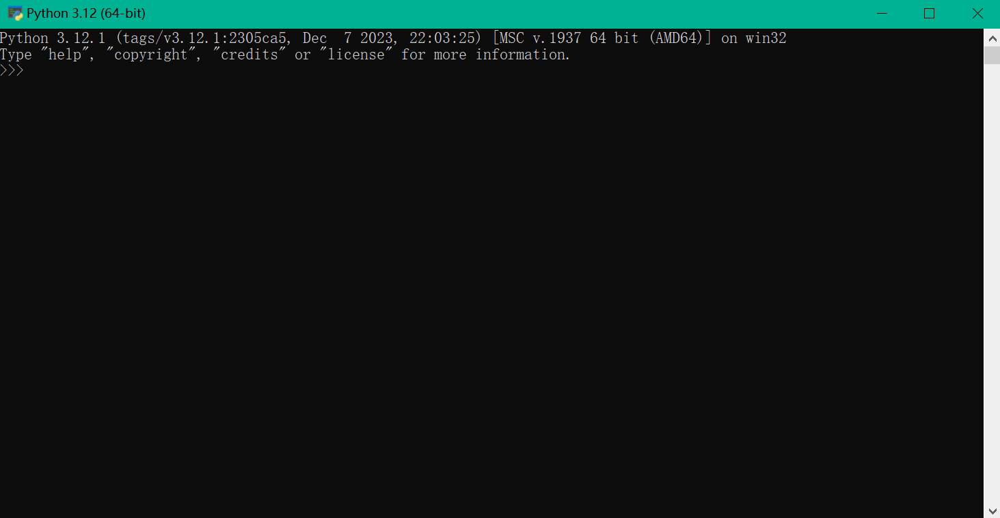
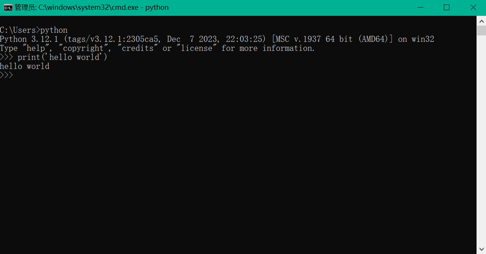

# 第1章 初识python笔记


## 第1节 python介绍

### 计算机

按层次来划分计算机系统的话，我们可以划分成七个层次。


**硬件逻辑层**：主要由门电路、触发器等逻辑电路组成，属于电子工程的领域，这里就不展开介绍了。
**微程序机器层**：编程语言主要是微指令集，微指令所组成的微程序直接交由硬件执行，主要是由生产硬件的公司的程序员来编写的。
**传统机器层**：编程语言主要是CPU指令集（机器指令），和硬件是直接相关的，程序员所用机器指令编写的程序可以交由微程序直接进行解析，而这里提到的指令集，存储在CPU内部，对CPU的运算进行指导和优化，拥有指令集，CPU就可以有效地运行。我们知道，CPU的制造商分为AMD和Intel两大阵营，那么这两大厂商生产的CPU最大的区别是——指令集不同，Intel的CPU所使用的指令集不适合AMD的CPU，同样的，AMD的CPU所使用的指令集也不适合Intel。除了不同厂商以外，同一个厂商也可以生产不同指令集的CPU，即不同架构的CPU使用不同的CPU指令集。
**操作系统层**：操作系统，一方面，向上提供了简易的操作界面，使得用户能够容易地操作计算机；同时，向下对接了指令系统，管理硬件资源。操作系统对用户程序所使用机器的各种资源进行管理和分配，包括CPU、存储器等等，比如说，当一个用户程序需要运行的时候，首先由操作系统将其加载到内存中，这就需要操作系统首先为其分配内存空间来进行存储。再比如说，某一个程序需要使用某一个输出设备进行结果输出的时候，需要操作系统为其提供该设备的控制权。由此可见，操作系统是在软件和硬件之间的适配层。
**汇编语言层**：编程语言是汇编语言，汇编语言可以翻译成可直接执行的机器语言，完成这个翻译过程的程序就是汇编器。从这一层开始，它们所使用的编程语言就是人类比较容易理解的语言了。
**高级语言层**：编程语言就是为广大程序员所接受的高级语言，种类非常多，有几百种，常见的编程语言有Python、Java、C/C++、Golang等。
**应用层**：计算机针对某种用途而设计的应用，像Word、Excel等。


### 程序翻译与程序解释

计算机是无法直接理解人类语言的，它只认识01010101...这样的比特位，因此，我们需要进行程序翻
译或程序解析，把人类语言翻译或解析成计算机所能理解的语言。

### 程序

为了完成某种特定功能，以某种程序设计语言编写的有序指令的集合。
程序是指挥cpu工作的“工作手册”。计算机只能执行二进制代码，程序设计语言一般类似英文，想要让计算机理解你写的程序，必须把程序代码“翻译”成计算机能理解的二进制代码，根据翻译形式的不同，可以分为：

+ 编译 将程序代码翻译成计算机能理解的二进制目标代码，会生成特定的可执行代码（在window上是exe文件），可执行代码是二进制的，无法看到源代码。然后执行可执行代码就可以得到想要的结果
  +  c、c++、oc等
+ 解释 将程序代码一句一句翻译为计算机可以执行的指令，立即执行，不会生成可执行文件
  +  python、php、JavaScript等

### 语言的区别

+ 解释型语言
  + 是在运行的时候将程序翻译成机器语言，所以运行速度相对于编译型语言要慢。比如PHP、
    Python
  + 优点：可移植性较好，只要有解释环境，可在不同的操作系统上运行
  + 缺点：运行需要解释环境，运行起来比编译的要慢，占用资源也要多一些，代码效率低，代码修改后就可运行，不需要编译过程
  
+  编译型语言
  + 在程序执行之前，有一个单独的编译过程，将程序翻译成机器语言，以后执行这个程序的时候，就不用再进行翻译了。比如C、C++、Java
  + 优点：运行速度快，代码效率高，编译后的程序不可修改，保密性较好
  + 缺点：代码需要经过编译方可运行，可移植性差，只能在兼容的操作系统上运行

### python排名

TIOBE 排行榜中 C 和 Java 一直占据着前两位，近 20 年来没有哪个语言可以撼动它们两的地位，直到这几年 Python 发展越来越快，市场占有率一直在提升，在2021年时排名第一。

### python应用

• web后端开发
• 网络爬虫
• 人工智能
• 自动化运维
• 网络编程
• 国内：豆瓣、百度、阿里、新浪等都在使用python；国外：Google、FaceBook、Twitter
• 如果不是程序员，在日常工作中，也越来越需要python的帮助，甚至在投简历时，会被优先考虑。
• 大学生和在校的学生也有对应的考试与课程。国务院印发的《新一代人工智能发展规划》、教育部出台《高等学校人工智能创新行动计划》。

### python起源

Python是Guido van Rossum在1989年圣诞节期间，为了打发无聊的圣诞节而编写的一个编程语言。
第一个公开发行版发行于1991年。
吉多·范罗苏姆（Guido van Rossum） ，是一名荷兰计算机程序员，他作为 Python 程序设计语言的作者而为人们熟知。在 Python 社区，吉多·范罗苏姆被人们认为是“仁慈的独裁者（BDFL）”，意思是他仍然关注 Python 的开发进程，并在必要的时刻做出决定。他在 Google 工作，在那里他把一半的时间用来维护 Python 的开发。
2020年11月，Python 之父 Guido 加入 Microsoft 。

### python 的设计目标

1999 年，吉多·范罗苏姆向 DARPA 提交了一条名为 “Computer Programming for Everybody” 的
资金申请，并在后来说明了他对 Python 的目标：

+ 一门**简单直观的语言**并与主要竞争者一样强大
+ **开源**，以便任何人都可以为它做贡献
+ 代码**像纯英语那样容易理解**
+ 适用于**短期**开发的日常任务

这些想法中的基本都已经成为现实，Python 已经成为一门流行的编程语言。

### python 的设计哲学

1. 优雅
2. 明确
3. 简单

### python之禅

Python 开发者的哲学是：用一种方法，最好是只有一种方法来做一件事
• 如果面临多种选择，Python 开发者一般会拒绝花俏的语法，而选择明确没有或者很少有歧义的语
法
• 优美胜于丑陋（Python 以编写优美的代码为目标）
• 明了胜于晦涩（优美的代码应当是明了的，命名规范，风格相似）
• 简洁胜于复杂（优美的代码应当是简洁的，不要有复杂的内部实现）
• 复杂胜于凌乱（如果复杂不可避免，那代码间也不能有难懂的关系，要保持接口简洁）
• 扁平胜于嵌套（优美的代码应当是扁平的，不能有太多的嵌套）
• 间隔胜于紧凑（优美的代码有适当的间隔，不要奢望一行代码解决问题）
• 可读性很重要（优美的代码是可读的）
• 即便假借特例的实用性之名，也不可违背这些规则（这些规则至高无上）
• 不要包容所有错误，除非你确定需要这样做（精准地捕获异常，不写 except:pass 风格的代码）
• 当存在多种可能，不要尝试去猜测
• 而是尽量找一种，最好是唯一一种明显的解决方案（如果不确定，就用穷举法）
• 虽然这并不容易，因为你不是 Python 之父（这里的 Dutch 是指 Guido ）
• 做也许好过不做，但不假思索就动手还不如不做（动手之前要细思量）
• 如果你无法向人描述你的方案，那肯定不是一个好方案；反之亦然（方案测评标准）
• 命名空间是一种绝妙的理念，我们应当多加利用（倡导与号召）

### 为什么选择 python？

• 代码量少
• ……
同一样问题，用不同的语言解决，代码量差距还是很多的，一般情况下 Python 是 Java 的
1/5，所以说 人生苦短，我用 python

### python的特点

+ 是跨平台语言【可以运行在不同的操作系统上】
+ python 是一种解释型语言【开发过程中没有了编译的环节】
+ 开发过程中没有了编译这个环节，类似于PHP和Perl语言
+ python 是交互式语言
+ 可以在一个Python提示符，直接互动执行程序
+ python 是**面向对象语言**
+ python支持面向对象的风格或代码封装在对象的编程技术
+ • python 是**完全面向对象的语言**
  + **函数、模块、数字、字符串**都是对象，在 **Python 中一切皆对象**
  + 完全支持继承、重载、多重继承
  + 支持重载运算符，也支持泛型设计
+ python 是初学者的语言
+ python 对初级程序员而言，是一种伟大的语言，它支持广泛的应用程序开发，从简单的文字处理
  到 WWW 浏览器再到游戏

### 优点

- 易于学习：python有相对较少的关键字，结构简单，和一个明确定义的语法，学习起来更加简单
- 易于阅读：python代码定义的更清晰
- 易于维护：python的成功在于它的源代码是相当容易维护的
- 一个广泛的标准库：python的最大的优势之一是丰富的库，跨平台的，在UNIX，Windows和Macintosh兼容很好python **拥有一个强大的标准库**，Python 语言的核心只包含 **数字、字符串、列表、字典、文件** 等常见类型和函数，而由 Python 标准库提供了 **系统管理、网络通信、文本处理、数据库接口、图形系统、XML 处理 等额外**的功能
- python 社区提供了**大量的第三方模块**，使用方式与标准库类似。它们的功能覆盖 **科学计算、人工智能、机器学习、Web 开发、数据库接口、图形系统** 多个领域
- 互动模式：互动模式的支持，您可以从终端输入执行代码并获得结果的语言，互动的测试和调试代码片断
- 可移植：基于其开放源代码的特性，Python已经被移植（也就是使其工作）到许多平台
- 可扩展：如果需要一段运行很快的关键代码，或者是想要编写一些不愿开放的算法，你可以使用C或C++完成那部分程序，然后从你的Python程序中调用
- 数据库：python提供所有主要的商业数据库的接口
- GUI编程：python支持GUI可以创建和移植到许多系统调用
- 可嵌入：你可以将python嵌入到C/C++程序，让你的程序的用户获得"脚本化"的能力
- 免费、开源
- **面向对象**

### 缺点

- 运行速度慢
- 和C程序相比非常慢，因为Python是解释型语言，代码在执行时会一行一行地翻译成CPU能理解的机器码，这个翻译过程非常耗时，所以很慢。而C程序是运行前直接编译成CPU能执行的机器码，所以非常快
- 代码不能加密
- •如果要发布Python程序，实际上就是发布源代码，这一点跟C语言不同，C语言不用发布源代码，只需要把编译后的机器码（也就是在Windows上常见的xxx.exe文件）发布出去。要从机器码反推出C代码是不可能的，所以，凡是编译型的语言，都没有这个问题，而解释型的语言，则必须把源码发布出去

### python版本

Python有 2 个版本，Python2 和 Python3

> 新的 Python 程序建议使用 Python 3.0 版本的语法

- Python 2.x 是 **过去的版本（官方已停止维护）**
  - 解释器名称是 **python**
- Python 3.x 是 **现在和未来 主流的版本**
  - 解释器名称是 **python3**
  - 相对于 Python 的早期版本，这是一个 **较大的升级**
  - 为了不带入过多的累赘， Python 3.0 在设计的时候 **没有考虑向下兼容**
    - 许多早期 Python 版本设计的程序都无法在 Python 3.0 上正常执行
  - Python 3.0 发布于 **2008 年**
  -  到目前为止，Python 3.0 的稳定版本已经有很多年了
    - ▪ Python 3.3 发布于 2012
    - ▪ Python 3.4 发布于 2014
    - ▪ Python 3.5 发布于 2015
    - ▪ Python 3.6 发布于 2016

1. python3使用越来越广泛，大部分新的项目开始使用python3
2. 大部分三方库已经支持Python3.x
3. python3.x起始比python2.x效率低，但是python3.x有极大的优化空间，效率正在追赶
4. 使用python3，完全可以看得懂且维护Python2.x开发的项目
5. Python3.x已经成为趋势

### python解释器

• cpython 官方默认的解释器，使用最广泛
• jypython 运行于java平台上的解释器
• ironpython 运行于.net平台上的解释器
• pypy 使用Python编写的解释器，支持JIT技术（即时编译）

## 第2节 软件安装

### python解释器

Python的解释器是一种可以解释、执行Python代码的软件程序。

Python官方提供了多个解释器，包括CPython、Jython、IronPython、PyPy等。其中，CPython是
最常用的一个，也是官方默认的解释器。

### 集成开发环境（IDE）

集成开发环境（ IDE ，Integrated Development Environment）—— 集成了开发软件需要的所有工
具，一般包括以下工具：

• 图形用户界面
• 代码编辑器（支持 代码补全／自动缩进）
• 编译器／解释器
• 调试器（断点／单步执行）

#### Pycharm

推荐初学者使用
**官网**：https://www.jetbrains.com/pycharm/
**中文版**：https://www.jetbrains.com.cn/pycharm/
**版本**：
专业版涉及所有高级功能，免费试用30天，购买许可密钥才能在试用期之后激活。


学生可以申请免费使用：https://www.jetbrains.com/shop/eform/students
社区版是免费的，包括所需的所有基本功能。
建议使用社区版即可。

**特点：**

• PyCharm 是 Python 的一款非常优秀的集成开发环境
• PyCharm 除了具有一般 IDE 所必备功能外，还可以在 Windows 、Linux 、macOS 下使用
• PyCharm 适合开发大型项目
	◦ 一个项目通常会包含 很多源文件
	◦ 每个 源文件 的代码行数是有限的，通常在几百行之内
	◦ 每个 源文件 各司其职，共同完成复杂的业务功能

#### jupyter

免费使用，集成在anaconda中，或者使用pip单独安装。
推荐中级玩家使用，记录自己的学习笔记、代码案例，非常方便。

#### anaconda

**官网**：https://www.anaconda.com/products/individual
使用个人版即可，team和enterprise版太贵了，买不起。
推荐高级玩家使用，集成了很多第3方库及开发工具，常用在数据分析相关的工作。

#### IDLE

安装python解释器时自带的解释器，适用于简单脚本的编写。
太简陋了，一般不推荐使用。

### 安装python3

官方网址：https://www.python.org/

1. 点击Downloads


2. 选择windows


3. 选择版本-点击下载


4. 双击安装


5. 进行安装


6. 等待安装
7. 安装成功 点击close


8. 打开windwos终端验证
9. 出现下图中的三行文字，则表示安装成功。



卸载：


### 安装pycharm

• 去官网下载pycharm
https://www.jetbrains.com.cn/pycharm/


点击下载


根据自己的电脑配置，选择合适的版本


点击“下一步”


选择“下一步”


进行勾选 -> 选择“下一步”


进行安装


等待


选择 -> 点击


• 启动
• 选择 -> ok
• 勾选 -> 点击继续
• 汉化方法
	◦ 点击Plugins，搜索 chinese
	◦ 选择中文语言包
	◦ 点击install
	◦ 点击restart IDE，重启ide


◦ 打开项目后，可以选择File→settings→Plugins进行安装
◦ 不想使用时，可以找到插件，选择禁用。


选择风格


### 运行代码的方式

#### **Python 源代码**

1. Python 源代码就是一个特殊格式的文本文件，可以使用任意文本编辑软件做 Python 的开发
2. Python 程序的 文件扩展名 是 .py

#### 交互式

+ 直接在终端中运行解释器，而不输入要执行的文件名
+ 在 Python 的 `Shell` 中直接输入 Python 的代码，会立即看到程序执行结果

开始->windows系统→运行（或者直接搜索）
输入cmd，然后在命令行模式输入python，回车。





**优点**
• 适合于学习/验证 Python 语法或者局部代码
**缺点**
• 代码不能保存
• 不适合运行太大的程序

**退出方法**
• 直接输入 `exit()`

```shell
exit()
```

**使用热键退出**
在 python 解释器中，按热键 `ctrl + d` 可以退出解释器

#### 使用pycharm

##### **项目**

+ 开发 项目 就是开发一个 专门解决一个复杂业务功能的软件
+ 通常每 一个项目 就具有一个 独立专属的目录，用于保存 所有和项目相关的文件
  + 一个项目通常会包含 很多源文件


##### 新建项目

通过 欢迎界面 或者菜单 File / New Project 可以新建项目

+ 打开pycharm软件


• 新建 `Python学习` 项目
• 选择创建工程位置
• 选择解释器
• 点击创建


• 创建成功


##### 新建python源代码

在 `Python学习` 目录下新建`测试.py` 文件
• 在文件夹名称上点击鼠标右键，新建→python文件


##### 编辑python源代码

编辑 `测试.py` 并且输入以下内容：

```python
print("hello python")
print("hello world")
```

> `print` 是 `python` 中我们学习的第一个 函数
> `print` 函数的作用，可以把 "" 内部的内容，输出到屏幕上


##### 运行python源代码

• 在pycharm中，鼠标在代码 中，鼠标右键选择运行
• 在pycharm中，鼠标放在要执行的文件名上，鼠标右键选择运行
• 在pycharm中，点击三角运行符号


##### 打开 Python 项目

• 在开始界面，直接选择上次创建的项目


• 或者在进入项目后，点击文件→ 打开，可以切换到其他项目。

##### 设置项目使用的解释器版本

• 打开的目录如果不是由 PyCharm 建立的项目目录，有的时候 使用的解释器版本是 Python2.x 的，需要单独设置解释器的版本
• 通过 File / Settings... 可以打开设置窗口

文件导航区域 能够 浏览／定位／打开 项目文件
文件编辑区域 能够 编辑 当前打开的文件
控制台区域 能够：

• 输出程序执行内容
• 跟踪调试代码的执行
• 右上角的 工具栏 能够 执行(SHIFT + F10) / 调试(SHIFT + F9) 代码
• 通过控制台上方的单步执行按钮(F8)，可以单步执行代码

##### 代码执行顺序

从上到下，从左至右

##### 注意事项

• python文件后缀以py结尾
• 一行一个语句
• 文件名尽量不用使用中文，不要包含空格
• 不要混合使用tab键和空格缩进，缩进用于区分代码块
• 除了在引号里（单引号、双引号）中，其它地方不要使用中文，要用英文半角
• python编码规范遵循PEP8（https://www.python.org/dev/peps/pep-0008/）

#### 终端中运行

```shell
$ python xxx.py
```

## 第3节 编程第1个程序

### 第1个程序

在 Python 中可以使用 `print` 函数将信息输出到控制台

```py
# 打印数字
print(2024)

# 打印字符串
print("hello world")
```

### 注释

代码是给机器执行用的，注释是给人看的，方便阅读代码时，能够快速的了解代码的功能。
注释是程序猿的良心，做个有良心的人吧！
注释的代码或者文字不会被执行

> 使用用自己熟悉的语言，在程序中对某些代码进行标注说明，增强程序的可读性
> 良好的注释是一个优秀程序员的基本素质

#### 注释的优点

• 注释可以提高代码的可读性、可维护性。
• 保留代码
• 方便调试

#### 注释的书写格式

##### 块注释

>  • 以`#`开始，一直到本行结束都是注释
> • 为了保证代码的可读性， `#` 后面建议先添加一个空格，然后再编写相应的说明文字（PEP8）

```python
# 块注释
print('我在学习python')
```

##### 行内注释

```python
print('我在学习python') # 与代码同行,#前面至少有两个空格
```

##### 多行注释

> • 如果希望编写的注释信息很多，一行无法显示，就可以使用多行注释
> • 要在python 程序中使用多行注释，可以用 一对 连续的 三个 引号(单引号和双引号都可以)

```python
# 1.使用三个单引号
'''中间的任何内容都是注释，
可以有多行但中间不能再有三个单引号'''

# 2.使用三个双引号
"""中间都是注释内容，
但不能出现三个双引号"""
```

#### 示例-飞机大战（单行注释的使用）

```python
# 功能实现游戏主窗口
import pygame,time,random
_display = pygame.display
color_red = pygame.Color(255,0,0)
class MainGame(object):
screen_width = 900 # 游戏界面宽度
screen_height = 550 # 界面的高度
Tank_p1 = None # 坦克对象
window = None # 窗口对象
EnemyTank_list = [] # 存储所有敌方坦克
EnemTank_count = 10 # 要创建的敌方坦克的数量
Bullet_list = [] # 创建我方子弹列表
EnemyTank_bullet_list = []
Explode_list= []
wall_list = []
......
......
......
MainGame().startGame()
```

#### 示例-DocStrings（文档字符串）（多行注释的使用）

```python
def add(num1,num2):
    """ 完成传入的两个数之和
    :param num1: 加数1
    :param num2: 加数2
    :return: 和
    """
    return num1 + num2
    print( add.__doc__ )
```

> **DocStrings（文档字符串）**
> 是一个重要工具，用于解释文档程序，帮助你的程序文档更加简单易懂
> 在函数体的第一行使用一对三个单引号 ''' 或者一对三个双引号 """ 来定义文档字符串。
> 首行简述函数功能，第二行空行，第三行为函数的具体描述。
> 你可以使用 doc（注意双下划线）调用函数中的文档字符串属性。

#### Python中文编码声明注释（了解）

Python 还提供了一种特殊的中文编码声明注释，其主要用来解决 Python 2.x 中不支持直接写中文的问题。虽然此问题在 Python 3.x 中已经不存在啦，但为了规范编码，增强代码的可执行性，方便其他程序员及时了解程序所用的编码，建议初学者在程序开头处加上中文编码声明注释。
中文编码声明注释的语法有如下 2 种：

```python
# -*- coding:编码 -*-
# coding=编码
```

语法中的编码，指的是编写程序所用的字符编码类型，比如 UTF-8、GBK 编码等。另外，在第一种语法中，‘`-*-`'并没有实际意义，只是为了美观才加上去了，因此，第一种语法格式中可以直接将前后的‘`-*-`'去掉。
举个例子，如果指定编码为 UTF-8，则可以使用下面的中文编码声明注释：

```python
# -*- coding:utf-8 -*-
# coding:utf-8
# coding=utf-8
```

#### 什么时候需要使用注释？

1. 注释不是越多越好，对于一目了然的代码，不需要添加注释
2. 对于 复杂的操作，应该在操作开始前写上若干行注释
3. 对于 不是一目了然的代码，应在其行尾添加注释
4. 绝不要描述代码，假设阅读代码的人比你更懂 Python，他只是不知道你的代码要做什么

> 在一些正规的开发团队，通常会有 代码审核 的惯例，就是一个团队中彼此阅读对方的代码

**pycharm技巧**：pycharm中可以选中多行代码，按住`ctrl + /` 批量注释代码或者批量去掉注释。

### print()函数

官方定义：`print(*objects , sep=' ' , end='\n' , file=None , flush=False )`

> 将 objects 打印输出至 file 指定的文本流，以 sep 分隔并在末尾加上 end。 sep 、 end 、
> file 和 flush 必须以关键字参数的形式给出。
>
> 所有非关键字参数都会被转换为字符串，就像是执行了 `str()` 一样，并会被写入到流，以
> sep 分隔并在末尾加上 end。 sep 和 end 都必须为字符串；它们也可以为 `None` ，这意味着
> 使用默认值。 如果没有给出 objects，则 `print()` 将只写入 end。
>
> file 参数必须是一个具有 `write(string)` 方法的对象；如果参数不存在或为 `None` ，则
> 将使用 `sys.stdout` 。 由于要打印的参数会被转换为文本字符串，因此 `print()` 不能用
> 于二进制模式的文件对象。 对于这些对象，应改用 `file.write(...)` 。
>
> 输出缓冲通常由 file 确定。 但是，如果 flush 为真值，流将被强制刷新。

#### 打印数字

```py
print(2024)
```

#### 打印字符串

```py
print('我是mia')
```

#### 打印变量

```py
# 打印变量
year = 2024
print(year)
```

#### 打印多个内容

```python
# 打印变量,优点：一次定义，多次使用
year = 2024
print(year)
print(year)
print(year)
```


```python
# 在一行中打印多个内容
year = 2024
print(year, '年，我要减肥')
print(year, '年，我要读100本书')
print(year, '年，我要去10个城市旅游')
```

#### 设置分隔符

```python
# sep：设置多个内容之间的分隔符
year = 2024
print(year, '年，我要减肥', sep='')
print(year, '年，我要读100本书', sep='')
print(year, '年，我要去10个城市旅游', sep='')
```

#### 设置结束符

```python
# end:设置结束符，默认结束符'\n'
year = 2024
print(year, '年，我要减肥', sep='', end='\n\n')
print(year, '年，我要读100本书', sep='', end='\n\n')
print(year, '年，我要去10个城市旅游', sep='', end='\n\n')
```

#### 格式化输出

+ 如果希望输出文字信息的同时，**一起输出 数据**，就需要使用到 **格式化操作符**
+  `%` 被称为 **格式化操作符**，专门用于处理字符串中的格式
  + 包含 `%` 的字符串，被称为 **格式化字符串**
  +  `%` 和不同的 **字符** 连用，**不同类型的数据** 需要使用 **不同的格式化字符**

| 格式化字符 | 含义                                                         |
| ---------- | ------------------------------------------------------------ |
| %s         | 字符串                                                       |
| %d         | 有符号十进制整数，%06d 表示输出的整数显示位数，不足的地方使用 0 补全 |
| %f         | 浮点数，%.2f 表示小数点后只显示两位                          |
| %%         | 输出 %                                                       |

• **语法格式如下：**

`print("格式化字符串" % 变量1)`
`print("格式化字符串" % (变量1, 变量2...))`

```python
# %占位符 格式化输出
year = 2024
month = 2
date = 2
day = '一'
weather = '晴'
print('今天是 %d 年 %d 月 %02d 日，星期 %s ，今天的天气是 %s' % (year, month, date,
day, weather))
```

**练习**

定义字符串变量 name ，输出 我的名字叫 mia，请多多关照！

```python
name = 'mia'
print("我的名字叫 %s，请多多关照！" % name)
```

定义整数变量 student_no ，输出 我的学号是 000001

```python
student_no = 1
print("我的学号是 %06d" % student_no)
```

定义小数 price 、weight 、money ，输出 手机单价 8999 元，购买 5 台，需要支付 44995 元

```python
price = 8999
num = 5
money = 44995
print("手机单价 %d 元，购买 %d 台，需要支付 %d 元" % (price, num, money))
```

定义一个小数 scale ，输出 数据比例是 10.00%

```python
scale = 0.1
print("数据比例是 %.02f%%" % (scale * 100))
```

### 键盘的输入

+ 所谓 输入，就是 **用代码** 获取 用户通过 **键盘** 输入的信息
+ 例如：
  + 去银行取钱，在 ATM 上输入密码
  + 在淘宝网购，在手机上输密码付款
+ 在 Python 中，如果要获取用户在 键盘 上的输入信息，需要使用到 **input** 函数
+ 用户输入的 任何内容 Python 都认为是一个 字符串
+ **语法如下**：`字符串变量 = input("提示信息：")`

```python
s = input('请你输入你的名字：')
print('你输入的是：',s)

# 计算你的出生年份
year = 2024
age = input('请输入你的年龄：')
age = int(age)
print('你的出生年份是%d'% (year - age))
```

**练习**

输入名字，保存到字符串变量 name ，输出 我的名字叫 XX，请多多关照！

```py
name = input()
print("我的名字叫 %s，请多多关照！" % name)
```

输入学号，保存到变量 student_no ，输出 我的学号是 XX

```python
student_no = input()
print("我的学号是 %s" % student_no)
```

输入小数 price 、weight 、money ，输出 手机单价 XX 元，购买了 XX 台，需要支付XX 元

```python
price = input('请输入手机价格：')
num = input('请输入数量：')
money = input('请输入总价：')
print('手机单价 %s 元，购买 %s 台，需要支付 %s 元' % (price, num, money))
```

输入一个小数 scale ，输出 数据比例是 XX.00%

```python
scale = input('请输入一个小数：')
scale = float(scale)
print('数据比例是 %.2f%%' % (scale * 100))
```

## 知识总结及练习


### 命令总结

<figure class='table-figure'>
    <table>
        <thead>
            <tr>
                <th>类别</th>
                <th>函数</th>
                <th>说明</th>
                <th>函数定义</th>
            </tr>
        </thead>
        <tbody>
            <tr>
                <td rowspan="2">基本输入输出</td>
                <td><code>print()</code></td>
                <td>输出</td>
                <td><code>print(*objects, sep=&#39; &#39;, end=&#39;\n&#39;, file=None,flush=False)</code></td>
            </tr>
            <tr>
                <td><code>input()</code></td>
                <td>输入</td>
                <td><code>input(prompt)</code></td>
            </tr>
        </tbody>
    </table>
</figure>

### 单词总结


```
print 打印、输出
input 输入
error 错误
IDE 集成开发环境
IDLE python解释器自带的代码编辑器
Pycharm 写代码的软件名
plugins 插件
restart 重启
install 安装
uninstall 卸载
IPO Input-Process-Output（输入-处理-输出）
PEP Python Enhancement Proposals\Python改进提案
```

### 课后甜点

#### **流程图**

**流程图的基本元素**
起始框、处理框、输入输出框、判断框


**案例**


#### **IPO模型**


IPO 模型是一种常用的程序设计方法，其名称代表了 `Input-Process-Output（输入-处理-输出）`三个步骤。它强调了程序的流程和数据流动，可以帮助程序员更清晰地思考问题和编写代码。IPO 模型包
括以下几个步骤：

• 输入（Input）：确定程序需要的输入数据，并且定义输入数据的格式、范围和验证方式。
• 处理（Process）：确定要进行的计算或功能操作，编写相应的算法和程序代码，并且测试确保其正确性。
• 输出（Output）：指定程序的输出结果和格式，并且确保输出符合要求和预期

> 后续我们学的所有内容其实都是对数据的处理。程序其实就是接收数据，处理数据，最后得到结果的过程。
> 类比计算器。
> 今天我们学习了数据最简单的输入输出，数据的输入输出还有其他的形式，比如说语音输入输出，甚至现在还有为残疾人设计的眼动输入法，学编程的意义在于用科技改变生活。

### 小试牛刀

#### 选择题

1. 关于python语言的特点，以下选项描述正确的是（ ）。
  A. python语言不支持面向对象
  B. python语言是非跨平台语言
  C. python语言是编译型语言
  D. python语言是解释型语言

2. 关于 python 语言的特点，以下选项中描述错误的是（ ）。
  A. python 语言是非开源语言
  B. python 语言是跨平台语言
  C. python 语言是多模型语言
  D. python 语言是脚本语言

3. 关于 python 语言的注释，以下选项中描述错误的是（ ）。

  A.  python 语言的单行注释以#开头

  B.  python 语言的单行注释以单引号 ' 开头

  C.  python 语言的多行注释以 '''（三个单引号）开头和结尾

  D.  python 语言有两种注释方式：单行注释和多行注释

4. 下列哪句代码可以打印出apple（ ）。
  A. s = 'apple'
  B. print('apple')
  C. print(s)
  D. print(apple)

5. 下列代码哪个可以用来接收输入的内容（ ）。
  A. a = input
  B. a = input()
  C. a = print
  D. a = print()

#### 编程题

个人名片
• 在控制台依次提示用户输入：姓名、公司、职位、电话、邮箱
• 按照以下格式输出：

```
**************************************************
姓名：
公司：
职位：
电话：
邮箱：
**************************************************
```

#### 答案及解析

选择题
D A B B B

编程题

```py
"""
【项目名称】个人名片
【要求】
1 在控制台依次提示用户输入：姓名、公司、职位、电话、电子邮箱
2 打印出以上信息
"""
name = input("请输入姓名：")
company = input("请输入公司：")
title = input("请输入职位：")
phone = input("请输入电话：")
email = input("请输入邮箱：")
print("**************************************************")
print("姓名：%s" % name)
print("公司：%s" % company)
print("职位：%s" % title)
print("电话：%s" % phone)
print("邮箱：%s" % email)
print("**************************************************")
```

