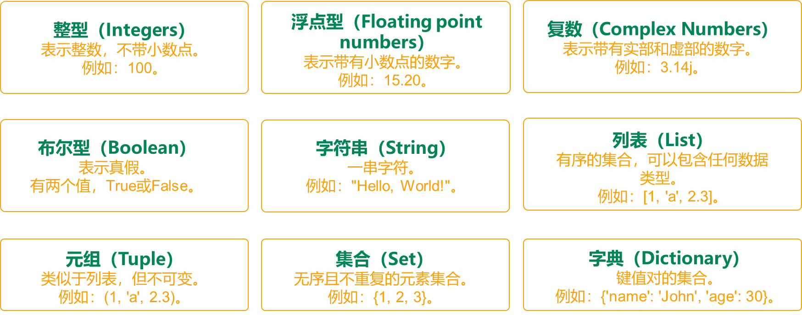
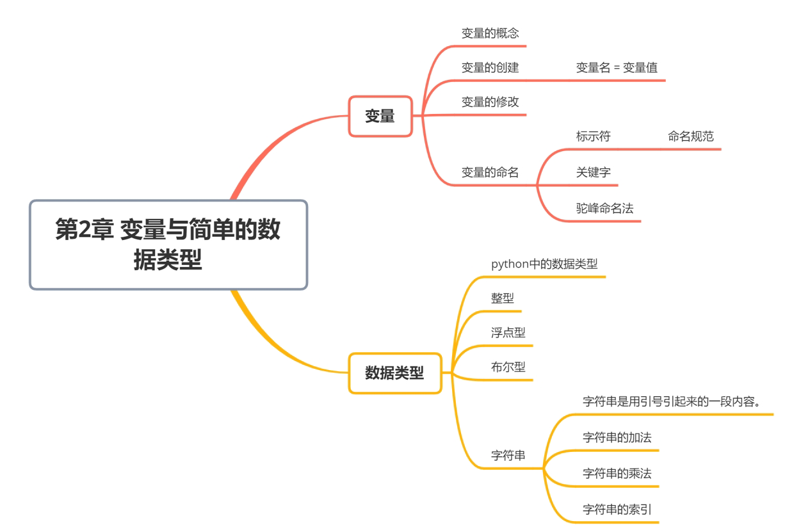

# 第 2 章 变量与简单数据类型

## 第 1 节 变量

### 变量的概念

> 代码：处理数据用的
> 变量：存储数据的

代码是用来处理数据的，而变量就是用来存储数据的。

#### 引入

把跟自己相关的数据存放在计算机内存里。
可以把计算机内存想象成一个非常大的仓库，仓库里有许多的盒子，每个盒子里可以存放数据，这个盒子就是变量。

`语法： 变量值 = 变量名`

中间的等于号：赋值符号。赋值的意思就是把数据（变量值）放到变量盒子，然后再给这个盒子起个
名字（变量名），方便我们使用它的时候能快速的找到它。
赋值的过程也被称作变量的定义。

例如：

```py
name = 'mia'
age = 18
major = '计算机'
education = 'master'
```

姓名、年龄、爱好在保存到计算机仓库里的时候，所占的存储空间是不一样的，大的数据占地方大，
比如说爱好，少的数据占地方小，例如年龄只是一个两位的数字。

表示不同意义的数据在计算机中有不同的数据类型。
在程序中，我们一般以变量表示数据，所谓变量：

• 变量是用来保存数据的
• 在程序中，变量的值是可以改变的，所以叫变量，不能改变的叫常量

#### 常量

程序在运行的过程中，值永远不会发生改变的量称之为**常量**
**python 没有专门的常量类型，一般约定俗成使用大写表示常量**

```python
# 圆周率
PI = 3.1415926
# 我的生日
MY_BIRTHDAY = '2024-01-09'
```

### 变量的定义

+ 在 Python 中，每个变量 **在使用前都必须赋值**，变量 **赋值以后** 该变量 **才会被创建**
+ 等号（=）用来给变量赋值
  + = 左边是一个变量名
  + = 右边是存储在变量中的值

```py
变量名 = 值
```

> 变量定义之后，后续就可以直接使用了
> 变量必须先定义后使用
> = 两边要留一个空格

#### 单个变量的定义

```python
# 定义 qq 号码变量
qq_number = "1234567"
# 定义 qq 密码变量
qq_password = "123"
# 在程序中，如果要输出变量的内容，需要使用 print 函数
print(qq_number)
print(qq_password)
```

> 如果要输出变量的内容，必须要使用 print 函数

#### 多个变量的定义

```python
# 多个变量的值相同
num1 = num2 = num3 = 10

# 多个变量的值不同，元组赋值
a, b = 10, 20
```

#### **练习： 超市买苹果**

> • 可以用 其他变量的计算结果 来定义变量
> • 变量定义之后，后续就可以直接使用了

需求
• 苹果的价格是 10.5 元/斤
• 买了 7.5 斤 苹果
• 计算付款金额

```py
# 定义苹果价格变量 直接赋值
price = 10.5
# 定义购买重量
weight = 7.5
# 计算金额 使用其他的变量赋值
money = price * weight
print("苹果的价格 %.2f 元 " % money)
```

### 变量的修改

```py
# 跨年
year= 2023
print(year)
year= 2024
print(year)
```

**不同类型的变量也可以进行修改、重新赋值，与类型无关。**

```python
# 定义价格
money = 10
money = '十元'

print(money)
```

• 今天超市有活动，消费就减 5 块钱
• 请重新计算购买金额

```py
# 定义苹果价格变量
price = 10.5
# 定义购买重量
weight = 7.5
# 计算金额
money = price * weight
# 只要买苹果就返 5 元
money = money - 5
print(money)
```

**思考**

+ 上述代码中，一共定义有几个变量？
  + 三个： `price` ／ `weight` ／ `money`
+ `money = money - 5` 是在定义新的变量还是在使用变量？
  ◦ 直接使用之前已经定义的变量
  ◦ 变量名 只有在 **第一次出现** 才是 **定义变量**
  ◦ 变量名 再次出现，不是定义变量，而是直接使用之前定义过的变量
+ 在程序开发中，可以修改之前定义变量中保存的值吗？
  ◦ 可以
  ◦ 变量中存储的值，就是可以 变 的


### 变量的命名

#### 标识符

> 标示符就是程序员定义的 **变量名**、**函数名**
> **名字** 需要有 **见名知义** 的效果
>
> ```python
> # 见名知义的好处
> a = '长江市长江大桥'
> bridge = '长江市长江大桥'
> 
> 两种断句  ，变量名有具体含义更好识别
> 长江市长  江大桥
> 长江市 长江大桥
> ```

+ 标示符可以由 **字母、下划线 和 数字** 组成
+ **不能以数字开头**
+ **不能与关键字重名**
+ Python 中的 标识符 是 **区分大小写** 的

思考：下面的标示符哪些是正确的，哪些不正确为什么？

```py
fromNo12
from#12
my_Boolean
my-Boolean
Obj2
2ndObj
myInt
My_tExt
_test
test!32
haha(da)tt
jack_rose
jack&rose
GUI
G.U.I
```


#### 关键字

+ **关键字** 就是在 Python 内部已经使用的标识符
+ **关键字** 具有特殊的功能和含义
+ 开发者 **不允许定义和关键字相同的名字的标示符**

通过以下命令可以查看 Python 中的关键字

```python
import keyword
print(keyword.kwlist)
```

```
['False', 'None', 'True', 'and', 'as', 'assert', 'async', 'await', 'break',
'class', 'continue', 'def', 'del', 'elif', 'else', 'except', 'finally', 'for',
'from', 'global', 'if', 'import', 'in', 'is', 'lambda', 'nonlocal', 'not',
'or', 'pass', 'raise', 'return', 'try', 'while', 'with', 'yield']
```

|          |                                   |          |                                                        |
| -------- | --------------------------------- | -------- | ------------------------------------------------------ |
| 数据类型 | 'False', 'None', 'True','del',    | 导 ⼊ 库   | 'import','from',                                       |
| 逻辑运算 | 'and', 'or','not','in','is',      | 函数     | 'def','pass', 'global','return',                       |
| 循环     | 'while','for','continue','break', | 异常处理 | 'raise','try','except','finally',                      |
| 条件判断 | 'if','elif','else',               | ⽂ 件操作 | 'as','with'                                            |
| ⾯ 向对象 | 'class'                           | 不常 ⽤   | 'lambda','nonlocal','yield','assert','as ync','await', |

#### 变量的命名规则

> **命名规则** 可以被视为一种 惯例，并无绝对与强制
> 目的是为了 **增加代码的识别和可读性**

1. 在 Python 中，如果 **变量名** 需要由 **二个 或 多个单词** 组成时，可以按照以下方式命名
   a. 每个单词都使用小写字母
   b. 单词与单词之间使用 `_` 下划线 连接
       ▪ 例如： `first_name` 、`last_name` 、`qq_number` 、`qq_password`

**驼峰命名法**

+ 当 **变量名** 是由二个或多个单词组成时，还可以利用驼峰命名法来命名
+ **小驼峰式命名法**
  + 第一个单词以小写字母开始，后续单词的首字母大写
  + 例如： `firstName` 、`lastName`
+ **大驼峰式命名法**
  + 每一个单词的首字母都采用大写字母
  + 例如： `FirstName` 、`LastName` 、`CamelCase`


好的变量命名风格应该见名知意，有意义。
• 见名知意，有自描述性
• 不建议使用中文命名变量


### 变量删除（了解）

删除变量删除后变量就不存在了，不能够再通过变量名进行存取了

```python
del 变量名
```

### 命名空间（了解）

运行 python 代码时，内存中分为命名空间和数据空间
命名空间中存储的是数据存放的地址，类似于老师的花名册
数据空间中存储真实的数据值，类似于每个学生的真实座位

```python
name = 'mia'
print(name)
print(id(name))
a = name
print(id(a))
b = 2
print(id(b))
```

### 变量类型

• 在 Python 中定义变量是 不需要指定类型（在其他很多高级语言中都需要）
• 我们可以使用 `type` 和 `isinstance` 来测试和判断数据类型

#### `type(obj)`

**功能**：返回 obj 的数据类型
**参数**：obj 是你要测试变量或数值
示例：

```py
age = 10
name = 'hello'
print(type(name), type(age))
#判断变量是否是指定类型
if type(age) is int:
    print('是')
else:
    print('否')
```


#### `isinstance`（了解）

`isinstance(obj,typename)`
**功能**：判断 obj 是否是指定类型，是返回 True, 否返回 False
**参数**： obj

+ obj 是你要判断的变量或数值
+ typename 是指定数据类型, 可以是 `int,float,str` 等。也可是一个类型的元组, 例如: `(int,float)`

```python
age = 10
name = 'hello'
print(isinstance(age,int))
print(isinstance(name,(str,int)))    #   只要name是str或int的一种就返回True
if isinstance(age,int):
    print('是')
else:
    print('否')
```

#### `type` 和 `isinstance` 的区别

`type` 判断基本类型是没问题的，但 **无法判断子类对象是父类** 的一种

`isinstance` **可以判断子类对象是父类** 的一种

```python
class A:
	pass
class B(A):
	pass

objA = A()
objB = B()
#输出否
if type(objB) is A:
	print('是')
else:
	print('否')
print(isinstance(objB,A)) #True
```

## 第 2 节 简单数据类型


### 数据类型



不同类型的变量可以进行的运算是不同的，所以必须理解变量的类型，python 中数据类型可以分为：

+ **整型（**Integers**）**：表示整数，不带小数点。例如：100。
+ **浮点型（**Floating point numbers**）**：表示带有小数点的数字。例如：15.20。
+ **复数（**Complex Numbers**）**：表示带有实部和虚部的数字。例如：3.14j。
+ **布尔型（**Boolean**）**：有两个值，True或False。
+ **字符串（**String**）**：一串字符。例如："Hello, World!"。
+ **列表（**List**）**：有序的集合。可以包含任何数据类型：数字、字符串等。例如：[1, 'a', 2.3]。
+ **元组（**Tuple**）**：类似于列表，但不可变。例如：(1, 'a', 2.3)。
+ **集合（**Set**）**：无序且不重复的元素集合。例如：{1, 2, 3}。
+ **字典（**Dictionary**）**：键值对的集合。例如：{'name': 'John', 'age': 30}。

#### Number（数值）

+ **整型（int）**
  python3 中只有 int 一种，可以表示整数，例如：10，-5,10000
+ **浮点型（float）**
  表示带小数点的实数，有两种表示法：
  + 小数表示： 1.9
  + 科学计数法： 用 e 来表示 10 的指数，1e2 就代表了 100，注意 e 前面必须有数值，e 后面必须为整数
+ **复数（complex）**
  表示数学上的无理数，形如：`a+bj`
+ **布尔值（bool）**
  【`True`，`False`】
  表示两种状态，男女、阴晴、亮暗等，它只有两个值：True，False

#### 字符型

字符串是以单引号或者双引号括起来的任意文本，也可以是以'''或者 """ 引起来的任意文本

• 在 python 中，用引号（单引号、双引号、三引号）表示字符串

```python
# 用单引号表示：
'hello'

# 用双引号表示：
"我用python"

# 用3个单引号表示：可以表示多行文本，例如：
'''伟大
   的
        祖国'''

# 用3个双引号表示：可以表示多行文本，例如：
"""       人生苦短
           我用python
"""
```

#### `None`

• 空值，表示变量没有确定的值 表示空对象，一般用于判断，不同于 0 和空字符


#### 组合的数据类型

**列表（list）**
**元组（tuple）**
**字典（dict）**
**集合（set）**

### 数值型数据

#### 整数 integer

Python 可以处理任意大小的整数，当然包括负整数，在程序中的表示方法和数学上的写法一模一样

##### 定义

• 普通定义

```python
num1 = 10

print(num1)
# type(变量名)：可以查看变量的类型，int表示整数数字
print(type(num1))
```

• 连续定义

```python
num2 = num3 = num4 = 5
```

• 交互定义

```python
# 交互定义
num5, num6 = 1, 2
```

##### 运算

```python
num5, num6 = 1, 2
print(num5 + num6)
```

#### 浮点数 float

由整数部分和小数部分组成
注意：运算可能有四舍五入的误差

```python
# 计算0.1 + 0.2的值
result = 0.1 + 0.2
print(type(result))  # <class 'float'>
print(result)  # 输出：0.30000000000000004

# 使用round()函数四舍五入结果
result = round(0.1 + 0.2, 1)
print(result)  # 输出：0.3

import math
# 向上取整
print(math.ceil(3.14))  # 4

# 向下取整
print(math.floor(3.14))  # 3
```

#### 布尔值 bool

##### **概念**

布尔类型的变量只有 `True`、`False` 两种值
作用：作为真假的判断

```python
a = True
b = False
print(a, b)
```

在 python 中，能够解释为假的值有：

+ `None、0、0.0、False、所有的空容器（空列表、空元组、空字典、空集合、空字符串）`

其它是真

##### 计算

• 如果变量是 bool 型，在计算时
◦ `True` 对应的数字是 `1`
◦ `False` 对应的数字是 `0`


### 字符串

字符串就是 一串字符，是编程语言中表示文本的数据类型。
在 Python 中可以使用 一对双引号 `"` 或者 一对单引号 `'` 定义一个字符串。
字符串是以单引号或者双引号括起来的任意文本，也可以是以三引号 `'''` 或者 `"""` 引起来的任意文本

#### 创建字符串

```python
#单引号字符串
str1 = 'hello'

#空串
str2 = str()

#双引号字符串
str2 = "hello world"

#三引号字符串 多行字符串
str3 = '''hello world
hello 2024'''
str4 = """hello 2024
hello world"""
```

注意：
1、引号本身是一种表现形式，不属于字符串的内容
2、如果字符串本身带单引号，外侧用双引号包裹起来

```python
str3 = "he's a singer."
str3 = 'he\'s a singer.' # 转义符
```


#### 字符串运算

+ 字符串变量 之间使用 `+` 拼接字符串

  > 在 Python 中，**字符串之间**可以使用 `+` 拼接生成**新的字符串**

+ 字符串变量 可以和 `整数` 使用 `*` 重复拼接相同的字符串

  ```python
  In [1]: "-" * 50
  Out[1]: '--------------------------------------------------'
  ```

+ **数字型变量 和 字符串 之间 不能进行其他计算**

```python
# 字符串运算
str1 = "hello python"
str2 = "hello world"

# 字符串加法（字符串拼接）
str3 = str1 + str2
print(str3)

# 字符串乘法（重复字符串）
str3 = str2 * 3
print(str3)
print(20 * "*")
print("-" * 20)

# 错误示例
# str3 = str2 + 3
# print(str3)

```

#### 比较大小

原理：按顺序从两个字符串中从左侧开始获取字符，比较两个字符，谁的 ascII 值大那么就是哪个字符串大，如果相等，则继续比较下一个

```python
str1 = "abc"
str2 = "ab"
print(str1 > str2)

ord('h')  # ord()函数：返回字符的ascii码值
chr(72) # chr()函数：返回ascii码对应的字符
```

#### 字符串编码解码

计算机只能识别二进制，那么字符串如何存储到计算机里呢
计算机不能直接存储字符串，但我们可以将字符编码，例如用 65 表示大写字符 A，66 表示大写字符 B....等这种表示方式就是美国类的 ASCII 码，只能表示 127 个字符，但对于美国人来说已经足够了。一但能用整数表示字符，我们可以很方便的把整数用二进制表示，那么字符串也就和容易存储到计算机了。
但还有很多其他国家的语言是不能用 ASCII 表示的，所有 ISO 组织就推出了 unicode 码，用来表示任何一种语言的字符，unicode 码也称之为万国码，通用码，可以表示任何一种语言的任何一个字符。
unicdoe 码有多种表示方式，例如：utf-8、utf-16、utf-32 等。一般使用较多的是 utf-8，utf-8 是一种变长的编码，表示一个字符可能用一个字节，也可能是三个字节 中文常用编码一般用 GBK 编码，用 2 个字节表示一个汉字


#### 字符串索引和切片

获取某个位置的字符：可以使用 索引 获取一个字符串中 指定位置的字符，索引计数从 0 开始

```python
str1 = 'hello,world'
print(str1[0],str1[-1]) # h d
```

索引的顺序和倒序

+ 在 Python 中不仅支持 顺序索引，同时还支持 倒序索引
+ 所谓倒序索引就是 从右向左 计算索引
  + 最右边的索引值是 `-1`，依次递减


**切片：**

- 列表切片的基本语法是 `list[start:stop:step]`，其中 `start` 是起始索引，`stop` 是结束索引（不包括这个位置），`step` 是步长。
- 如果省略 `start`，默认从索引0开始。
- 如果省略 `stop`，默认到列表的末尾。
- 如果省略 `step`，默认步长是1。

```python
s2 = '123456789'
print(s2[0:9:2])  # 13579
print(s2[::3])  # 147

# 字符串反转
print(s2[-1:-10:-1])  # 987654321
print(s2[::-1])  # 987654321
```


#### 字节(了解）

在 python3 中最重要的特性是对文本和二进制数据做了更加清晰的区分，文本总是 Unicode，由字符类型表示，而二进制数据则由 byte 类型表示，python3 不会以任意隐式方式混用字节型和字符型，也因此在 python3 中不能拼接字符串和字节包（python2 中可以，会自动进行转换），也不能在字节包中搜索字符串，也不能将字符串传入参数为字节包的函数。
Bytes 对象是由单个字节作为基本元素（8 位，取值范围 0-255）组成的序列，为不可变对象。 bytes 对象只负责以二进制字节序列的形式记录所需记录的对象，至于该对象到底表示什么（比如到底是什么字符）则由相应的编码格式解码所决定。Python3 中，bytes 通常用于网络数据传输、二进制图片和文件的保存等等。可以通过调用 bytes()生成 bytes 实例，其值形式为 `b'xxxxx'`，其中 'xxxxx' 为一至多个
转义的十六进制字符串（单个 x 的形式为：\x12，其中\x 为小写的十六进制转义字符，12 为二位十六进制数）组成的序列，每个十六进制数代表一个字节（八位二进制数，取值范围 0-255），对于同一个字符串如果采用不同的编码方式生成 bytes 对象，就会形成不同的值.

**创建字节**

```python
#创建字节
b1 = b'hello'
b2 = b"ello"
b3 = b'''hello'''
b4 = bytes('中文','utf-8')
```


#### 设置 python 文件编码格式

```python
-*- coding: utf-8 -*-
import sys
sys.setdefaultencoding('utf-8') #修改系统默认编码格式
```

#### 字符串和字节的转换

编码（字符串 → 字节串）

- **encode() 方法**
  将字符串按照指定的编码格式转换成字节串。常见的编码格式包括 `'utf-8'`、`'gbk'`、`'ascii'` 等。

  ```python
  s = "你好，世界"  # Unicode 字符串
  # 将字符串编码为 UTF-8 格式的字节串
  b = s.encode('utf-8')
  print(type(b))  # <class 'bytes'>
  print(b)  # 输出: b'\xe4\xbd\xa0\xe5\xa5\xbd\xef\xbc\x8c\xe4\xb8\x96\xe7\x95\x8c'
  ```

- **错误处理**
  如果字符串中包含无法用指定编码表示的字符，可以通过参数 `errors` 指定错误处理方式，例如 `'ignore'`（忽略错误）、`'replace'`（用特殊字符替换）等。

  ```python
  s = "你好，世界"
  # 尝试用 ASCII 编码会报错，所以可以设置 errors 参数
  b = s.encode('ascii', errors='replace')
  print(b)  # 输出: b'??,????'
  ```

------

解码（字节串 → 字符串）

- **decode() 方法**
  将字节串按照指定的编码格式转换回字符串。注意解码时使用的编码格式必须与编码时一致，否则可能会产生乱码或报错。

  ```python
  b = b'\xe4\xbd\xa0\xe5\xa5\xbd\xef\xbc\x8c\xe4\xb8\x96\xe7\x95\x8c'
  # 按照 UTF-8 编码解码字节串
  s = b.decode('utf-8')
  print(s)  # 输出: 你好，世界
  ```

- **错误处理**
  同样地，可以设置 `errors` 参数来处理无法解码的字节。

  ```python
  b = b'\xff\xfe\xfd'
  # 解码时遇到错误，忽略无法解码的部分
  s = b.decode('utf-8', errors='ignore')
  print(s)  # 输出可能为空字符串或部分内容
  ```

#### 格式化输出

在Python中，字符串格式化输出是编程中的一个常见需求，它允许开发者将变量嵌入到字符串中，并控制其显示方式。以下是三种主要的字符串格式化方法：使用百分号（`%`）操作符、`str.format()`函数以及`f-string`（格式化字符串字面量）。下面我将详细介绍这三种方法并提供示例代码。

##### 1. 使用百分号（`%`）操作符

这是最早的字符串格式化方法，在Python 2中广泛使用。它可以用来插入不同类型的值，如整数、浮点数和字符串等。

```python
name = "Alice"
age = 30
print("My name is %s and I'm %d years old." % (name, age))
```

这里 `%s` 表示字符串类型，`%d` 表示十进制整数类型。你也可以指定宽度和精度，例如 `%.2f` 表示保留两位小数的浮点数。

##### 2. 使用 `str.format()` 函数

从Python 2.6开始引入了更加灵活的`format()`方法，可以更方便地处理复杂的字符串格式化需求。

```python
name = "Alice"
age = 30
formatted_str = "My name is {} and I'm {} years old.".format(name, age)
print(formatted_str)

# 或者使用命名参数
formatted_str_with_names = "My name is {n} and I'm {a} years old.".format(n=name, a=age)
print(formatted_str_with_names)
```

还可以通过索引位置或关键字来重复使用参数，或者指定对齐方式、填充字符等。

##### 3. 使用 `f-string`（格式化字符串字面量）

自Python 3.6起，f-string提供了一种更为简洁直观的方式来格式化字符串。只需在字符串前加上`f`或`F`前缀，然后直接在大括号内写表达式即可。

```python
name = "Alice"
age = 30
f_string = f"My name is {name} and I'm {age} years old."
print(f_string)

# 可以在大括号内执行表达式
f_string_with_expression = f"Next year, I'll be {age + 1}."
print(f_string_with_expression)
```

此外，f-string还支持格式规范符，比如控制数字的对齐方式、宽度、精度等。

```python
value = 123.456789
print(f"The value is {value:>10.2f}")  # >10.2f 表示右对齐，总宽度为10，保留两位小数
```

每种方法都有其特点和适用场景。对于简单的字符串替换，`%`操作符就足够了；对于需要更多控制的情况，`str.format()`提供了更大的灵活性；而对于追求简洁性和可读性的现代Python代码，f-string无疑是最佳选择。 


#### 常用方法

```
str.capitalize 		str.isidentifier 	str.rindex
str.casefold 		str.islower 		str.rjust
str.isnumeric 		str.rpartition 		str.count
str.isprintable 	str.rsplit 			str.isspace
str.rstrip 			str.endswith 		str.istitle
str.split 			str.expandtabs 		str.isupper
str.splitlines 		str.find 			str.join
str.startswith 		str.format 			str.ljust
str.strip 			str.format_map 		str.lower
str.swapcase 		str.index 			str.lstrip
str.title 			str.isalnum 		str.maketrans
str.translate 		str.isalpha 		str.partition
str.upper 			str.isdecimal 		str.replace
str.zfill 			str.isdigit 		str.rfind
str.encode 			str.center
# 44个
```

> 提示：正是因为 python 内置提供的方法足够多，才使得在开发时，能够针对字符串进行更加灵活的操作！应对更多的开发需求！

##### 判断（9 个）

| 方法               | 说明                                                         |
| ------------------ | ------------------------------------------------------------ |
| string.isspace()   | 如果 string 中只包含空格，则返回 True                        |
| string.isalnum()   | 如果 string 至少有一个字符并且所有字符都是字母或数字则返回 True |
| string.isalpha()   | 如果 string 至少有一个字符并且所有字符都是字母则返回 True    |
| string.isdecimal() | 检查字符串是否只包含十进制字符，如果是返回 true，否则返回 false。 |
| string.isdigit()   | 如果 string 只包含数字则返回 True，全角数字、⑴、`\u00b2`     |
| string.isnumeric() | 如果 string 只包含数字则返回 True，全角数字，汉字数字        |
| string.istitle()   | 如果 string 是标题化的(每个单词的首字母大写)则返回 True      |
| string.islower()   | 如果 string 中包含至少一个区分大小写的字符，并且所有这些(区分大小写的)字符都是小写，则返回 True |
| string.isupper()   | 如果 string 中包含至少一个区分大小写的字符，并且所有这些(区分大小写的)字符都是大写，则返回 True |

以下是每个方法的具体例子和它们的使用场景：

1. **`string.isspace()`**
   ```python
   s = '   '
   print(s.isspace())  # 输出: True
   ```

   `isspace()` 方法用于判断字符串是否只包含空格字符，包括普通的空格 `' '`、制表符 `\t`、换行符 `\n` 等 。

2. **`string.isalnum()`**
   ```python
   s = 'abc123'
   print(s.isalnum())  # 输出: True
   ```

   `isalnum()` 方法会检查字符串是否至少有一个字符，并且所有字符都是字母或数字 。

3. **`string.isalpha()`**
   ```python
   s = 'abcdef'
   print(s.isalpha())  # 输出: True
   ```

   `isalpha()` 方法用于检测字符串是否只由字母组成。如果字符串中所有的字符都是字母（可以是任何语言的字母），则返回 `True` 。

4. **`string.isdecimal()`**
   ```python
   s = '123456'
   print(s.isdecimal())  # 输出: True
   ```

   `isdecimal()` 方法检查字符串是否只包含十进制字符，即0-9的数字 。

5. **`string.isdigit()`**
   ```python
   s = '²3455'
   print(s.isdigit())  # 输出: True
   ```

   `isdigit()` 方法除了能识别标准的十进制数字外，还能识别一些特殊的数字字符，如上标数字 `²` 等 。

6. **`string.isnumeric()`**
   ```python
   s = 'Ⅷ'
   print(s.isnumeric())  # 输出: True
   ```

   `isnumeric()` 方法比 `isdigit()` 更宽泛，它可以识别更多的数字形式，包括全角数字和罗马数字等。

7. **`string.istitle()`**
   ```python
   s = 'This Is A Title'
   print(s.istitle())  # 输出: True
   ```

   `istitle()` 方法用于判断字符串是否为标题格式，即每个单词的首字母大写而其余字母小写 。

8. **`string.islower()`**
   ```python
   s = 'hello world'
   print(s.islower())  # 输出: True
   ```

   `islower()` 方法会检查字符串中是否至少有一个区分大小写的字符，并且这些字符全部为小写 。

9. **`string.isupper()`**
   ```python
   s = 'HELLO WORLD'
   print(s.isupper())  # 输出: True
   ```

   `isupper()` 方法与 `islower()` 类似，但它检查的是字符串中的字符是否全部为大写 。


##### 查找和替换（8 个）

| 方法                                                      | 说明                                                         |
| --------------------------------------------------------- | ------------------------------------------------------------ |
| string.startswith(str)                                    | 检查字符串是否是以 str 开头，是则返回 True                   |
| string.endswith(str)                                      | 检查字符串是否是以 str 结束，是则返回 True                   |
| string.find(str, start = 0, end = len(string))            | 检测 str 是否包含在 string 中，如果 start 和 end 指定范围，则检查是否包含在指定范围内，如果是返回开始的索引值，否则返回 -1 |
| string.rfind(str, start = 0, end = len(string))           | 类似于 find()，不过是从右边开始查找                          |
| string.index(str, start = 0, end = len(string))           | 跟 find() 方法类似，不过如果 str 不在 string 会报错 ValueError |
| string.rindex(str, start = 0, end = len(string))          | 类似于 index()，不过是从右边开始，找不到会报 ValueError      |
| string.replace(old_str, new_str, num = string.count(old)) | 把 string 中的 old_str 替换成 new_str，如果 num 指定，则替换不超过 num 次 |
| str.count(sub, start = 0, end = len(string))              | 查找子串 sub 出现的次数；start 从指定下标开始查，end 结束下标 |

```python
# 示例字符串
sample_str = "Hello, world! This is a test string."

# 使用 startswith 检查字符串是否以特定前缀开始
print(sample_str.startswith("Hello"))  # 输出: True

# 使用 endswith 检查字符串是否以特定后缀结束
print(sample_str.endswith("string."))  # 输出: True

# 使用 find 查找子串的位置，如果找不到则返回 -1
position = sample_str.find("world")
print(position)  # 输出: 7

# 使用 rfind 从右向左查找子串的位置
position = sample_str.rfind("is")
print(position)  # 输出: 20

# 使用 index 查找子串的位置，如果找不到会抛出 ValueError
try:
    position = sample_str.index("notfound")
except ValueError as e:
    print(e)  # 输出: substring not found

# 使用 rindex 类似于 index，但是从右边开始查找
try:
    position = sample_str.rindex("is")
    print(position)  # 输出: 20
except ValueError as e:
    print(e)

# 使用 replace 替换子串
new_str = sample_str.replace("test", "example")
print(new_str)  # 输出: Hello, world! This is a example string.

# 使用 count 统计子串出现的次数
count = sample_str.count("is")
print(count)  # 输出: 2
```


##### 大小写转换（5 个）

| 方法                | 说明                             |
| ------------------- | -------------------------------- |
| string.capitalize() | 把字符串的第一个字符大写         |
| string.title()      | 把字符串的每个单词首字母大写     |
| string.lower()      | 转换 string 中所有大写字符为小写 |
| string.upper()      | 转换 string 中的小写字母为大写   |
| string.swapcase()   | 翻转 string 中的大小写           |

1. **`string.capitalize()`**
   ```python
   s = 'hello world'
   print(s.capitalize())  # 输出: Hello world
   ```

   `capitalize()` 方法会将字符串的第一个字符转换为大写，并将其余的字母转换为小写 。

2. **`string.title()`**
   ```python
   s = 'the quick brown fox'
   print(s.title())  # 输出: The Quick Brown Fox
   ```

   `title()` 方法会将字符串中每个单词的首字母都转换为大写。需要注意的是，如果单词中有数字或符号，其后的第一个字母也会被转换为大写 。

3. **`string.lower()`**
   ```python
   s = 'Hello World'
   print(s.lower())  # 输出: hello world
   ```

   `lower()` 方法会将字符串中的所有大写字母转换为小写，而不影响原本就是小写的字符或其他非字母字符 。

4. **`string.upper()`**
   ```python
   s = 'hello world'
   print(s.upper())  # 输出: HELLO WORLD
   ```

   `upper()` 方法会将字符串中的所有小写字母转换为大写形式 。

5. **`string.swapcase()`**
   ```python
   s = 'Hello World'
   print(s.swapcase())  # 输出: hELLO wORLD
   ```

   `swapcase()` 方法会翻转字符串中每个字符的大小写状态，即大写字母变成小写，小写字母变成大写 。

##### 文本对齐（3个）

| 方法                 | 说明                                                         |
| -------------------- | ------------------------------------------------------------ |
| string.ljust(width)  | 返回一个原字符串左对齐,并使用空格填充至长度 width 的新字符串 |
| string.rjust(width)  | 返回一个原字符串右对齐,并使用空格填充至长度 width 的新字符串 |
| string.center(width) | 返回一个原字符串居中，并使用空格填充至长度 width 的新字符串  |

```python
# 定义一个示例字符串
sample_str = "Hello"

# 使用 ljust() 方法左对齐字符串并填充空格到指定宽度
left_aligned = sample_str.ljust(10)  # 总宽度为10个字符
print(f"Left-aligned: '{left_aligned}'")  # 输出: 'Left-aligned: 'Hello     ''

# 使用 rjust() 方法右对齐字符串并填充空格到指定宽度
right_aligned = sample_str.rjust(10)  # 总宽度为10个字符
print(f"Right-aligned: '{right_aligned}'")  # 输出: 'Right-aligned: '     Hello''

# 使用 center() 方法居中对齐字符串并填充空格到指定宽度
centered = sample_str.center(10)  # 总宽度为10个字符
print(f"Centered: '{centered}'")  # 输出: 'Centered: '  Hello   ''
```

##### 去除空白字符（3个）

| 方法            | 说明                             |
| --------------- | -------------------------------- |
| string.lstrip() | 截掉 string 左边(开始)的空白字符 |
| string.rstrip() | 截掉 string 右边(末尾)的空白字符 |
| string.strip()  | 截掉 string 左右两边的空白字符   |

```python
# 示例字符串
original_str = "   Hello, World!   "
print(f"Original: '{original_str}'")  # Original: '   Hello, World!   '

# 使用 lstrip() 移除左边的空白字符
stripped_left = original_str.lstrip()
print(f"Lstrip: '{stripped_left}'")  # Lstrip: 'Hello, World!   '

# 使用 rstrip() 移除右边的空白字符
stripped_right = original_str.rstrip()
print(f"Rstrip: '{stripped_right}'")  # Rstrip: '   Hello, World!'

# 使用 strip() 同时移除左右两边的空白字符
stripped_both = original_str.strip()
print(f"Strip: '{stripped_both}'")  # Strip: 'Hello, World!'
```


##### 拆分和连接 （6个）

| 方法                      | 说明                                                         |
| ------------------------- | ------------------------------------------------------------ |
| string.partition(str)     | 把字符串 string 分成一个3元素的元组 (str前面, str, str后面)  |
| string.rpartition(str)    | 类似于 partition() 方法,不过是从右边开始查找                 |
| string.split(str="", num) | 以 str 为分隔符拆分 string, 如果 num有指定值,则仅分隔num+1个子字符串, str 默认包含"\r,"\t,'\n'和空格 |
| string.rsplit(str="",num) | 从右向左拆分                                                 |
| string.splitlines()       | 按照行("\r,"\n','\r\n')分隔,返回一个包含各行作为元素的列表   |
| string.join(seq)          | 以 string 作为分隔符,将 seq 中所有的元素(的字符串表示)合并为一个新的字符串 |

```python
# 示例字符串，包含多个单词和标点符号
original_str = "Hello, World! This is a test string."

# 使用 partition() 方法
# partition() 方法搜索指定的分隔符，并将字符串分割成一个三元组 (前面的部分, 分隔符, 后面的部分)
# 如果未找到分隔符，则返回 (原字符串, '', '')
partitioned = original_str.partition("World")  # 查找 "World" 并分割字符串
print(f"Partition: {partitioned}")  # 输出将会是 ('Hello, ', 'World', '! This is a test string.')

# 使用 rpartition() 方法
# rpartition() 方法与 partition() 类似，但它是从右向左搜索分隔符
rpartitioned = original_str.rpartition("test")  # 从右边查找 "test" 并分割字符串
print(f"Rpartition: {rpartitioned}")  # 输出将会是 ('Hello, World! This is a ', 'test', ' string.')

# 使用 split() 方法
# split() 方法默认以空白字符（空格、制表符、换行符等）作为分隔符，将字符串拆分成列表
# 也可以传入参数指定分隔符
split_result = original_str.split()  # 拆分字符串为单词列表
print(f"Split: {split_result}")  # 输出将会是 ['Hello,', 'World!', 'This', 'is', 'a', 'test', 'string.']

# 使用 rsplit() 方法
# rsplit() 方法与 split() 相同，但如果指定了最大分割次数，它会从右边开始计数
rsplit_result = original_str.rsplit(maxsplit=2)  # 从右边开始最多分割两次
print(f"Rsplit: {rsplit_result}")  # 输出将会是 ['Hello, World! This is a', 'test', 'string.']

# 使用 splitlines() 方法
# splitlines() 方法按照行边界（\n, \r, \r\n 等）拆分字符串，返回由各行组成的列表
multiline_str = "First line\nSecond line\rThird line\r\nFourth line"
splitlines_result = multiline_str.splitlines()  # 按行拆分多行字符串
print(f"Splitlines: {splitlines_result}")  # 输出将会是 ['First line', 'Second line', 'Third line', 'Fourth line']

# 使用 join() 方法
# join() 方法用于连接序列中的元素，元素必须是字符串类型
# 它接受一个可迭代对象（如列表），并用调用该方法的字符串作为分隔符来连接这些元素
elements = ['Hello', 'World', 'This', 'is', 'a', 'test']
joined_str = '-'.join(elements)  # 使用 '-' 连接列表中的元素
print(f"Joined: {joined_str}")  # 输出将会是 'Hello-World-This-is-a-test'
```


##### 其他

| 方法                                              | 描述                                                         |
| ------------------------------------------------- | ------------------------------------------------------------ |
| `bytes.decode(encoding="utf-8", errors="strict")` | Python3 中没有 decode 方法，但我们可以使用 bytes 对象的 decode() 方法来解码给定的 bytes 对象。这个 bytes 对象可以由 str.encode() 来编码返回。 |
| `encode(encoding='UTF-8', errors='strict')`       | 以 encoding 指定的编码格式编码字符串，如果出错默认报一个 ValueError 的异常，除非 errors 指定的是 'ignore' 或者 'replace'。 |
| `expandtabs(tabsize=8)`                           | 把字符串 string 中的 tab 符号转为空格，tab 符号默认的空格数是 8。 |
| `len(string)`                                     | 返回字符串长度。                                             |
| `maketrans()`                                     | 创建字符映射的转换表，对于接受两个参数的最简单的调用方式，第一个参数是字符串，表示需要转换的字符，第二个参数也是字符串表示转换的目标。 |
| `translate(table, deletechars='')`                | 根据 str 给出的表（包含 256 个字符）转换 string 的字符，要过滤掉的字符放到 deletechars 参数中。 |
| `max(str)`                                        | 返回字符串 str 中最大的字母。                                |
| `min(str)`                                        | 返回字符串 str 中最小的字母。                                |
| `zfill(width)`                                    | 返回长度为 width 的字符串，原字符串右对齐，前面填充0。       |
| `eval()`                                          | 功能：将字符串当成有效的表达式来求值并返回结果。返回值：计算后得到的数字。注意：字符串本身是不可以改变的。 |
| `ord()`                                           | 功能：获取字符的整数表示。                                   |
| `chr()`                                           | 功能：把数字编码转为对应的字符。                             |
| `str()`                                           | 将对象转换为字符串。                                         |

```python
# 1. decode() 示例 (Python3 中 bytes 对象的方法)
# 将字节数据按照指定编码格式解码为字符串
byte_data = b"Hello, World!"
decoded_str = byte_data.decode(encoding="utf-8", errors="strict")
print(f"Decode: {decoded_str}") # Decode: Hello, World!

# 2. encode() 示例
# 将字符串按照指定编码格式编码为字节数据
original_str = "Hello, World!"
encoded_bytes = original_str.encode(encoding='UTF-8', errors='strict')
print(f"Encode: {encoded_bytes}") # Encode: b'Hello, World!'

# 3. expandtabs() 示例
# 将字符串中的制表符展开为指定宽度的空格
tabbed_str = "Hello\tWorld"
expanded_tabs = tabbed_str.expandtabs(tabsize=4)
print(f"Expandtabs: {expanded_tabs}") # Expandtabs: Hello    World

# 4. len() 示例
# 计算字符串的长度
length_of_str = len(original_str)
print(f"Length of '{original_str}': {length_of_str}") # Length of 'Hello, World!': 13

# 5. maketrans() 和 translate() 示例
# 创建字符映射转换表并使用它来转换字符串中的字符
trans_table = str.maketrans("o", "0")  # 将 'o' 替换为 '0'
translated_str = original_str.translate(trans_table)
print(f"Translate (o -> 0): {translated_str}") # Translate (o -> 0): Hell0, W0rld!

# 6. max() 示例
# 找出字符串中字典序最大的字符
max_char = max(original_str)
print(f"Max character in '{original_str}': {max_char}") # Max character in 'Hello, World!': W

# 7. min() 示例
# 找出字符串中字典序最小的字符
min_char = min(original_str)
print(f"Min character in '{original_str}': {min_char}") #    Min character in 'Hello, World!': ,

# 8. zfill() 示例
# 在字符串左侧填充零，直到结果字符串达到指定宽度
number_str = "42"
padded_number = number_str.zfill(5)
print(f"Zfill (to width 5): {padded_number}") # Zfill (to width 5): 00042

# 9. eval() 示例 (注意安全问题)
# 计算字符串表达式的值，注意这可能会带来安全风险
expression = "3 + 5"
evaluated_result = eval(expression)
print(f"Eval ('{expression}'): {evaluated_result}") # Eval ('3 + 5'): 8

# 10. ord() 示例
# 获取字符的Unicode码点
char_code = ord('A')
print(f"Ord ('A'): {char_code}") # Ord ('A'): 65

# 11. chr() 示例
# 根据Unicode码点获取对应的字符
character = chr(65)
print(f"Chr (65): {character}") # Chr (65): A

# 12. str() 示例
# 将对象转换为字符串表示形式
object_to_str = str([1, 2, 3])
print(f"Str ([1, 2, 3]): {object_to_str}") # Str ([1, 2, 3]): [1, 2, 3]
```

##### 前缀表达

在Python中，字符串的前缀表达主要涉及给字符串添加特定前缀以改变其行为或表示方式。这些前缀包括`u`、`r`、`b`、`f`等，每个都有其独特的用途和应用场景。下面是对这些前缀的详细介绍及其示例：

1. **Unicode 前缀 `u`**
   
   在Python 2中，使用`u`前缀可以创建一个unicode字符串，从而允许处理多语言文本而不出现编码问题。例如：
   ```python
   unicode_str = u"Hello, 世界"
   ```
   然而，在Python 3中，所有的字符串默认都是unicode字符串，因此`u`前缀不再是必需的，但仍然可以使用以保持向后兼容性。

2. **原始字符串前缀 `r`**

   使用`r`前缀可以创建原始字符串，这意味着反斜杠不会被视为转义字符。这对于正则表达式或者包含文件路径的字符串特别有用。例如：
   ```python
   raw_str = r"C:\path\to\file.txt"
   print(raw_str)  # 输出: C:\path\to\file.txt
   ```

3. **字节字符串前缀 `b`**

   在Python 3中，使用`b`前缀可以创建一个字节字符串（bytes对象），这对于网络传输或存储二进制数据非常有用。例如：
   ```python
   byte_str = b'Hello, World!'
   print(byte_str)  # 输出: b'Hello, World!'
   ```

4. **格式化字符串前缀 `f`**

   自Python 3.6起，引入了格式化字符串（f-string），它提供了一种更直观的方式来进行字符串插值。例如：
   ```python
   name = "Alice"
   formatted_str = f"Hello, {name}"
   print(formatted_str)  # 输出: Hello, Alice
   ```

5. **组合前缀**

   Python还允许组合使用这些前缀来创建具有多种特性的字符串。例如，`fr`前缀可用于创建既支持格式化又为原始字符串的对象：
   ```python
   path_template = fr"C:\Users\{username}\Documents"
   print(path_template)  # 输出将根据变量username的实际值进行替换
   ```

需要注意的是，并非所有前缀都可以自由组合。比如`fu`组合是没有意义的，因为在Python 3中，所有的字符串已经是unicode的了，所以不需要再用`u`来声明。


### 空值

说明：是python中一个特殊的值，用None表示
注意：None不能理解为0，因为0是有意义的，而None是没有任何实际意义的
作用：
1、定义变量时，不知道初始值要赋值成什么，可以写赋值为None。当你有确定的值时在进行赋值

```python
c = None
print(c)
```

### 类型转换函数

python是一种强类型语言：要求运算符两边的操作数必须是同一个类型的，否则必须转换
下表为常用的数据类型转换函数

| 函数名          | 函数值                                                    |
| --------------- | --------------------------------------------------------- |
| `int(x,[基数])` | 将数字或字符串转换为整数,如果x为浮点数,则自动截断小数部分 |
| `float(x)`      | 将x转换成浮点型                                           |
| `bool(x)`       | 转换成bool类型的True或 False                              |
| `str(x)`        | 将x转换成字符串,适合人阅读                                |

```python
# 转换为整数int
# 字符串str-->整数int
# 纯数字的字符串
s = '2024'
n = int(s)
print(type(s), type(n))
# 浮点数float-->整数int
s1 = 2.23
print(int(s1))
# 布尔bool-->整数int
s2, s3 = True, False
print(int(s2),int(s3))


# 转换为浮点数float
# str-->float
s = '324.6' # 有没有小数点都可以
print(float(s))
# int-->float
n = 2024
print(float(n))
# bool-->float
print(float(s2), float(s3))


# 转换为布尔bool
# str-->bool
s = '0'
print(bool(s))
s1 = ''  # 空串
print('*'*20)
print(bool(s1))
# int-->bool
n=0
print(bool(n))
# float-->bool
f=0.0
print(bool(f))


# 转换为字符串str
# int-->str
n = 5
print(str(n))
print(type(str(n)))
# float -->str
f = 5.3
print(str(f))
print(type(str(f)))
# bool --> str
a = True
print(type(a))
print(type(str(a)))

# 进制的转换
s = '1a'
print(int(s, 16)) # 26
```

**超市买苹果**

需求
• 收银员输入 苹果的价格，单位：元／斤
• 收银员输入 用户购买苹果的重量，单位：斤
• 计算并且 输出 付款金额

```python
# 1. 输入苹果单价
price_str = input("请输入苹果价格：")
# 2. 要求苹果重量
weight_str = input("请输入苹果重量：")
# 3. 计算金额
price = float(price_str)
weight = float(weight_str)
money = price
```

针对 价格 定义了几个变量？
• 两个
• price_str 记录用户输入的价格字符串
• price 记录转换后的价格数值


> 如果开发中，需要用户通过控制台 输入 **很多个 数字**，针对每一个数字都要定义两个变量，不方便 改
> 进：**定义** 一个 **浮点变量** 接收用户输入的同时，就使用 float 函数进行转换

```python
price = float(input("请输入价格:"))
```

• 改进后的好处：
节约空间，只需要为一个变量分配空间
起名字方便，不需要为中间变量起名字
• 缺点：
如果输入的不是数字会出错

## 总结及习题

### 本章总结



### 命令总结

<figure class='table-figure'>
    <table>
        <thead>
            <tr>
                <th>类别</th>
                <th>函数</th>
                <th>说明 </th>
                <th>函数定义</th>
            </tr>
        </thead>
        <tbody>
            <tr>
                <td rowspan="4">类型转换</td>
                <td>int()</td>
                <td>将数字或字符串转换为整数，如果x为浮点数，则自动截断小数部分</td>
                <td>int(x, base=10)</td>
            </tr>
            <tr>
                <td>float()</td>
                <td>将x转换成浮点型 </td>
                <td> float(x=0.0)</td>
            </tr>
            <tr>
                <td>bool()</td>
                <td>转换成bool类型 的True或 False</td>
                <td>&nbsp;</td>
            </tr>
            <tr>
                <td>str()</td>
                <td>将x转换成字符串，适合人阅读</td>
                <td>type(object)</td>
            </tr>
            <tr>
                <td rowspan="2">类型检测</td>
                <td>type()</td>
                <td>返回对象类型</td>
                <td>&nbsp;</td>
            </tr>
            <tr>
                <td>isinstance()</td>
                <td>判断对象是否是类的实例</td>
                <td><code>isinstance(object, classinfo)</code></td>
            </tr>
        </tbody>
    </table>
</figure>

### 单词总结

| 单词    | 释义        |
| ------- | ----------- |
| integer | 整数        |
| float   | 小数,浮点数 |
| bool    | 布尔值      |
| string  | 字符串      |
| none    | 空          |
| import  | 导入        |
| keyword | 关键字      |
| type    | 类型        |
| is      | 是          |

### 课后甜点

#### 探究地址问题(小整数对象[-5~256])

多个变量等于小整数对象，则这些变量的地址相同，因为小整数经常使用，这样的话可以节省空间和提升效率

```python
num7 = 1
num8 = 1
print(id(num7), id(num8)) #地址相同
num9 = 501
num10 = 501
print(id(num9), id(num10)) #地址不相同，需要在Linux下执
```

Python中的小整数（通常指的是-5至256之间的整数）的地址问题是一个经常被误解的话题。实际上，Python的整数对象并不像C语言中的整型变量那样直接映射到内存中的地址。在Python中，整数对象是通过引用计数机制进行内存管理的。

当你在Python中创建一个整数对象时，Python会根据该整数的值动态地为其分配内存空间。对于小整数，Python会使用一种称为“小整数缓存”的机制来优化内存使用。这个缓存池中的整数对象会被重复利用，而不是为每个新创建的小整数分配新的内存空间。这样可以减少内存分配和释放的开销，提高程序的性能。

关于小整数的地址问题，实际上你无法直接获取一个小整数的内存地址，因为Python的内存管理机制并不提供这样的访问方式。小整数对象的地址是由Python解释器内部管理的，对外界是不可见的。
如果你需要跟踪Python对象的内存地址，**可以使用Python提供的内置函数`id()` 来获取对象的唯一标识符**，这个标识符通常可以用来近似地表示对象的内存地址。但是请注意，这个标识符并不是真正的内存地址，而是由Python解释器生成的一个唯一标识符，用于区分不同的对象实例。
总结来说，Python中小整数的地址问题并不是一个实际存在的问题，因为Python的内存管理机制与C语言等低级语言不同。Python通过引用计数和对象池化等机制来优化内存使用和提高性能，而不需要程序员直接关心对象的内存地址。如果你需要跟踪对象的唯一标识符，可以使用 `id()` 函数来获取。

#### 为什么浮点计算不准确？

让我们通过一个简单的例子来说明浮点数不准确的原因。
假设我们要计算0.1 + 0.2的值。在我们的预期中，这个值应该是0.3。但在计算机中，由于浮点数的存储方式，结果可能会略有不同。

```python
# 计算0.1 + 0.2的值
result = 0.1 + 0.2
print(result)
# 输出：0.30000000000000004
```

如上所示，计算结果为0.30000000000000004，而不是预期的0.3。这是因为计算机无法精确表示这个小数，导致结果存在舍入误差。

为了解决这个问题，我们可以使用Python的内置函数`round()` 来四舍五入结果，从而获得更准确的值。

```python
# 使用round()函数四舍五入结果
result = round(0.1 + 0.2, 1)
print(result) # 输出：0.3
```

如上所示，使用 `round()` 函数可以将结果四舍五入到指定的小数位数，从而获得更准确的值。在这个例子中，我们将结果四舍五入到小数点后一位，得到的结果是0.3。


在Python中，浮点数不准确的原因主要是由于计算机内部表示浮点数的方式导致的。
首先，我们需要明白浮点数在计算机中的存储方式。计算机使用一种称为`IEEE 754标准`的方式存储浮点数。这种标准将一个浮点数表示为一个符号位、一个指数位和一个尾数位。虽然这种表示方式非常适合于科学计算和工程应用，但它并不适合所有的场景。
其中，一个关键的问题是计算机无法精确表示所有的十进制小数。例如，0.1这个小数在二进制中是一个无限循环小数，这意味着计算机无法精确地表示它。因此，当我们在Python中表示0.1这个小数时，实际上得到的是一个近似值，而不是真正的0.1。
此外，浮点数的运算也会导致精度问题。例如，当我们进行两个浮点数的相加、相减、相乘或相除时，结果可能会因为舍入误差而与预期的结果略有不同。
为了解决这个问题，Python提供了一些内置函数来处理浮点数，例如`round()` 、`floor()` 和`ceil()` 等。这些函数可以帮助我们控制舍入误差，并获得更准确的结果。
总结来说，Python中的浮点数不准确是由于计算机内部表示浮点数的方式和浮点数运算的特性导致的。虽然这个问题无法完全避免，但我们可以使用Python提供的函数来控制和减少舍入误差，从而获得更准确的结果。

### 小试牛刀

**选择题**

1. 变量 a 为整型的是（ ）。
A． a = 1.1
B． a,b = 1,1.3
C． a = '1'
D． a = b = 1.0
答案：B

2. 字符串是由（）组成的一串字符。
A.数字，字母
B. 数字，下划线
C. 字母，下划线
D. 数字，字母，下划线
答案：D

3. Python 字符串，以下选项中描述错误的是
A.可以使用 datatype() 测试字符串的类型
B. 输出带有引号的字符串，可以使用转义字符
C. 字符串是一个字符序列，字符串中的编号叫"索引"
D. 字符串可以保存在变量中，也可以单独存在
答案：A

4. 下列哪个选项不是字符串？
A.'我不是一个字符串'
B. 'this is a string'
C. 我是一个字符串
D. 'forward'
答案：C

5. 将x转换为一个整数（ ）
A.int(x)
B. long(y)
C. max(x)
D. min(x)
答案：A

**编程练习**

这里有 10 个苹果，小A 拿走了 2 个，小B 拿走了 4 个，小C 拿走剩下的所有的苹果。我们想知道：
小A 和 小B 两个人一共拿走多少苹果？
小C 能拿走多少苹果？

```python
total = 10
A = 2
B = 4
C = total - A - B
print('小A 和 小B 两个人一共拿走', A+B, '个苹果')
print('小C 拿走',C , '个苹果')
```

mia 银行账户里面有100元。经过了下面的操作：

往里面存了 10 元；
购物花掉了 20 元；
把里面的钱全部取出。
请在每次操作后输出账户余额

```python
money = 100
money = money + 10
print('账号余额为 %d 元' % money)
money = money - 20
print('账号余额为 %d 元' % money)
money = money - money
print('账号余额为 %d 元' % money)
```

