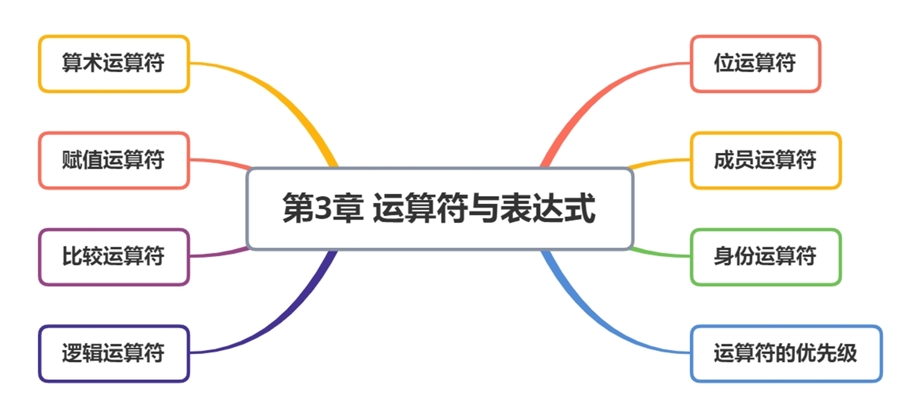

# 第 3 章 运算符与表达式

## 运算符

| 类型                   | 内容                          |
| ---------------------- | ----------------------------- |
| 算术运算符             | `+` `-` `*` `/` `//` `%` `**` |
| 赋值运算符             | `=` `+=` `-=` `*=` `/=` `//=` `%=` |
| 位运算符               | `& | ~ ^ <<  >>`            |
| 关系运算符(比较运算符) | `==` `!=` `<` `>` `<=` `>=` |
| 逻辑运算符             | `and` `or` `not` |
| 成员运算符             | `in` `not in`    |
| 身份运算符             | `is`                          |

关于运算符要知道两件事情：
• 计算顺序 ： 是从左向右算还是从右向左算
• 优先级 ： 各种类型的运算符组合使用时，要按照优先级顺序计算，比如先乘除后加减。

## 表达式

概念：由变量、常量和运算符组成的式子称为表达式
在数学上为了计算结果，我们会写一些式子计算，例如：`30 + 5`
这是数学中的计算式，python中为了计算也有类似的式子，叫表达式。在表达式中30和5称作操作数，`` + 称之为运算符。
表达式的目的在于计算结果。


表达式构成：
• 最基本的表达式就是一些数值，变量、函数，例如： `3` , `a` (变量) `print('hello')`
• 由基本表达式加上适当的运算符构成复杂的表达式： `3 + a`
综合上述，所谓表达式，就是由操作数和运算符组成的，符合python语法的式子。

## 算术运算符

• 算术运算符是 **运算符的一种**。
• 是完成基本的算术运算使用的符号，用来处理四则运算。

| 运算符 | 描述   | 实例                                      |
| ------ | ------ | ----------------------------------------- |
| +      | 加     | 10 + 20 = 30                              |
| -      | 减     | 10 - 20 = -10                             |
| *      | 乘     | 10 * 20 = 200                             |
| /      | 除     | 10 / 20 = 0.5                             |
| //     | 取整除 | 返回除法的整数部分（商）9 // 2 输出结果 4 |
| %      | 取余数 | 返回除法的余数 9 % 2 = 1                  |
| **     | 幂     | 又称次方、乘方，2 ** 3 = 8                |


**模运算（%）**

- **符号取决于右操作数**：当使用模运算时，结果的符号通常与第二个操作数（右操作数）保持一致。这是因为模运算是基于除法的结果来计算的，而Python中的除法结果遵循这个规则。

- **模运算公式**：`r = a % b = a - n * b` 这个公式很好地解释了模运算的工作原理。这里 `n` 是 `a / b` 的商向下取整后的值，即 `n = floor(a / b)` 或者在 Python 中使用 `//` 来表示整除。

**整除（`//`）**

- **浮点数支持**：当你使用整除(`//`)且其中一个操作数是浮点数时，结果也会是一个浮点数。这使得 Python 的整除运算符比一些其他语言更加灵活。

**应用场景**

- **判断奇偶性**：通过 `n % 2 == 0` 可以判断一个整数是否为偶数。
- **检查能否整除**：利用 `a % b == 0` 判断 `a` 是否可以被 `b` 整除。
- **最大公约数**：虽然没有直接提到，但模运算常用于实现欧几里得算法来找到两个数的最大公约数。
- **水仙花数**：指的是一个n位数字，其各个位置上的数字的n次幂之和等于该数字本身。例如153=1^3+5^3+3^3。寻找或验证水仙花数时可能需要用到模运算来分离数字的每一位。

**字符串乘法**

- 在 Python 中，`*` 运算符不仅可以用于数值的乘法，还可以用于字符串。将一个字符串与一个整数 `n` 相乘会生成一个新的字符串，它是原字符串重复 `n` 次的结果。例如，`"abc" * 3` 结果为 `"abcabcabc"`。

### 算术运算表达式

• 功能：进行符号对象的算术运算，不会修改变量的值

• 值：相关算术运算的结果

```python
print(4 + 1)
a = 10
b = 3
print(a - b)
print(a * 4)
print(a / b)
print(a // b)  # 整除，取整
print(a % b)   # 获取余数，求模
print(a ** 3)  # 幂运算
```

### 算术运算符的优先级

+ 和数学中的运算符的优先级一致，在 Python 中进行数学计算时，同样也是：
  ◦ **先乘除后加减**
  ◦ 同级运算符是 **从左至右** 计算
  ◦ 可以使用 `()` 调整计算的优先级
+ 以下表格的算术优先级由高到最低顺序排列

| 运算符        | 描述                   |
| ------------- | ---------------------- |
| `**`          | 幂(最高优先级)         |
| `*  /  %  //` | 乘、除、取余数、取整除 |
| `+ -`         | 加法、减法             |

```python
print(3 + 2 * 4 ** 2)
print(3 + 2 * (4 ** 2) )
```

## 赋值运算符

• 在 Python 中，使用 `=` 可以给变量赋值
• 在算术运算时，为了简化代码的编写， Python 还提供了一系列的 与 **算术运算符** 对应的 **赋值运算符**
• 注意：**赋值运算符中间不能使用空格**

| 运算符 | 描述                 | 实例                        |
| ------ | -------------------- | --------------------------- |
| `=`    | 简单的赋值运算符     | c=a+b将a+b的运算结果赋值为c |
| `+=`   | 加法赋值运算符       | c +=a等效于c=c+a            |
| `-=`   | 减法赋值运算符       | c -=a等效于c=c-a            |
| `*=`   | 乘法赋值运算符       | `c *= a等效于c=c*a`         |
| `/=`   | 除法赋值运算符       | c /= a 等效于c=c/a          |
| `//=`  | 取整除赋值运算符     | c //= a 等效于 c=c//a       |
| `%=`   | 取模(余数)赋值运算符 | c%=a 等效于c=c%a            |
| `**=`  | 幂赋值运算符         | `c **= a 等效于c=c**a`      |

### 赋值运算表达式

• 格式：`变量 = 表达式`
• 功能：计算等号右侧 `“表达式”` 的值，并赋值给等号左侧的`“变量”`
• 值：赋值结束后变量的值

```python
a = 2
print(   a  )
a +=    2  # 自增
print   (  a  )
a = a + 2
print(a)
```

注意：
• 赋值运算符左边必须是变量
• 所有赋值运算符优先级相同，赋值运算符优先级非常低，仅高于成员运算符和身份运算符、逻辑运
算符

## 比较（关系）运算符

关系运算就是比较运算，如果表达式成立，返回True，否则返回False。关系运算的结果是布尔值。

| 运算符 | 描述                                                         |
| ------ | ------------------------------------------------------------ |
| ==     | 检查两个操作数的值是否**相等**,如果是,则条件成立,返回 True   |
| !=     | 检查两个操作数的值是否**不相等**,如果是,则条件成立,返回 True |
| >      | 检查左操作数的值是否**大于**右操作数的值,如果是,则条件成立,返回 True |
| <      | 检查左操作数的值是否**小于**右操作数的值,如果是,则条件成立,返回 True |
| >=     | 检查左操作数的值是否**大于或等于**右操作数的值,如果是,则条件成立,返回 True |
| <=     | 检查左操作数的值是否**小于或等于**右操作数的值,如果是,则条件成立,返回 True |

**真值与假值**

- **数值到布尔**：任何非零数字（包括负数）都被视为 `True`，而0被视为 `False`。
- **序列和集合类型**：空的序列或集合（如 `''`, `[]`, `()`, `{}`, `set()`, `range(0)`）被视为 `False`，而非空的则为 `True`。
- **其他对象**：大多数对象实例被评估为 `True`，除非该类定义了 `__bool__()` 或 `__len__()` 方法并特别指定了返回 `False` 的条件。

### 关系运算表达式

格式：`表达式1 关系运算符 表达式2`
功能：计算表达式1和表达式2的值
值 ：如果关系成立，则整个关系运算表达式的值为真，关系不成立，则整个关系运算表达式的值为假

```python
print(3 != 3)  # 判断不相等
print(3 == 2)  # 判断相等
print(3 >= 2)
print(3 <= 3)
print(3.0 == 3)  # True
print(True == False)
print('hello' < 'hell')  # 字符串的比较运算：每个字符的ascii码值
ord('h')  # ord()函数：返回字符的ascii码值

print(1<2<3)
print(1<2 and 2<3)

print('y'<'x'==False)
print('y'<'x' and 'x'==False)

# 类型不一致不能直接比较
print("hello" < 3) # TypeError: '<' not supported between instances of 'str' and 'int'
```

注意：
• 优先级： 比较运算符优先级相同
• 从左向右算
• 可以这样写： `1 < a < 3` 等价于 `a > 1 and a < 3`

## 逻辑运算符

| 运算符 | 逻辑表达式 | 描述                                                         |
| ------ | ---------- | ------------------------------------------------------------ |
| and    | x and y    | 只有 x 和 y 的值都为 True，才会返回 True<br/>否则只要 x 或者 y 有一个值为 False，就返回 False |
| or     | x or y     | 只要 x 或者 y 有一个值为 True，就返回 True<br/>只有 x 和 y 的值都为 False，才会返回 False |
| not    | not x      | 如果 x 为 True，返回 False<br/>如果 x 为 False，返回 True    |


• 在程序开发中，通常 **在判断条件**时，会需要同时判断多个条件
• 只有多个条件都满足，才能够执行后续代码，这个时候需要使用到 **逻辑运算符**
• **逻辑运算符** 可以把 **多个条件** 按照 **逻辑** 进行 **连接**，变成 **更复杂的条件**
• Python 中的 逻辑运算符 包括：`与 and／或 or／非 not` 三种
• 逻辑与 and 对应汉语的意思是“并且” 、 “同时”
• 逻辑或 or 对应汉语意思为"或者"
• 逻辑非 not 对应汉语意思为”相反“
在逻辑运算中，`False、None、0、0.0、‘’（空字符串）`被看做假（False），其它的看做真(True)

### 案例代码

```python
# 与，并且 and
print(True and False)
print(True and True)
print(True and False and True)
print(1==1 and True and 2<3)
# 短路运算
print('hello' and 'hi')  # hi
print('' and 'hi')  # ''
print(False and 'hi')  # 
print(0 and 1)  # 0


# 或者or
print(True or False)
print(False or False or True)
# 短路运算
print(1 or 0) # 1
print(2024 or 2025 or 0) # 2024
print(0 or '' or 888) # 888

# 非not
print(not True)  # False
print(not 1)  # False
print(not '')  # True
```


### 优先级

```python
# 优先级 not > and > or
print(True and False and not False)
print(True or False and True or False)
```

> 
>
> **表达式 1: `print(True and False and not False)**`
>
> 按照运算符优先级，我们先处理`not False`部分：
>
> - `not False`的结果是`True`。
>
> 接下来根据`and`运算符的短路特性，从左到右依次评估：
>
> - `True and False`，由于`False`的存在，整个表达式的值为`False`，不再继续评估后面的`and True`（尽管这里没有更多内容需要评估）。
>
> 因此，最终结果是`False`。
>
> 
>
> **表达式 2: `print(True or False and True or False)`**
>
> 同样地，我们先处理优先级较高的`and`部分：
>
> - `False and True`的结果是`False`。
>
> 现在原表达式简化为：
>
> - `True or False or False`
>
> 根据`or`运算符的短路特性，如果左侧的操作数为`True`，则右侧的操作数不会被评估，因为无论它们是什么值，整个表达式的值已经是`True`了。


### 短路运算规则

- **And 运算符 (`and`)**:
  - 如果第一个操作数为 `False`，则直接返回第一个操作数的值，不评估第二个操作数。
  - 如果第一个操作数为 `True`，则返回第二个操作数的值（无论其真假）。
- **Or 运算符 (`or`)**:
  - 如果第一个操作数为 `True`，则直接返回第一个操作数的值，不评估第二个操作数。
  - 如果第一个操作数为 `False`，则返回第二个操作数的值（无论其真假）。

#### 案例分析

##### 案例 1: 避免运行时错误

```python
x = None
y = "Hello"
result = x and y  # 结果是 None，因为 x 是 False 值，不会评估 y
print(result)  # 输出: None
```

在这个例子中，由于 `x` 是 `None`（在布尔上下文中被视为 `False`），所以整个表达式的结果就是 `x` 的值，即 `None`，而不会尝试访问 `y`。

##### 案例 2: 设置默认值

```python
a = ""
b = "Default Value"
default_value = a or b  # 结果是 "Default Value"，因为 a 是空字符串，在布尔上下文中为 False
print(default_value)  # 输出: Default Value
```

这里，由于 `a` 是一个空字符串（也被视为 `False`），因此 `default_value` 将被设为 `b` 的值 `"Default Value"`。

##### 案例 3: 函数调用与副作用

```python
def side_effect():
    print("This function has a side effect.")
    return True

condition = False
# 因为 condition 是 False，side_effect() 不会被调用，从而避免了副作用
result = condition and side_effect()
print(result)  # 输出: False
```

这个案例展示了如何利用短路运算来避免不必要的函数调用，从而防止可能的副作用。

##### 案例 4: 条件执行

```python
def expensive_computation():
    print("Performing an expensive computation...")
    return True

flag = True
# 因为 flag 是 True，expensive_computation() 不会被调用
result = flag or expensive_computation()
print(result)  # 输出: True
```

在此示例中，如果 `flag` 为真，则不会进行昂贵的计算，因为它不是必需的。


## 位运算符

| 运算符 | 描述           | 功能                                                         | 实例   |
| ------ | -------------- | ------------------------------------------------------------ | ------ |
| `&`    | 按位与运算符   | 参与运算的两个值,如果两个相应位都为1,则该位的结果为1,否则为0 | `5&7`  |
| `|`    | 按位或运算符   | 参与运算的两个值,如果两个相应位有一个为1时,则该位的结果为1,否则为0 | `5|7`  |
| `^`    | 按位异或运算符 | 参与运算的两个值,如果两个相应位不同时,则该位的结果为1,否则为0 | `5^7`  |
| `~`    | 按位取反运算符 | 对数据的每个二进制位进行取反操作,把1变为0,把0变为1           | `~5`   |
| `<<`   | 左移动运算符   | 运算术的各二进制位全部向左移动若干位,由符号右侧的数字指定移动的位数,高位丢弃,低位补0 | `9<<2` |
| `>>`   | 右移动运算符   | 运算术的各二进制位全部向右移动若干位,由符号右侧的数字指定移动的位数,低位丢弃,高位补0 | `9>>2` |


### `&`

• 按位与运算符：参与运算的两个值，如果两个相应位都为1，则该位的结果为1，否则为0

```py
'''
    0000 0101
    0000 0111
    --------------
    0000 0101
'''
print(5 & 7)
```

### `|`

按位或运算符：参与运算的两个值，如果两个相应位有一个为1时，则该位的结果为1，否则为0

```python
'''
    0000 0101
    0000 0111
    --------------
    0000 0111
'''
print(5 | 7)
```

### `^`

按位异或运算符：参与运算的两个值，如果两个相应位不同时，则该位的结果为1，否则为0

```python
'''
    0000 0101
    0000 0111
    --------------
    0000 0010
'''
print(5 ^ 7)

# 交换两个数的值
a = 5
b = 7
a = a^b
b = a^b
a = a^b
print(a,b)
```

### `~`

• 按位取反运算符：对数据的每个二进制位进行取反操作，把1变为0，把0变为1
• （了解即可）

```py
'''
源码：直接显示整数的二进制表示。
反码：对正数，反码与源码相同；对负数，除符号位外，按位取反。
补码：对正数，补码与源码相同；对负数，反码加 1。

0000 0101
--------------
1111 1010 # 底层存储补码
1000 0101 # 反码：补码减1
1000 0110 # 补码：反码取反 ，符号位不变
'''
print(~5)  # -6


def show_binary_representation(num):
    """
    展示给定整数的源码、反码和补码表示。
    """
    if num >= 0:
        print(f"{num} 的源码: {bin(num)[2:].zfill(8)}")
        print(f"{num} 的反码: {bin(num)[2:].zfill(8)}")
        print(f"{num} 的补码: {bin(num)[2:].zfill(8)}")
    else:
        # 转换为无符号整数进行处理
        unsigned_num = abs(num) ^ 0xFF  # 按位取反
        complement = unsigned_num + 1

        print(f"{num} 的源码: 1{'{0:07b}'.format(abs(num))}")
        print(f"{num} 的反码: 1{'{0:07b}'.format(unsigned_num & 0x7F)}")
        print(f"{num} 的补码: 1{'{0:07b}'.format(complement & 0x7F)}")


# 测试不同整数的编码表示
test_cases = [5, -5, 0, 127, -128]
for num in test_cases:
    print(f"\n对于 {num}:")
    show_binary_representation(num)

```

### `<<`

左移动运算符：运算术的各二进制位全部向左移动若干位，由符号右侧的数字指定移动的位数，高
位丢弃，低位补0

```python
'''
0000 1001
----------------
0010 0100
'''
print(9 << 2)
```

### `>>`

右移动运算符：运算术的各二进制位全部向右移动若干位，由符号右侧的数字指定移动的位数，低
位丢弃，高位补0

```python
'''
0000 1001
----------------
0000 0010
'''
print(9 >> 2)
print(-9 >> 2) #了解
```

## 成员运算符

主要应用在序列中

| 运算符 | 描述                                                 | 实例                            |
| ------ | ---------------------------------------------------- | ------------------------------- |
| in     | 如果在指定的序列中找到值返回 True, 否则返回 False    | `3 in (1, 2, 3)` 返回 True      |
| not in | 如果在指定的序列中没有找到值返回 True, 否则返回False | `3 not in (1, 2, 3)` 返回 False |


### **格式：**

```python
x in seq
x not in seq
```

说明：x表示一个数据，seq表示一个集合

### 判断子串

```python
# 成员判断
str7 = "hello world"
print("wo" in str7)
```

## 身份运算符

| 运算符   | 描述                                                         |
| -------- | ------------------------------------------------------------ |
| `is`     | 判断两个标识符是否引用同一个对象,是的话返回真,否则返回假     |
| `is not` | 判断两个标识符是否不是引用同一个对象,是的话返回真,否则返回假 |

### 格式：

```python
obj1 is obj2
obj1 is not obj2
```

注意:is和==的区别
• `is`用于判断两个变量引用实体是否为同一个【id】(`id()`函数获取实体的id（地址）)
• `==`用于判断两个变量的值是否相同，但id不一定相同

```python
num1 = 1
num2 = 1
print(id(num1), id(num2))
print(num1 == num2)
print(num1 is num2)
num3 = 401
num4 = 401
print(id(num3), id(num4))
print(num3 == num4)
print(num3 is num4)
```

## 优先级

• 尽量不要把一个表达式写的过于复杂，如果遇到复杂的需求，则最好分步运算
• 不要过多的依赖于运算符的优先级，否则代码的可读性太差，在实际的项目开发中，一般采用小括号`（）`将高优先级的括起来
• 以下表格的运算符优先级由高到最低顺序排列

| 运算符                           | 描述                           |
| -------------------------------- | ------------------------------ |
| `**`                             | 幂 (最高优先级)                |
| `~ + -`                          | 按位取反，一元运算符（正负号） |
| `* / % //`                       | 乘、除、取余数、取整除         |
| `+ -`                            | 加法、减法                     |
| `<<`   `>>`                      | 左移，右移                     |
| `&`                              | 按位与                         |
| `^`                              | 按位异或                       |
| `>  <  >=  <=`                   | 比较运算符                     |
| `==   !=`                        | 等于运算符                     |
| `=  +=  -=  *=  /=  %= //=  **=` | 赋值运算符                     |
| `is` `is not`                    |                                |
| `in` `not in`                    |                                |
| `not`   `or and`                 | 逻辑运算符                     |

## 总结与习题

### 知识总结



### 单词总结

| 单词 | 释义                   |
| ---- | ---------------------- |
| and  | 并且                   |
| or   | 或者                   |
| is   | 是（身份运算符）       |
| in   | 在....里（成员运算符） |
| not  | 否                     |

### 小试牛刀

选择题
1. 使 a 减 3 的结果除以 b 的是（ ）。
  A． (a - 3) / b
  B． a - 3 / b
  C． (a - 3) // b
  D． a - 3 // b
  答案：A

2. 表达式 3 + 5 % 6 * 2 // 8 的值是
  A. 5
  B. 7
  C. 6
  D. 4
  答案：D

  > 按照这个顺序，我们首先计算取余运算 `%`，然后是乘法 `*` 和整除 `//`，最后执行加法 `+`。
  >
  > 让我们一步一步来计算这个表达式的值：
  >
  > 1. 计算 `5 % 6` 得到 `5`，因为 `5` 除以 `6` 的余数是 `5`。
  > 2. 接着计算 `5 * 2` 得到 `10`。
  > 3. 然后计算 `10 // 8` 得到 `1`，因为这是整除运算，结果取整数部分。
  > 4. 最后计算 `3 + 1` 得到 `4`。
  >
  > 因此，表达式 `3 + 5 % 6 * 2 // 8` 的值是 `4`。

3. 表达式5/2的值是
  A. 3
  B. 2
  C. 2.5
  D. 2.50
  正确答案： C

4. 阅读下面代码，输出的结果是（）。
  ```python
  a=20
  b=10
  c=15
  d=5
  e=0
  e=(a+b)*c/d
  print(e)
  ```

  A. 10
  B. 15
  C. 29
  D. 90
  答案: D

5. 以下是Python比较运算符中的用于判断相等的是?
A. >=
B. <=
C. ==
D. =
答案：C

6. 以下结果为True的是？
A 3 >= 5
B 4 == 4
C 5 < 3
D 5 != 5
正确答案：B

7. 以下选项中，输出结果为False的是
A. 'python' < 'pypi'
B. 'ABCD' == 'abcd'.upper()
C. 'python123' > 'python'
D. ''<'a'
答案：A

8. 表达式 1001 == 0x3e7 的结果是
A. false
B. False
C. true
D. True
正确答案： B

9. 不等于比较两个对象是否不相等，1!=2返回（）。
A. True
B. False
C. 1
D. 0
答案：A

10. 表达式'y'<'x' == False 的结果是
A. True
B. Error
C. None
D. False
正确答案： D

11. 下面代码的输出结果是
print（0.1+0.2==0.3）
A. false
B. True
C. False
D. true
正确答案：C

**编程练习**
现在有 14 个苹果。要均分给 4 名同学，分不掉的苹果放回冰箱。请问：
每位同学能分得几个苹果？
一共分出去多少苹果？
把几个苹果放回冰箱？
现在需要编写一个程序，输出三个数字作为答案，每个数字一行。

```python
apple = 14
student = 4
print(apple // student)
print(apple // student * student)
print(apple - (apple // student * student))
```

