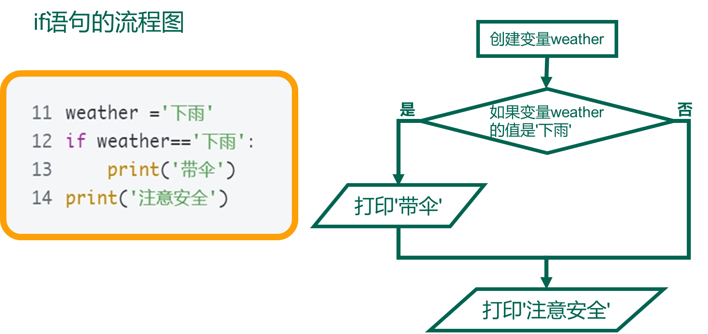
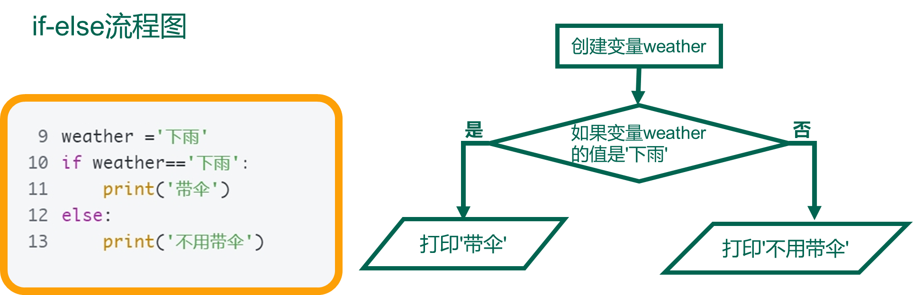
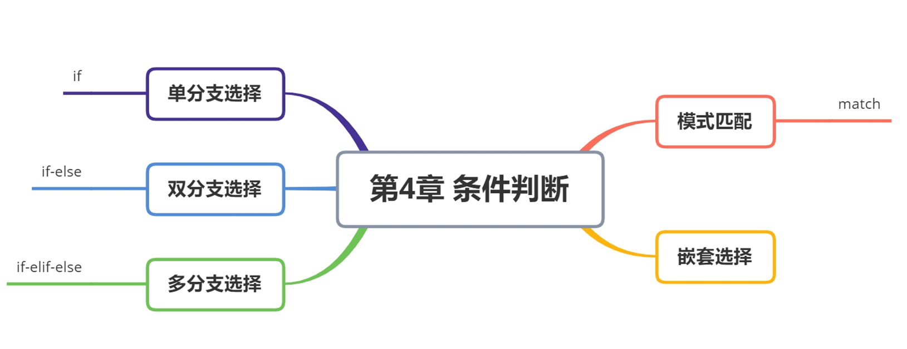

# 第4章 条件判断

## 顺序结构

在编程中，顺序结构是最基本的控制结构之一，它指的是程序中的语句按照它们出现的顺序依次执行。这种结构不需要任何条件判断或循环控制，代码会从上到下逐行执行。

**顺序结构示例**

下面是一个简单的Python示例，展示了顺序结构：

```python
# 打印一条消息
print("Hello, World!")

# 定义一个变量并打印它的值
x = 10
print("The value of x is:", x)

# 执行另一个操作
y = x + 5
print("The value of y is:", y)
```

在这个例子中，程序会按以下顺序执行：

1. 打印 "Hello, World!"。
2. 定义变量 `x` 并将其设置为 `10`。
3. 打印变量 `x` 的值。
4. 计算 `y = x + 5` 并将结果存储在 `y` 中。
5. 打印变量 `y` 的值。

## 第1节 单分支选择结构

### if(单分支)

在 Python 中，if 语句 就是用来进行判断的，格式如下：

```python
if 要判断的条件:
    条件成立时，要做的事情
    ……
```

> 注意：代码的缩进为一个 `tab` 键，或者 `4 个空格` —— **建议使用空格**

+ 在 Python 开发中，Tab 和空格不要混用！

我们可以把整个 if 语句看成一个完整的代码块

```python
# if基本语法
# 四个空格缩进
if True:
    print('条件成立才能看见我')


# 判断变量weather的值，打印是否需要带伞
# 如果值是下雨，则打印带伞
# 区分一个等于号和两个等于号的作用
weather ='下雨'
if weather=='下雨':
    print('带伞')

# 多行下级代码
if 1:
    print("1的布尔值是True")
    print("所以执行到这里了")
```

思考：判断天气时，无论什么天气都要打印'注意安全'

```python
# 加需求：无论什么天气打印注意安全
if 1:
    print(1)
print(2)


if True:
    print('条件成立才能看见我')
print('跟条件没关系，无论如何都能看见我')

# 加需求：无论是否下雨，都打印注意安全
weather ='下雨'
if weather=='下雨':
    print('带伞')
print('注意安全')
```


### 执行流程

```python
if 条件表达式:
	【代码块】
【后续代码】
```

如果条件表达式为真，则执行【代码块】。否则不执行，直接执行if语句后面的【后续代码】

注意：
【代码块】必须缩进
单if语句可以嵌套



### 判断年龄

需求
1. 定义一个整数变量记录年龄
2. 判断是否满 18 岁 （>=）
3. 如果满 18 岁，允许买烟

```python
# 1. 定义年龄变量
age = 18
# 2. 判断是否满 18 岁
# if 语句以及缩进部分的代码是一个完整的代码块
if age >= 18:
    print("可以买烟")
# 3. 思考！- 无论条件是否满足都会执行
print("这句代码什么时候执行?")
```

注意：
• if 语句以及缩进部分是一个 完整的代码块

## 第2节 双分支选择结构

### if-else（双分支）

#### 基本语法

```py
if 要判断的条件:
    条件成立时，要做的事情
    ……
else:
    条件不成立时，要做的事情
    ……
```

注意：

`if` 和 `else` 语句以及各自的缩进部分共同是一个 **完整的代码块**

```python
if 0:
    print("111111")
else:
    print("222222")
    
# 判断变量weather的值，打印是否需要带伞
# 如果值是下雨，则打印带伞
# 否则打印不带伞
weather ='下雨'
if weather=='下雨':
    print('带伞')
else:
    print('不用带伞')
```

### 执行流程：

```python
if 条件表达式:
    【语句块A】
else:
    【语句块B】
【后续代码】
```

> 如果条件表达式为真，执行【语句块A】然后执行【后续代码】，
> 否则执行【语句块B】，然后再执行【后续代码】，二选一，不可能既执行A又执行B
> 注意： 【语句块A】和【语句块B】必须缩进
> if-else可以嵌套

> if-else中间不能写同级代码，会报错



### 判断年龄改进

需求
1. 输入用户年龄
2. 判断是否满 18 岁 （>=）
3. 如果满 18 岁，允许进网吧嗨皮
4. 如果未满 18 岁，提示回家写作业

```python
# 1. 输入用户年龄
age = int(input("今年多大了？"))
# 2. 判断是否满 18 岁
# if 语句以及缩进部分的代码是一个完整的语法块
if age >= 18:
    print("可以进网吧嗨皮……")
else:
    print("应该回家写作业！")
# 3. 思考！- 无论条件是否满足都会执行
print("这句代码什么时候执行?")
```

## 第3节 多分支选择结构

### if-elif-else（多分支）

#### 基本语法

• 在开发中，使用 `if` 可以 **判断条件**
• 使用 `else` 可以处理 **条件不成立** 的情况
• 但是，如果希望 **再增加一些条件，条件不同，需要执行的代码也不同** 时，就可以使用 `elif`
• 语法格式如下：

```python
if 条件1:
    条件1满足执行的代码
    ……
elif 条件2:
    条件2满足时，执行的代码
    ……
elif 条件3:
    条件3满足时，执行的代码
    ……
else:
    以上条件都不满足时，执行的代码
    ……
```

• 注意
1. `elif` 和 `else` 都必须和 `if` 联合使用，而不能单独使用
2. 可以将 `if` 、`elif` 和 `else` 以及各自缩进的代码，看成一个 **完整的代码块**

### 执行流程

```python
if 条件1:
    【代码段1】
elif 条件2:
    【代码段2】
.........
条件n:
    【代码段n】
else:
    【else语句块】
【后续代码】
```

执行流程：**多选一**，

+ 如果满足条件1，执行【代码段1】，然后跳出if-elif语句，执行【后续代码】，
+ 否则判断是否满足条件2，如果满足执行【代码段2】，然后跳出if-elif语句，执行【后续代码】...。
+ 如果所有条件都不满足，执行【else语句块】，然后再执行【后续代码】。

注意：else是可选的，可以写也可以不写。


### **BMI计算**

```python
# bmi计算
# bmi=体重（kg）/(身高*身高（米）)
# bmi<18.5 过瘦 18.5-23.9 正常 >23.9 过胖

# 完成输入功能
height = float(input('请输入你的身高：'))
weight = float(input('请输入你的体重：'))
# 完成bmi值的计算
bmi = weight / (height * height)
print(bmi)

if bmi < 18.5:
    print("过轻")
elif bmi < 25:
    print("正常")
elif bmi < 28:
    print("过重")
elif bmi < 32:
    print("肥胖")
else:
    print("严重肥胖")
```

### 日期判断

需求：从控制台输入一个数字，如果是1则输出星期一，2则输出星期二，依次类推

```python
num = int(input())

# 全部使用if语句可以实现
if num == 1:
    print("星期一")
if num == 2:
    print("星期二")
if num == 3:
    print("星期三")
if num == 4:
    print("星期四")
if num == 5:
    print("星期五")
if num == 6:
    print("星期六")
if num == 7:
    print("星期日")
```

```python
num = int(input())

# 使用if-elif-else语句
if num == 1:
    print("星期一")
elif num == 2:
    print("星期二")
elif num == 3:
    print("星期三")
elif num == 4:
    print("星期四")
elif num == 5:
    print("星期五")
elif num == 6:
    print("星期六")
elif num == 7:
    print("星期日")
else:
    print("输入有误")
```

以上两种代码的执行效率不同
每一个`elif`都是对它上面所有表达式的否定

### 年龄判断

```
从控制台输入一个年龄
小于等于0 输入有误
0~3 婴儿
4~8 童年
9~18 少年
19~29 青年
30~39 壮年
40~49 中年
50~150 老年
150以上 老妖怪
```

```python
# 啰嗦版
age = int(input())

if age <= 0:
    print("输入有误")
elif 0 < age and age <= 3:
    print("婴儿")
elif 4 <= age and age <= 8:
    print("童年")
elif 9 <= age and age <= 18:
    print("少年")
elif 19 <= age and age <= 29:
    print("青年")
elif 30 <= age and age <= 39:
    print("壮年")
elif 40 <= age and age <= 49:
    print("中年")
elif 50 <= age and age <= 150:
    print("老年")
else:
    print("妖怪")
```

```python
# 正常版
age = int(input())
if age <= 0:
    print("输入有误")
elif age <= 3:
    print("婴儿")
elif age <= 8:
    print("童年")
elif age <= 18:
    print("少年")
elif age <= 29:
    print("青年")
elif age <= 39:
    print("壮年")
elif age <= 49:
    print("中年")
elif age <= 150:
    print("老年")
else:
    print("妖怪")
```

## 第4节 嵌套选择

### 多层判断

+ 开发中，使用 `if` 进行条件判断，如果希望 **在条件成立的执行语句中** 再 **增加条件判断**，就可以使用 **if 的嵌套**
+  if 的嵌套 的应用场景就是：**在之前条件满足的前提下，再增加额外的判断**
+  if 的嵌套 的语法格式，**除了缩进之外** 和之前的没有区别
+  语法格式如下：

```python
if 条件 1:
    条件 1 满足执行的代码
    .....

    if 条件 1 基础上的条件 2:
        条件 2 满足时，执行的代码
        .....
    else:
        条件 2 不满足时，执行的代码

# 条件 1 不满足的处理
else:
    条件 1 不满足时，执行的代码
    .....
```

```python
if 今天发工资:
	先还信用卡的钱
    if 有剩余:
        又可以happy了，O(∩_∩)O哈哈~
    else:
        噢，no。。。还的等30天
else:
    盼着发工资
```


### 火车站安检

需求
1. 定义布尔型变量 `has_ticket` 表示是否有车票
2. 定义整型变量 `knife_length` 表示刀的长度，单位：厘米
3. 首先检查是否有车票，如果有，才允许进行 **安检**
4. 安检时，需要检查刀的长度，判断是否超过 20 厘米
◦ 如果超过 20 厘米，提示刀的长度，不允许上车
◦ 如果不超过 20 厘米，安检通过
5. 如果没有车票，不允许进门

```python
# 定义布尔型变量 has_ticket 表示是否有车票
has_ticket = True
# 定义整数型变量 knife_length 表示刀的长度，单位：厘米
knife_length = 20

# 首先检查是否有车票，如果有，才允许进行 安检
if has_ticket:
    print("有车票，可以开始安检...")
    # 安检时，需要检查刀的长度，判断是否超过 20 厘米
    # 如果超过 20 厘米，提示刀的长度，不允许上车
    if knife_length >= 20:
        print("不允许携带 %d 厘米长的刀上车" % knife_length)
    # 如果不超过 20 厘米，安检通过
    else:
        print("安检通过，祝您旅途愉快……")
# 如果没有车票，不允许进门
else:
    print("大哥，您要先买票啊")
```


## 第5节 match语句

### match

Python中的`match` 语句是**Python 3.10**及以后版本中**引入的新特性**，用于模式匹配。它允许你根据对象的模式来检查对象，并执行相应的代码块。

下面是一个简单的match 语句的例子：

```python
x = 10

match x:
    case 1:
        print("x is 1")
    case 2:
        print("x is 2")
    case _:  # 匹配所有其他值
        print("x is not 1 or 2")
```

> 在这个例子中，我们使用 `match` 语句来检查变量x 的值。根据x 的值，我们可以选择执行不同的代码块。在上面的例子中，因为x 的值为10，所以会执行最后一个代码块，输出"x is not 1 or 2"。


`match` 语句中的每个代码块由一个或多个`case` 子句组成。每个case 子句后面跟着一个模式和一个代码块。当模式匹配成功时，会执行相应的代码块。如果没有任何模式匹配成功，则可以选择使用一个默认的代码块，使用下划线`_` 来表示。


除了数字匹配， `match` 语句还可以用于字符串、元组、列表、字典等类型的模式匹配。下面是一个字符串模式匹配的例子：

```python
text = "hello"

match text:
    case "hello":
        print("text is 'hello'")
    case "world":
        print("text is 'world'")
    case _:
        print("text is neither 'hello' nor 'world'")
```

在这个例子中，我们使用字符串模式来检查变量`text` 的值。如果text 的值是"hello"，则会执行第一个代码块；如果`text` 的值是"world"，则会执行第二个代码块；否则，会执行默认的代码块。


### match与if的对比

在Python中， `match` 语句和`if` 语句都可以用于条件判断，但它们的使用场景和功能有所不同。

**if语句：**

• `if` 语句是最基本的条件控制结构，用于基于条件测试执行不同的代码块。
• `if` 语句在处理简单条件和分支时非常有用。
• 你可以使用 `elif` （`else if`）来添加额外的条件分支。
• `if` 语句不支持模式匹配，只能基于**布尔表达式进行条件判断**。


**match语句：**

- `match` 语句是Python 3.10及以后版本引入的新特性，主要用于**模式匹配**。
- `match` 语句允许你根据对象的模式结构来检查对象，并根据匹配的模式执行相应的代码块。
- `match` 语句特别适用于处理复杂的数据结构，如元组、列表、字典等，以及自定义类的实例。
- 它通过模式匹配提供了更简洁、更直观的方式来处理复杂的条件逻辑。
- 你可以使用 `case` 子句来定义不同的模式，并指定要执行的代码块。
- 如果没有任何模式匹配成功，你可以使用默认的代码块（使用下划线 `_` 表示）。
- `match` 语句还可以与 `when` 关键字结合使用，以添加额外的条件判断。


**总结：**

• 当需要**基于布尔表达式进行条件判断**时，使用 `if` 语句。
• 当需要基于**对象的模式结构**进行条件匹配时，使用 `match` 语句。
• match 语句在处理复杂的数据结构和模式匹配时提供了一种更简洁、更直观的方式。

### 其他用法（了解）

`match` 语句接受一个表达式并把它的值与一个或多个 case 块给出的一系列模式进行比较。这表面上像 C、Java 或 JavaScript（以及许多其他程序设计语言）中的 switch 语句，但其实它更像 Rust 或Haskell 中的模式匹配。只有第一个匹配的模式会被执行，并且它还可以提取值的组成部分（序列的元或对象的属性）赋给变量。

最简单的形式是将一个主语值与一个或多个字面值进行比较：

```python
def http_error(status):
    match status:
        case 400:
        	return "Bad request"
        case 404:
        	return "Not found"
        case 418:
        	return "I'm a teapot"
        case _:
        	return "Something's wrong with the internet"
```

注意最后一个代码块：“变量名” `_` 被作为 通配符 并必定会匹配成功。如果没有 case 匹配成功，则不会执行任何分支。


你可以用 `|` （“或”）将多个字面值组合到一个模式中：

```python
case 401 | 403 | 404:
	return "Not allowed"
```

形如解包赋值的模式可被用于绑定变量：

```python
# point is an (x, y) tuple
match point:
    case (0, 0):
        print("Origin")
    case (0, y):
        print(f"Y={y}")
    case (x, 0):
        print(f"X={x}")
    case (x, y):
        print(f"X={x}, Y={y}")
    case _:
        raise ValueError("Not a point")
```

第一个模式有两个字面值，可视为前述字面值模式的扩展。接下来的两个模式结合了一个字面值和一个变量，变量 绑定 了来自主语（ `point` ）的一个值。第四个模式捕获了两个值，使其在概念上与解包赋值 (x, y) = point 类似。

(了解）

如果用类组织数据，可以用“类名后接一个参数列表”这种很像构造器的形式，把属性捕获到变量里：

```python
class Point:
    def __init__(self, x, y):
        self.x = x
        self.y = y

def where_is(point):
    match point:
        case Point(x=0, y=0):
            print("Origin")
        case Point(x=0, y=y):
            print(f"Y={y}")
        case Point(x=x, y=0):
            print(f"X={x}")
        case Point():
            print("Somewhere else")
        case _:
            print("Not a point")
```


## 案例实战

### bmi计算

需求：输入用户的身高（单位m），体重（单位kg）
输出：用户的bmi，身体健康情况的建议。
公式： bmi=体重（kg）/(身高*身高（米）)
范围：bmi<18.5 过瘦 18.5-23.9 正常 >23.9 过胖
进阶要求：判断用户输入的身高、体重是否是按照正确的单位输入的，如果不对，提醒用户按照正确的输入。

```python
# bmi计算
# bmi=体重（kg）/(身高*身高（米）)
# bmi<18.5 过瘦 18.5-23.9 正常 >23.9 过胖

# 完成输入功能
height = float(input('请输入你的身高：'))
weight = float(input('请输入你的体重：'))

# 输入验证
if 0 < height < 2 and 0 < weight < 100:
    # 完成bmi值的计算
    bmi = weight / (height * height)
    print(bmi)
    # 判断bmi的值
    if bmi < 18.5:
        print('太瘦了，多吃点吧')
    elif bmi < 23.9:
        print('非常健康，继续保持！')
    else:
        print('瘦点更漂亮哦')
else:
    print('身高在0~2米之间，体重在0~100kg之间，请检查输入！')
```

### 闰年判断

输入一个年份（大于 1582 的整数 ），判断这一年是否是闰年，如果是输出 1，否则输出 0。

```python
'''
公历闰年计算方法：
1、普通年能被4整除且不能被100整除的为闰年。（如2004年就是闰年,1900年不是闰年）
2、世纪年能被400整除的是闰年。(如2000年是闰年，1900年不是闰年)
'''
year = int(input("输入一个年份: "))
if (year % 4) == 0:
    if (year % 100) == 0:
        if (year % 400) == 0:
            print('%d 是闰年'%year) # 整百年能被400整除的是闰年
        else:
            print('%d 不是闰年'%year)
    else:
        print('%d 是闰年'%year) # 非整百年能被4整除的为闰年
else:
    print('%d 不是闰年'%year)


# 简单版
(year % 4 == 0 and year % 100 != 0) or year % 400 == 0
```

### 三角形判断

输入三角形的三条边的长度a,b,c
• 如果三条线段不能组成一个三角形，输出不能组成三角形；
• 如果是直角三角形，输出直角三角形；
• 如果是锐角三角形，输出锐角三角形；
• 如果是钝角三角形，输出钝角三角形；
• 如果是等腰三角形，输出等腰三角形；
• 如果是等边三角形，输出等边三角形。
如果这个三角形符合以上多个条件，请分别输出，并用换行符隔开。

```python
x = input("请输入三个整数，以空格隔开: ").split()
x.sort()  # 从小到大排序
x1, x2, x3 = int(x[0]), int(x[1]), int(x[2])

if x1 + x2 > x3:  # 两边之和大于第三边
    if x1 ** 2 + x2 ** 2 == x3 ** 2:
        print('直角三角形')
    elif x1 ** 2 + x2 ** 2 > x3 ** 2:
        print('锐角三角形')
    else:
        print('钝角三角形')

    if x1 == x2 or x2 == x3:  # 两边相等
        print('等腰三角形')
    if x1 == x2 and x2 == x3:  # 三边相等
        print('等边三角形')
else:
    print('不能组成三角形')
```

## 总结与习题

### 知识总结



### 单词总结

| **单词** | **释义** |
| -------- | -------- |
| if       | 如果     |
| else     | 否则     |
| match    | 匹配     |

### 课后甜点

代码规范

**缩进**

条件判断、循环、函数定义的时候都需要用缩进来控制代码块结束

小技巧：一般句尾有冒号时，都是需要缩进的

四个空格或者一个tab键为一个缩进

**代码编排**

缩进4个空格，不能用tab键和空格混合缩进

所有行限制的最大字符数为79

添加适当的空行

**空格**

二元运算符两边添加一个空格

逗号、分号、冒号后边留一个空格，前面不留

```python
if x == 4:
    print(x, y)
    x, y = y, x
```

​	◦ 紧跟在小括号，中括号或者大括号后 不要留空格

```python
正确： spam(ham[1], {eggs: 2})
错误: spam( ham[ 1 ], { eggs: 2 } )
```

### 生命游戏

生命游戏（Game of Life），也被称为康威生命游戏或康威生命游戏，是由英国数学家约翰·康威在1970年提出的一种模拟生命演化的游戏。这个游戏的目的是通过模拟生命的进化过程，展示生命的复杂性和自组织特性。
生命游戏的规则非常简单：在一个二维网格上，每个格子代表一个细胞，每个细胞有两种状态 - 存活或死亡。每个细胞的状态会根据其邻居的数量而发生变化。具体的规则如下：

1. 如果一个细胞周围有2个或3个存活细胞，则该细胞存活到下一轮。
2. 如果一个细胞周围有0个或1个存活细胞，则该细胞死亡。
3. 如果一个细胞周围有4个或更多的存活细胞，则该细胞死亡。

在每一轮中，根据上述规则，存活和死亡的细胞状态都会更新。这个过程可以模拟生命的进化过程，因为细胞的生死状态会受到周围细胞的影响。
有趣的是，尽管生命游戏的规则非常简单，但它能够产生各种复杂的模式和结构。这些模式有时呈现出类似于自然界中的复杂系统，例如生物群落和生态系统。通过观察这些模式的变化和演化，人们可以深入了解生命的复杂性和自组织特性。
此外，生命游戏也被用于研究和模拟各种自然现象，例如生态系统的稳定性、人口动态、甚至量子物理中的某些现象。它已经成为计算机科学和复杂性科学领域的一个重要工具。
总之，生命游戏是一种有趣且富有启发性的模拟游戏，它通过简单的规则展示了生命的复杂性和自组织特性。通过学习和研究这个游戏，人们可以深入了解生命的本质和进化的过程。

### 小试牛刀

#### 选择题

1. 下列数值填入①处后，不能输出 a 的是（ ）

if _①__:
	print(“a”)
A． 3
B． 2
C． 1
D． 0

答案：D

2. 关于 Python 的分支结构，以下选项中描述错误的是
A. 分支结构使用 if 保留字
B. Python 中 if-else 语句用来形成二分支结构
C. Python 中 if-elif-else 语句描述多分支结构
D. 分支结构可以向已经执行过的语句部分跳转
正确答案： D

3. 下列Python保留字中，不用于表示分支结构的是
A. elif
B. in
C. if
D. else
正确答案：B

4. 运行下方代码段，输出的是（ ）。

```py
a, b, c, d = 0, 1, 2, None
if (a and c):
	d = a * b
elif (b or c):
	d = a + c
elif not b:
	d = b
print(d)
```

A． 0
B． 1
C． 2
D． None
答案：C

5. python多条件判断，可以用（）来实现。
A. elif
B. else
C. swticn
D. ifelse
答案：A

#### 编程练习

定义一个整数变量 age ，编写代码判断年龄是否正确
• 要求人的年龄在 0-120 之间

```python
age = input('请输入年龄：')
age = int(age)
if age <= 120 and age >= 0:
    print('正确')
else:
    print('错误')
    
    
age = input('请输入年龄：')
age = int(age)
if 0 <= age <= 120:
    print('正确')
else:
    print('错误')
```


定义两个整数变量 python_score 、c_score ，编写代码判断成绩
◦ 要求只要有一门成绩 >= 60 分就算合格

```python
python_score = input('请输入python课程的成绩：')
c_score = input('请输入c课程的成绩：')
python_score = int(python_score )
c_score = int( c_score )
if python_score >= 60 or c_score >= 60:
    print('合格')
else:
    print('不合格')
    
    
py_score = input('请输入你的python课程成绩：')
c_score = input('请输入你的C课程成绩：')

# isdigit()判断是否为数字
if py_score.isdigit() and c_score.isdigit():
    py_score = int(py_score)
    c_score = int(c_score)
    if py_score>=60 or c_score>=60:
        print('合格')
    else:
        print('重修')
else:
    if not py_score.isdigit():
        print('py的成绩必须输入数字！')
    if not c_score.isdigit():
        print('c的成绩必须输入数字！')
```

定义一个布尔型变量 is_employee ，编写代码判断是否是本公司员工
◦ 如果不是提示不允许入内

```python
# 练习3: 定义一个布尔型变量 `is_employee`，编写代码判断是否是本公司员工
is_employee = True
# 如果不是提示不允许入内
if not is_employee:
    print("不允许入内")

```

