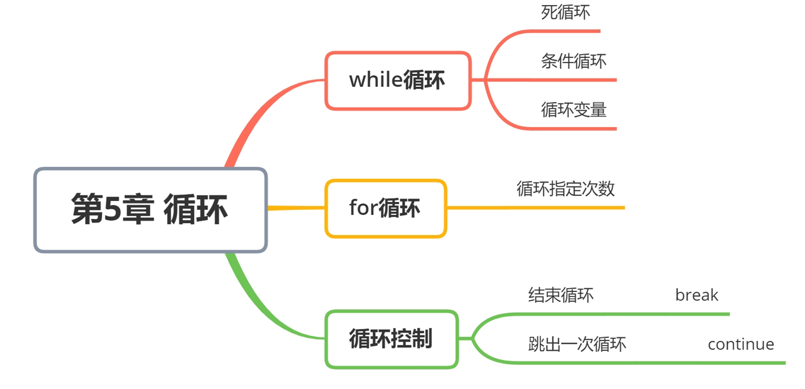
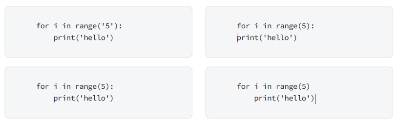
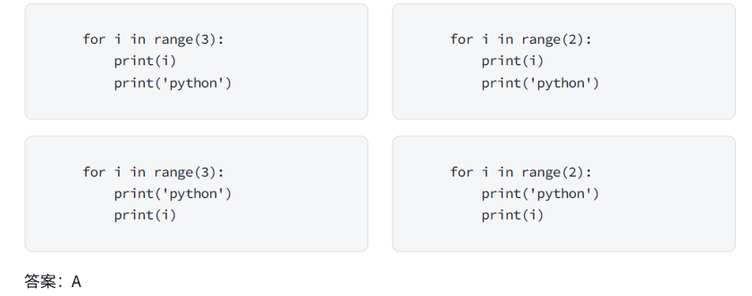

# 第5章 循环

## 第一节 循环

### while

• 循环的作用就是让 **指定的代码 重复**的执行
• `while` 循环最常用的应用场景就是 让执行的代码 按照 指定的次数 重复 执行

需求 —— 打印 5 遍 Hello Python
思考 —— 如果要求打印 100 遍怎么办？

#### while

```python
初始条件设置 —— 通常是重复执行的 计数器

while 条件(判断 计数器 是否达到 目标次数):
    条件满足时，做的事情1
    条件满足时，做的事情2
    条件满足时，做的事情3
    ...(省略)...
    处理条件(计数器 + 1)
```

注意：

• while 语句以及缩进部分是一个 完整的代码块

例子：打印 5 遍 Hello Python

```python
# 1. 定义重复次数计数器
i = 0
# 2. 使用 while 判断条件
while i < 5:
    print("Hello Python")  # 要重复执行的代码
    i = i + 1  # 处理计数器 i
    print("循环结束后的 i = %d" % i)

print(f"\n循环结束时的 i = {i}")
```

工作原理：
遇到while语句时，首先计算表达式的值
如果表达式的值为假，则跳过整个while语句，继续执行下面的代码；
如果表达式的值为真，则执行循环体。
执行完“循环体”再次计算“表达式”的值。如此循环往复直到“表达式”的值为假才停止循环

> 注意：循环结束后，之前定义的计数器条件的数值是依旧存在的

#### 练习

需求
• 高斯求和
计算1+2+3+……+100的和

```python
num = 1
sum = 0
while num <= 100:
    sum = sum + num
    num += 1

print("sum = %d" % sum)
```

#### 死循环

概念：条件始终为真的循环称为死循环

```python
while 1:
	print("放我出去！")
```

> 在循环语句中，表达式永远为真.导致循环持续执行，程序无法终止

```python
while True:
	#循环体
    
while 1:
	#循环体
```


#### while嵌套

• while 嵌套就是： while 里面还有 while

```python
while 条件 1:
    条件满足时，做的事情1
    条件满足时，做的事情2
    条件满足时，做的事情3
    ...(省略)...

    while 条件 2:
        条件满足时，做的事情1
        条件满足时，做的事情2
        条件满足时，做的事情3
        ...(省略)...
        处理条件 2
    处理条件 1

while 条件1： #外层循环
    【语句块A】
    while 条件2： #内存循环
        【语句B】
```

执行流程：首先判断外层循环的条件1，如果为真，则执行循环体中的【语句块A】，执行内层循环，判断条件2是否成立，如果成立，执行内层循环的【语句块B】，执行完内层循环后，重新判断外层循环条件....

• 特点：外层循环走一步，内层循环执行一遍
• 外层循环和内层循环的循环变量必须不同


### for循环

`range()` 函数可以用来创建一个数字序列，常与for 循环结合使用来重复执行代码块指定的次数。

```python
for i in range(5):
    # 这里是要重复执行的代码块
    print("这是第", i+1, "次循环")
```

在这个例子中， `range(5)` 创建了一个包含数字0到4的序列（总共5个数字）。`for` 循环会依次取这个序列中的每个数字，并执行循环体中的代码。由于`i` 是从0开始的，所以在打印语句中我们使用`i+1` 来确保输出是从1开始的序号。

#### 使用range() 带索引

```python
# 方法一：仅使用 range()
for index in range(50, 100, 2):
    print(index, sep="\t=\t")

# 方法二：使用 enumerate() 获取索引和值
for index, item in enumerate(range(50, 100, 2)):
    print(index, item, sep="\t=\t")
```

#### 计算1+2+3+……+100的和

```python
sum = 0
for x in range(1, 101):
	sum += x
print("sum = %d"%sum)
```

#### 阶乘和

```python
# 1!+2!+3!..+n!  for实现
result2 = 0
for n in range(20):
    if n>0:
        result = 1
        for i in range(n+1):
            if i>0:
                result *= i
        print(result)
        result2 += result
print(result2)


# 1!+2!+3!..+n! while实现
result2 = 0
n = 1
while n<=4:
    result = 1
    m = 1
    while m<=n:
        result *= m
        m += 1
    result2 += result
    n +=1
print(result2)
```


## 第2节 循环控制

### break

作用：退出循环

> 注意：只能跳出距离最近的for或者while循环

• 在循环过程中，如果 **某一个条件满足后**，**不** 再希望 **循环继续执行**，可以使用 `break` 退出循环

```python
i = 0

while i < 10:
    # break 某一条件满足时，退出循环，不再执行后续重复的代码
    if i == 3:
        break
    print(i)
    i += 1
print("over")
```

> `break` 只针对当前所在循环有效

```python
# for循环中使用
for x in range(10):
    if x == 5:
        # 结束循环(跳出循环)
        break
    print("x = %d" % x)

# 嵌套循环中使用
for x in range(3):
    for y in range(5):
        if y == 3:
            break
        print("******", y)
    print("-------", x)
```

> 调试代码，观察代码执行过程


**判断质数**

输入一个数字，判断该数字是不是质数

```python
n = int(input('请输入一个数字：'))
flag = True
for i in range(2,n):
    if n % i == 0:
        print('不是质数')
        flag = False
        break
if flag:
    print('是一个质数')
```

### continue

作用：跳过本次循环后面的剩余语句，然后继续下一次循环
注意：只能跳过距离最近的for或者while循环

```python
for x in range(10):
    if x == 5:
        continue
    print("x = %d" % x)
```

```python
num = 0
while num < 10:
    if num == 5:
        num += 1
        continue
    print("num = %d"%num)
    num += 1


num = 0
while num < 10:
    if num == 5:
        continue
        num += 1
    print("num = %d"%num)
    num += 1


i = 0
while i < 10:
    # 当 i == 7 时，不希望执行需要重复执行的代码
    if i == 7:
        i += 1
        continue
    # 重复执行的代码
    print(i)
    i += 1
```

> • 在**循环过程中**，如果 **某一个条件满足后**，**不** 希望 **执行循环代码**，但是又不希望退出循环，可以使用 `continue`
> • 也就是：在整个循环中，**只有某些条件**，不需要执行循环代码，而其他条件都需要执行
> • 需要注意：使用 `continue` 时，**条件处理部分的代码，需要特别注意**，不小心会出现 **死循环**

> `continue` 只针对当前所在循环有效

**水仙花数**

"水仙花数"是指一个三位数，其各位数字立方和等于该数本身

```python
for n in range(100, 1000):
    i = n // 100
    j = n // 10 % 10
    k = n % 10
    if k ** 3 > n:
        continue
    if n == i ** 3 + j ** 3 + k ** 3:
        print(n)
```


### while-else

格式

```python
while 表达式：
	循环体
else:
	【else语句块】
```

说明：当while语句正常执行完成之后，执行【else语句块】，如果用break跳出循环则不执行else

```python
num = 1
sum = 0
while num <= 5:
    sum = sum + num
    if sum==10:
        break
    num += 1
else:
    print('没有执行break需要执行语句')
```

### for-else

在 `Python` 中完整的 `for` `循环` 的语法如下：

```python
for 变量 in 集合:
	循环体代码
else:
	没有通过 break 退出循环，循环结束后，会执行的代码
```

### pass

作用：当语句要求不希望任何命令或代码来执行时使用
说明：

1. pass语句表示一个空操作，在执行时没有任何的响应，pass的位置最终应该有代码来执行，只不过暂时写不出来
2. 可以使用在流程控制和循环语句中

```py
if 1:
	pass
```


### 应用场景

#### 暴力穷举算法

穷举算法（Brute Force Algorithm）是一种最直接、最简单但通常效率较低的算法。它通过**遍历所有可能的解来寻找问题的答案**，适用于规模较小的问题或没有更高效方法的情况下。

------

**特点**

1. **简单直接**：实现容易，适用于初学者和快速原型设计。
2. **保证正确性**：如果问题有解，穷举法一定能找到。
3. **计算成本高**：通常时间复杂度较高，随着输入规模增加，执行时间呈指数增长。
4. **适用于小规模问题**：在数据量较小时可以使用，但对于大规模问题通常不实用。

---

> 一只小猴买了若干个桃子。
> 第一天他刚好吃了这些桃子的一半，又贪嘴多吃了一个；
> 第二天他也刚好吃了剩余桃子的一半，贪嘴多吃了一个；
> 第三天他又刚好吃了剩下的桃子的一半，并贪嘴多吃了一个。
> 第四天起来一看，发现桃子只剩下一个了。
> 请问小猴买了几个桃子？

```python
# 穷举
peach = 1
while True:
    d1 = peach//2 -1
    d2 = d1//2 -1
    d3 = d2//2 - 1
    if d3==1:
        print(peach)
        break
    peach += 1
```

> 问题正向不好分析，可以通过列举所有可能性，找出符合要求的


#### 迭代字典

• 在 迭代遍历 嵌套的数据类型时，例如 一个列表包含了多个字典
• 需求：要判断 某一个字典中 是否存在 指定的 值
◦ 如果 存在，提示并且退出循环
◦ 如果 不存在，在 循环整体结束 后，希望 得到一个统一的提示

**使用案例**

```python
students = [
    {"name": "阿土",
     "age": 20,
     "gender": True,
     "height": 1.7,
     "weight": 75.0
     },
    {"name": "小美",
     "age": 19,
     "gender": False,
     "height": 1.6,
     "weight": 45.0}
]

find_name = "阿土"
for stu_dict in students:
    print(stu_dict)
    # 判断当前遍历的字典中姓名是否为find_name
    if stu_dict["name"] == find_name:
        print("找到了")
        break
else:
    print("没有找到")
print("循环结束")

```

#### 判断质数效率优化对比

```python
# 计算一个数字是不是质数
'''100以内的质数'''
from math import sqrt

res1 = []
res2 = []
m = 100000000
import time

st = time.time()
# 方法一
# 1000wan算不出来
for x in range(2, m + 1):
    k = int(sqrt(x + 1))
    for i in range(2, k + 1):
        if x % i == 0:
            break
    else:
        # print('%-4d' % m)
        res1.append(x)
end = time.time()

print('-' * 50)
# 方法二
a = [1] * (m + 1)
a[0] = a[1] = 0
for i in range(2, m + 1):
    if a[i] == 1:
        for j in range(i * i, m + 1, i):
            if j % i == 0:
                a[j] = 0
for i, j in enumerate(a):
    if j != 0:
        # print(i)
        res2.append(i)
print('方法一用时：', end - st, len(res1))
print('方法二用时：', time.time() - end, len(res2))

```


## 总结及习题

### 知识总结



### 单词总结

| **单词** | **释义**   |
| -------- | ---------- |
| while    | 当....时候 |
| for      | 为了，对于 |
| break    | 打断       |
| continue | 继续       |
| pass     | 跳过       |
| range    | 范围       |

### 课后甜点

#### 指数爆炸

指数爆炸是一个数学术语，指的是指数函数在符合一定的条件时，其增长速度超过任何线性关系的情况。

指数函数在数学中是一个非常重要的函数类型，其定义是`y=a^x`（a>0且a≠1），其中a是底数，x是指数。当x增加时，如果a>1，指数函数会无限增加；如果0<a<1，指数函数会无限趋近于0。

指数爆炸主要发生在当指数非常大时，因为这时指数函数的增长速度会变得非常快。例如，当x=10
时，`2^x=1024`；当x=20时，`2^x=4194304`，已经远远超过了1024。这就是指数爆炸的一种表现。

在密码学中，指数爆炸是一个非常严重的问题。例如，在某些加密算法中，随着密钥长度的增加，加密和解密的时间复杂度可能会以指数方式增长，导致加密算法的效率变得非常低下，甚至无法使用。因此，在设计加密算法时需要特别注意避免出现指数爆炸的问题。

总的来说，指数爆炸是一种数学现象，在某些情况下可能会导致算法或计算效率低下甚至无法使用。因此，在设计算法或计算时需要特别注意避免出现指数爆炸的问题。

指数爆炸例子包括：
1. 折纸游戏：一张纸对折一次，厚度变成原来的2倍。再对折第二次，变为原来的2的2次方倍即4倍。以此类推，假设纸的厚度为0.1mm，则对折24次以后，长度超过1千米；对折39次达55000千米，超过地球赤道长度；对折42次达44万千米，超过地球至月球的距离；对折51次达22亿千米，超过地球至太阳的距离；对折82次为51113光年，超过银河系半径的长度。
2. 国王与麦粒的故事：古印度有个国王，他拥有数不尽的财富和至高无上的权力。有一天，国王的宰相发明出国际象棋，国王被这款新奇的游戏深深吸引，给国王枯燥的生活增添了无穷的乐趣。为了奖励自己的宰相，国王许诺宰相可以满足他的任意一个要求。宰相若有所思后说道：“陛下，请您在这张棋盘的第一个小格内赏我1粒麦子；第二个小格内给2粒，第三格内给4粒……照这样下去，每一格都比前一个小格加一倍。把这样摆满棋盘上所有格（共64格）的麦粒，都赏给您的仆人吧！” 国王一听，觉得这个要求很简单嘛，于是爽快的答应了下来。很快，计数麦子的工作开始了。1粒、2粒、4粒、8粒、16粒、32粒、64粒、128粒、256粒、512粒、1024粒…… 一袋又一袋的麦子被搬运到棋盘前，但是麦粒数一格接一格增长得越来越迅速，国王很快就发现，掏空国库、甚至拿出全印度的小麦，也无法兑现他对宰相许下的诺言！

```python
# 初始化棋盘大小和麦粒数量
board_size = 64
grains = 0
# 遍历棋盘上的每一个格子
for i in range(board_size):
    # 每个格子的麦粒数是2的i次方
    grain_on_current_square = 2 ** i
    # 累加每个格子的麦粒数
    grains += grain_on_current_square
    
# 输出结果
print(f"国王需要给宰相 {grains} 粒麦子。")

# 人生的复利 (1+0.01)=1.01
day = 0
total = 1
while day<365:
    total = total*0.99
    print(total)
    day += 1

```

3. 计算机中的指数爆炸：计算机方面运用“指数爆炸”是指在求解某个问题时，须考虑的情况随着问题的规模翻着番上升的现象。“歧路亡羊”就是典型的“指数爆炸”。

### 小试牛刀

#### 选择题

1. 下列关于for循环说法正确的是？
A. 循环变量i是从1开始的。
B. range后面括号中的数字表示循环的次数。
C. for循环语句中只能有一句下级代码。
D. 循环变量i的值是一直不变的。
答案：B

2. 执行这段代码，打印的结果是

```python
for i in range(5):
	print(i)
```

```
A. 5 5 5 5 5
B. 0 1 2 3 4
C. 1 2 3 4 5
D. 0 1 2 3 4 5
```

答案:B
for循环的括号中填写的是重复执行的次数。
for中的循环变量i, 都是从0开始, 而后面每次循环中i都会变大1。

3. 下列哪个选项可以在输出区打印5遍hello？



答案：C

4. 执行以下代码的运行结果是（ ）

   ```python
   for i in range(2):
   	print('python')
   	print('python')
   ```

   ```
   A. python
   
   B. python
   python
   
   C. python
   python
   python
   
   D. python
   python
   python
   python
   ```

   答案：D

5. 以下哪个选项可以在输出区打印出以下内容（ ）

0
python
1
python
2
python



6. while循环，在给定的判断条件为True时（）循环体，否则退出循环体。

A. 不执行
B. 执行
C. 不确定
D. 无法确定
答案：B

7. for循环是用来（）执行语句

A. 重复
B.无限
C. 无穷
D. 不停
答案：A

8. break是在语句块执行过程中终止循环，并且（）整个循环。

A. 跳出
B. 终止
C. 执行
D. 重复
答案：A

#### 编程题

##### 打印字符

```python
'''
打印出m行n列的图形
*****
*****
*****
*****
'''
m = 10
n = 100
for i in range(m):
    print('*' * n)

```

##### 等腰三角形

```python
'''
打印出n行的字符三角形
   * i=0,*=1,[]=3
  *** i=1,*=3,[]=2
 ***** i=2,*=5,[]=1
******* i=3,*=7,[]=0
'''
n=10
for i in range(n):
    print(' ' * (n-1-i) + '*' * (i*2+1) + ' ' * (n-1-i) )
```

##### 99乘法表

```python
'''
1x1=1
1x2=2 2x2=4
1x3=3 2x3=6 3x3=9
...
...
1x9=9.........9x9=81
'''
for i in range(9):
    for j in range(i+1):
        print('%dx%d=%d'% (j+1,i+1,(j+1)*(i+1)),end=' ')
    print()
    
    
for i in range(1, 10):
    for j in range(1, i + 1):
        print(f"{i} * {j} = {i * j}", end="\t")
    print()
```

