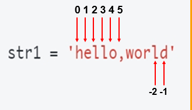
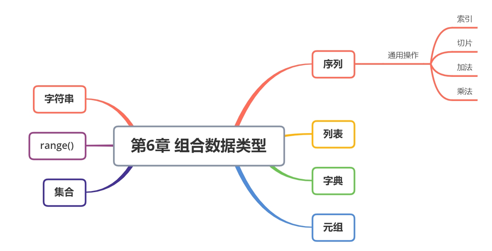

## 序列

在python中，有这样一些类型，它们的成员是有序排列的，并且可以通过下标访问成员，这些类型称之为序列。

包括：`列表`、`range`、`元组`和`字符串`；

### 序列的通用操作

| **函数**  | **描述**             | **备注**                      |
| --------- | -------------------- | ----------------------------- |
| len(item) | 计算容器中元素个数   |                               |
| del(item) | 删除变量             | del  有两种方式               |
| max(item) | 返回容器中元素最大值 | 如果是字典，只针对  key  比较 |
| min(item) | 返回容器中元素最小值 | 如果是字典，只针对  key  比较 |


| **描述** | **Python** **表达式** | **结果** | **支持的数据类型** |
| -------- | --------------------- | -------- | ------------------ |
| 切片     | "0123456789"[::-2]    | "97531"  | 字符串、列表、元组 |


| **运算符**    | **Python** **表达式**  | **结果**                      | **描述**       | **支持的数据类型**       |
| ------------- | ---------------------- | ----------------------------- | -------------- | ------------------------ |
| +             | [1,  2] + [3, 4]       | [1,  2, 3, 4]                 | 合并           | 字符串、列表、元组       |
| *             | ["Hi!"]  * 4           | ['Hi!',  'Hi!', 'Hi!', 'Hi!'] | 重复           | 字符串、列表、元组       |
| in            | 3  in (1, 2, 3)        | True                          | 元素是否存在   | 字符串、列表、元组、字典 |
| not  in       | 4  not in (1, 2, 3)    | True                          | 元素是否不存在 | 字符串、列表、元组、字典 |
| >  >= == < <= | (1,  2, 3) < (2, 2, 3) | True                          | 元素比较       | 字符串、列表、元组       |


## 列表

存储一个数据可以采用变量

问题：需要同时存储多个数据，该怎么做？

```python
# 需求：有5个人的年龄，求平均年龄
age1 = 10
age2 = 32
age3 = 43
age4 = 18
age5 = 90

average = (age1 + age2 + age3 + age4 + age5) / 5
```

### 列表的定义

+ List（列表） 是 Python 中使用 **最频繁** 的数据类型，在其他语言中通常叫做 **数组**
+ 专门用于存储 **一串 信息**
+ 列表用 [ ] 定义，**数据** 之间使用 , 分隔
+ 列表的 **索引** 从 0 开始
+ **索引** 就是数据在 **列表** 中的位置编号，**索引** 又可以被称为 **下标**
+ 注意：从列表中取值时，如果 **超出索引范围**，程序会报错

### 创建列表

语法：`列表名 = [ 元素1，元素2，元素3.....]`

```python
# 列表的创建
list1 = []  # 空列表
print(list1)
print(type(list1)) # <class 'list'>

# 创建一个包含多个不同类型元素的列表
list2 = [1, 2, 3, True, False, 'hello']
print(list2)

# 类型转换：把参数转换为列表
list3 = list() 
print(list3)
list3 = list('12345678') # 类型转换：str-->list
print(list3) # ['1', '2', '3', '4', '5', '6', '7', '8']
```

### 列表的常用操作

```python
list2 = [1, 2, 3, True, False, 'hello']
list3 = list('12345678')
# 此时 list3 = ['1', '2', '3', '4', '5', '6', '7', '8']

# 1. 列表的索引
print(list3[5])
# 索引从 0 开始，因此 list3[5] 对应元素 '6'，输出：6

# 2. 列表的切片
print(list3[2:6:2])
# 取下标范围 [2, 6)，步长 2，对应索引 2, 4，即 '3' 和 '5'，输出：['3', '5']

# 3. 列表的加法（拼接）和乘法（重复）
print(list3 + list2)
# 列表相加就是将两个列表拼接在一起：
# ['1', '2', '3', '4', '5', '6', '7', '8', 1, 2, 3, True, False, 'hello']

print(list3 * 3)
# 列表相乘会重复自身 3 次：
# ['1', '2', '3', '4', '5', '6', '7', '8',
#  '1', '2', '3', '4', '5', '6', '7', '8',
#  '1', '2', '3', '4', '5', '6', '7', '8']

# 4. 列表的成员运算
print('1' not in list3)
# 判断字符串 '1' 是否不在 list3 中。实际 '1' 在 list3 里，所以返回 False

print('1' in [1, 2, 3, 4])
# 这里 '1' 是字符串，与整数 1 不同类型，因此结果是 False

print([3, 2, 3, 4] < [2, 1])
# Python 会从左到右逐元素比较：比较第一个元素 3 与 2，
# 由于 3 > 2，所以 [3, 2, 3, 4] < [2, 1] 为 False

# 5. 内置函数 函数名()
print(len(list3))  # 求元素个数，结果 8
print(max(list3))  # 求元素的最大值。list3 全部是字符串，按字符比较，'8' 最大
print(min(list3))  # 求元素的最小值。'1' 最小

del list3  # 删除变量 list3
```

### 列表的遍历

+ 遍历 就是 从头到尾 依次 从 列表 中获取数据
+ 在 循环体内部 针对 每一个元素，执行相同的操作

```python
# 定义一个包含整数、布尔值和字符串的列表
list2 = [1, 2, 3, True, False, 'hello']

# 列表的遍历
# 遍历列表中的每个元素，并打印出来
for i in list2:
    print(i)

# 枚举遍历
# 使用enumerate函数同时获取列表中的索引和值，打印出来
for i, j in enumerate(list2):
    print(i, j)

# 索引遍历
# 使用range和len函数结合列表的索引来遍历并打印每个元素
for i in range(len(list2)):
    print(i, list2[i])
```

### 列表的常用方法

| **分类** | **关键字** **/**  **函数** **/**  **方法** | **说明**                  |
| -------- | ------------------------------------------ | ------------------------- |
| 增加     | 列表.insert(索引,  数据)                   | 在指定位置插入数据        |
|          | 列表.append(数据)                          | 在末尾追加数据            |
|          | 列表.extend(列表2)                         | 将列表2  的数据追加到列表 |
| 修改     | 列表[索引]  = 数据                         | 修改指定索引的数据        |
| 删除     | del  列表[索引]                            | 删除指定索引的数据        |
|          | 列表.remove[数据]                          | 删除第一个出现的指定数据  |
|          | 列表.pop                                   | 删除末尾数据              |
|          | 列表.pop(索引)                             | 删除指定索引数据          |
|          | 列表.clear                                 | 清空列表                  |
| 统计     | len(列表)                                  | 列表长度                  |
|          | 列表.count(数据)                           | 数据在列表中出现的次数    |
| 排序     | 列表.sort()                                | 升序排序                  |
|          | 列表.sort(reverse=True)                    | 降序排序                  |
|          | 列表.reverse()                             | 逆序、反转                |

```python
# 列表的常用方法method  变量.方法名()

list3 = list('12345678')
# 将字符串 '12345678' 转换成列表，得到 ['1','2','3','4','5','6','7','8']
# list3 = ['1', '2', '3', '4', '5', '6', '7', '8']

# 1. 添加元素 append()
list3.append('666')
print(list3)
# append() 在列表末尾添加一个新元素，'666' 作为单个元素追加
# 结果: ['1','2','3','4','5','6','7','8','666']

# 2. 添加列表 extend()
list3.extend([1, 2, 3])
print(list3)
# extend() 会把传入的列表 [1, 2, 3] 中的每个元素依次添加到原列表末尾
# 结果: ['1','2','3','4','5','6','7','8','666', 1, 2, 3]

# 3. 插入元素 insert()
list3.insert(2, 'hello')
print(list3)
# insert(索引, 元素) 会在指定索引处插入元素，原位置及其后元素依次向后移动
# 此处在索引 2 插入 'hello'，结果: ['1','2','hello','3','4','5','6','7','8','666',1,2,3]

# 4. 根据索引删除元素 pop()
list3.pop(3)
print(list3)
# pop(索引) 会移除并返回指定索引的元素，这里移除索引 3（即 '3'）
# 结果: ['1','2','hello','4','5','6','7','8','666',1,2,3]

# 5. 根据元素删除 remove()
list3.remove('7')
print(list3)
# remove(元素) 会删除列表中首次出现的指定元素，这里删除 '7'
# 结果: ['1','2','hello','4','5','6','8','666',1,2,3]

# 再次添加 'hello'
list3.append('hello')
print(list3)
# 结果: ['1','2','hello','4','5','6','8','666',1,2,3,'hello']

list3.remove('hello')
print(list3)
# remove('hello') 会删除首次出现的 'hello'（即索引 2 的那个），
# 并不会删除最后一个 'hello'
# 结果: ['1','2','4','5','6','8','666',1,2,3,'hello']

# 6. 清空列表 clear()
list3.clear()
print(list3)
# clear() 会删除列表中的所有元素，结果变为空列表 []


# 计算若干个人的平均年龄
age = [10,20,30,40,23,45,78,43]
print(sum(age) / len(age))
```


### 二维列表

•概念：列表中的元素是列表的列表

```py
# 定义一个嵌套列表（二维列表）
li1 = [
    [1, 2, 3],
    [4, 5, 6],
    [7, 8, 9]
]

# 访问单个元素
print("li1[1][1] =", li1[1][1])  # 输出 5

# 1. 使用 for-in 遍历
print("使用 for-in 遍历所有元素：")
for row in li1:        # row 是每一个子列表
    for elem in row:   # elem 是子列表中的每个元素
        print(elem, end=" ")
    print()  # 每遍历完一行后换行

# 2. 使用下标遍历
print("使用下标索引遍历所有元素：")
for i in range(len(li1)):          # i 表示子列表的索引
    for j in range(len(li1[i])):   # j 表示子列表中元素的索引
        print(li1[i][j], end=" ")
    print()
```


## 元组

+ Tuple（元组）**与列表类似**，不同之处在于元组的 **元素不能修改**
+  **元组** 表示多个元素组成的序列
  + 用于存储 一串 信息，数据 之间使用 `,` 分隔
  + 元组用 `()` 定义

```python
# 元组的创建
tuple1 = (1, 2, 3, True, 'hello')
print(tuple1)
print(type(tuple1))
list1 = [1]
print(list1)
tuple2 = (1, )   # 元组里只有一个元素时，加一个逗号 原因：区分数学运算
print(tuple2)
print(type(tuple2))
tuple3 = tuple()  # tuple():类型转换
print(tuple3)
print(type(tuple3))
tuple4 = ()
print(tuple4)
print(type(tuple4))

# 元组不可修改
# tuple1[0] = 100 # 元组不可变 报错

# 类型转换
tuple5 = tuple('hello') # str-->tuple
print(tuple5)
tuple6 = tuple([1,2,3,4]) # list-->tuple
print(tuple6)
list1 = list(tuple6)  # tuple-->list
print(list1)
str1 = str(tuple6)  # tuple-->str
print(str1)
print(type(str1))
print(str1[2])

# 序列的通用操作
print('-'*30)
# 索引
print(tuple1[-1])
# 切片
print(tuple1[::-1])
# len
print(len(tuple1))
print(max(tuple6),min(tuple6))
# del
del tuple5
# print(tuple5)
# +
print(tuple1+tuple6)
# *
print(tuple1*3)
# in
print(1 in tuple1)


# 元组的常用方法
a = tuple1.count('hellwwwo')
print(a)
print(tuple1)
a = tuple1.index(2)
print(a)

# 元组的遍历
print('-'*30)
for i in tuple1:
    print(i)
    
# 带索引遍历
for index,value in enumerate(tuple1):
    print(index,value)

for i in range(len(tuple1)):
    print(i,tuple1[i])
```


## `range`函数

### 基本语法

- **原型**: `range([start, ]stop[, step])`
  - `range(stop)` 
  - `range(start, stop)` 
  - `range(start, stop, step)`

- **功能**: 生成一个不可变的数字序列（等差数列），通常用于循环中的迭代。
- **参数**:
  - `start`: 序列的起始值（包含），默认为 0。
  - `stop`: 序列的结束值（不包含）。
  - `step`: 步长，默认为 1。可以使用负数来创建递减序列。

### 特性

- **不可变序列**: 不支持元素修改、不支持`+`和`*`操作。
- **惰性计算**: 在Python 3中，`range()`返回的是一个`range`对象，只有在需要时才会计算具体的数值，这使得它非常适合用来表示非常大的范围而不消耗大量内存。
- **常用场景**: 主要用于`for-in`循环遍历。


```python
# range(start, end, step)
print(list(range(10)))  # end
# [0, 1, 2, 3, 4, 5, 6, 7, 8, 9]

print(list(range(2,10)))  # start,end
# [2, 3, 4, 5, 6, 7, 8, 9]

print(list(range(2,10,3))) # start,end,step
# [2, 5, 8] 
```

### 使用示例

```python
# 仅指定end
print(list(range(10)))  
# 输出: [0, 1, 2, 3, 4, 5, 6, 7, 8, 9]

# 指定start和end
print(list(range(2, 10))) 
# 输出: [2, 3, 4, 5, 6, 7, 8, 9]

# 指定start, end, 和step
print(list(range(2, 10, 3)))  
# 输出: [2, 5, 8]

# 负步长 倒序
print(list(range(5, -1, -1)))  
# 输出: [5, 4, 3, 2, 1, 0]
```


### 迭代方法

#### 使用For循环
```python
for i in range(5):
    print(i)  # 输出: 0, 1, 2, 3, 4
```

#### 使用iter()和next()
```python
my_range = range(5)
my_iterator = iter(my_range)

print(next(my_iterator))  # 输出: 0
print(next(my_iterator))  # 输出: 1
# 继续调用 `next` 直到遍历完，再次调用将会抛出 StopIteration 异常
```


注意：`range()` 返回的对象是惰性计算的，适合处理大范围数据而不会导致内存问题。值得注意的是，`range()` 在 Python 3 中返回一个 `range` 对象，它计算值的方式是**惰性**的，即只有当需要时才会计算值，而不是一开始就生成整个列表，这样可以节省内存。例如，你可以创建一个非常大的范围而不必担心内存问题：

```python
big_range = range(10**8)  # 这不会消耗大量内存
```

但请记住，一旦你开始迭代（比如通过循环），那么迭代过程中产生的值会在每一次迭代中被计算出来。

### 课堂练习

```python
# 高斯求和
total = 0
for i in range(0, 101, 2):
    total += i
print(total)
```


```python
# 水仙花数：三位数，每一位数字的立方和 = 三位数本身
# 123   1^3+2^3+3^3 = 123
for i in range(100, 1000):  # 100~999
    a = i % 10            # 个位
    b = i % 100 // 10     # 十位
    c = i // 100          # 百位
    # t = str(i)
    # a = int(t[2])
    # b = int(t[1])
    # c = int(t[0])
    if a ** 3 + b ** 3 + c ** 3 == i:
        print(i)
```


## 字符串（String）

字符串就是 **一串字符**，是编程语言中表示文本的数据类型。

在 Python 中可以使用 一对双引号 `"` 或者 一对单引号 ' `定义一个字符串`。

字符串是以单引号或者双引号括起来的任意文本，也可以是以三引号`'''`或者`"""`引起来的任意文本。

在Python中，字符串是不可变的，而列表是可变的

```python
# 单引号字符串
str1 = 'hello'

# 空串
str2 = str()

# 双引号字符串
str2 = "hello world"

# 三引号字符串 多行字符串
str3 = '''hello world
hello 2024'''

str4 = """hello 2024
hello world"""
```

### 序列的通用操作

```python
# 定义一个字符串变量s1
s1 = 'hello world'

# 字符串拼接 + ：将's1'与'mia'连接起来并打印出来
print(s1 + ' mia')  # 输出: hello world mia

# 字符串重复 * ：将's1'的内容重复3次并打印出来
print(s1 * 3)  # 输出: hello worldhello worldhello world

# len()函数：计算并打印字符串s1的长度（空格也计入长度）
print(len(s1))  # 输出: 11

# max()和min()函数：分别找出字符串中ASCII码最大的字符和最小的字符，并打印它们
# 注意：如果字符串中有空格，空格的ASCII值是32，通常是最小的。
print(max(s1), min(s1))  # 输出取决于具体字符，对于'hello world'，输出可能是: w  (注意这里的min可能不是空格，因为它是不可见的)

# 删除字符串s1的注释被取消后，将导致后续尝试访问s1时抛出NameError异常
# del s1  # 取消此行注释会导致下一行执行时报错
# print(s1)  # 如果上一行未被注释，则此行会报错：NameError: name 's1' is not defined

# in运算符：检查字符's'是否在字符串s1中，并返回布尔值
print('s' in s1)  # 输出: False，因为在s1中没有字符's'

# 比较运算符<：比较两个字符串的字典顺序（即字母顺序），并返回布尔值
# 'abcd'<'abce'：由于'd'< 'e'，所以返回True
print('abcd' < 'abce')  # 输出: True

# 比较运算符<：这里'cd'和'abcd'比较，先比较第一个字符'c'和'a'，由于'c'> 'a'，所以直接返回False
print('cd' < 'abcd')  # 输出: False
```

### 索引

可以使用 **索引** 获取一个字符串中 指定位置的字符，索引计数从 **0** 开始。



```python
# 定义一个字符串变量s，并初始化为'abcd'
s = 'abcd'
print(s)  # 输出: abcd

# 访问字符串的第一个字符（索引从0开始）
print(s[0])  # 输出: a

# 创建一个新的字符串，将第一个字符替换为't'，其余部分保持不变
# 这里使用了字符串的切片操作，s[1:]表示从索引1开始到结尾的所有字符
s = 't' + s[1:]
print(s)  # 输出: tbcd

# 将字符串s转换为列表类型，这样就可以修改其中的元素了
# 因为在Python中，字符串是不可变的，而列表是可变的
s = list(s)
print(s)  # 输出: ['t', 'b', 'c', 'd']

# 修改列表中的第一个元素
s[0] = 'a'
print(s)  # 输出: ['a', 'b', 'c', 'd']
```


### 字符串的遍历

```python
s1 = 'hello world'
# 字符串的遍历
for i in s1:
    print(i)
    
for index,value in enumerate(s1):
    print(index,value)
    
for i in range(len(s1)):
    print(i,s1[i])
```

### 类型转换

```python
# 类型转换
print(str(12), type(str(12)))  # int-->str
print(str([1, 2, 3, 4]), type(str([1, 2, 3, 4])))  # list-->str
print(str((1,)), type(str(1, )))  # tuple-->str
```

### 常用函数

```python
# 常用方法
print(s1.islower()) # 判断字符串是否全部小写
print(s1.isupper()) # 判断字符串是否全部大写
print(s1.count('o')) # 统计字符串中字符的个数
print(s1.strip())  # 去除字符串首尾空格
print(s1.split(' '))  # 分隔字符串
print(s1.find('a'))  # 查找字符串
print('#$'.join(['111', '222', '333']))  # 字符串连接
```


```python
# 字符串的统计
s = input('请输入一篇文章：')
# 字母的个数、数字的个数、符号的个数
a,b,c = 0,0,0
for i in s:
    if i.isdigit(): # 判断是否是数字
        b+=1
    elif i.isalpha(): # 判断是否是字母
        a+=1
    else:
        c+=1
print(a,b,c)
```

## 字典（dict)

+ dictionary（字典） 是 除列表以外 python 之中 最灵活 的数据类型
+ 字典同样可以用来 存储多个数据
+ 通常用于存储 描述一个 物体 的相关信息
+ 和列表的区别
  + 列表 是 **有序** 的对象集合
  + 字典 是 **无序** 的对象集合


> •字典用 {} 定义
>
> •字典使用 键值对 存储数据，键值对之间使用 , 分隔
>
> • 键 key 是索引
>
> • 值 value 是数据
>
> • 键 和 值 之间使用 : 分隔
>
> • 键必须是唯一的
>
> • 值 可以取任何数据类型，但 键 只能使用 字符串、数字或 元组

### 字典的创建

```python
# 字典的创建
d = {
    'name': 'mia',  # 键值对
    'gender': False,
    'name': 'jack'  # 键重复的话，会覆盖掉之前的值
}
print(d)  # {'name': 'jack', 'gender': False}
print(type(d))  # <class 'dict'>


d1 = {}  # 空字典
d1 = dict()  # 空字典

d2 = {'name': '麻辣龙虾', 'taste': '美味'}

d3 = dict(a=1, b=2)
d4 = dict([('a', 1), ('b', 2)])
d5 = dict({'a': 1, 'b': 2})
```

### 增删改查

```python
d = {'name': 'mia', 'gender': False, 'height': 170}

# 新增键值对
d['age'] = 18
print(d)  # {'name': 'mia', 'gender': False, 'height': 170, 'age': 18}

# in 判断键是否在字典中
print('name' in d)
# 获取键值对
print(d['name'])  # mia

# 修改键值对
d['gender'] = True
print(d)  # {'name': 'mia', 'gender': True, 'height': 170, 'age': 18}

# 删除键值对
del d['age']
print(d)  # {'name': 'mia', 'gender': True, 'height': 170}

# 删除字典
del d
```

### 遍历

```python
d = {'name': 'mia', 'gender': False, 'height': 170}

# 字典的遍历

# 1. 遍历字典的键，并通过键访问对应的值
# 这种方式会遍历字典中的每一个键，然后使用 d[i] 获取每个键对应的值
for i in d:
    print(i, d[i])  # 打印键和对应的值


# 2. 使用 items() 方法同时遍历键和值
# items() 方法返回一个包含字典键值对的视图对象，可以同时获取键和值
print(d.items())  # 打印字典的所有键值元组对
for k, v in d.items():  # 直接解包键值对
    print(k, v)  # 打印键和对应的值

# 3. 使用 keys() 方法只遍历字典的键
# keys() 方法返回一个包含字典所有键的视图对象
for k in d.keys():  # 遍历所有的键
    print(k)  # 打印每个键

# 4. 使用 values() 方法只遍历字典的值
# values() 方法返回一个包含字典所有值的视图对象
for v in d.values():  # 遍历所有的值
    print(v)  # 打印每个值
```

### 常用方法

```python
d = {'name': 'mia', 'gender': False, 'height': 170}

# 字典的常用方法
# 使用pop方法移除字典中指定键的键值对，并打印剩余的字典内容
d.pop('name')
print(d)

# 使用copy方法创建字典的浅拷贝，并打印拷贝的字典
a = d.copy()
print('a的键值对', a)

# 使用get方法安全地访问字典中的值，如果键不存在则返回None
print(d.get('gender'))

# popitem() 方法用于 Python 字典（dictionary）。它的作用是 移除并返回字典中最后插入的键值对（从 Python 3.7 开始保持插入顺序，并在 Python 3.8 正式得到保证）。popitem() 常用于实现 后进先出 (LIFO) 的结构，或在需要 按插入顺序逆序移除元素 时高效操作。
d.popitem()
d.popitem()
print('pop', d)

# 使用update方法更新字典，添加新的键值对或修改现有键的值
d.update({'age': 18})
print('update', d)

# 使用clear方法清空字典中的所有键值对
d.clear()
print(d)
```

## 集合( set )

•**不允许有重复元素**，如果添加重复元素，则会自动过滤，可以进行交集、并集的运算。

•是一种**无序且无重复元素**的数据结构

•与dict类似，是一组key的集合(不存储value)

```python
# 定义一个空集合
s1 = set()  # 空集合，不能是{}，因为{}是字典

# 定义一个包含多个元素的集合
s2 = {1, 2, 3, 4}

# 打印空集合
print(s1)

# 通过列表创建集合
print(set([30, 40, 50]))

# 通过元组创建集合
print(set((11, 22, 33)))

# 通过字符串创建集合
print(set('hello'))

# 通过字典创建集合（注意：字典会变成键的集合）
print(set({'name': '大宝', 'age': 20}))
```


### 创建集合

```python
# 集合的创建
s = set()  # # 空集合，不能是{}，因为{}是字典
print(s, type(s)) # set() <class 'set'>

s = {1, 2, 3, 4, 1, 2}  # 创建集合，并自动去重
print(s, type(s)) # {1, 2, 3, 4}

s = set([1, 2, 3, 1])  # list-->set  从列表转换为集合
print(s)
s = set((1, 2, 3))  # tuple-->set 从元组转换为集合
print(s)
s = set('123')  # str-->set 从字符串转换为集合
print(s)
s = set({1: 'a', 'a': 2})  # dict-->set 从字典转换为集合，仅包含键
print(s) # {1, 'a'}
```

### 通用操作

```python
# 序列通用操作
s = {1, 2, 3, 4, 1, 2} 
# in  检查元素是否在集合中
print(1 in s)
# len 计算集合中元素的数量
print(len(s))
# max min 找到集合中的最大值和最小值
print(min({1, 2, 3, 4}))

# del s # 删除集合s
# print(s)
print(s[1]) # 错误 因为集合不支持索引操作

```

### 遍历

```python
s = {1, 2, 3, 4, 1, 2}
# 集合的遍历
for i in s:
    print(i)
```

### 常用方法

```python
# 常用的方法
s = set(1, "a")

# 移除集合s中的元素'a'
s.remove('a')
print(s)

# 更新集合s，添加新的元素，重复元素将被忽略
s.update({2, 3, 4, 5, 6, 7, 6, 5})
print(s)

# 向集合s中添加新元素9
s.add(9)
print(s)

# 再次向集合s中添加元素1，由于集合不存储重复元素，所以不会有变化
s.add(1)
print(s)

```

### 交集并集

```py
# 交集 并集
s = {1, 2, 3, 4, 5, 6, 7, 8, 9}
s2 = {5, 6, 7, 8, 9}

print(s & s2)  # 交集
print(s | s2)  # 并集
```

### 列表去重和统计

```py
# 列表去重
score = [80, 70, 60, 80, 70, 60, 40]
s = set(score)
print(s)
d = {}
# 统计各个分数都有几个学生
for i in s:
    t = score.count(i)
    d[i] = t
for k, v in d.items():
    print('得分为%d的学生有%d个人' % (k, v))
```


## 可变类型 & 不可变类型

**不可变数据**类型在创建后，其值就不能被改变。Python中的以下数据类型是不可变的：

```
1. 数字（例如：int, float, complex）
2. 字符串（例如：str）
3. 元组（例如：tuple）
4. 布尔类型（例如：bool）
```

**可变数据类型**的值可以在创建后被改变。Python中的以下数据类型是可变的：

```
1. 列表（例如：list）
2. 字典（例如：dict）
3. 集合（例如：set）
```

```python
s = 'abcd'
print(s)
print(s[0])
# # 将字符串s的第一个字符改为't'，其余部分保持不变
s = 't' + s[1:]
print(s)

# 将字符串s转换为列表，以便进行元素的替换
s = list(s)
print(s)
s[0] = 'a'
print(s)
```


## 本章总结

### 小结




### 单词

| 单词       | 释义               | 单词      | 释义 |
| ---------- | ------------------ | --------- | ---- |
| list       | 列表               | count     | 计数 |
| dictionary | 字典\|文件夹\|目录 | index     | 索引 |
| tuple      | 元组               | remove    | 移除 |
| min        | 最小值             | extend    | 添加 |
| max        | 最大值             | pop       | 移除 |
| sum        | 总和               | insert    | 插入 |
| set        | 集合               | reverse   | 反转 |
| range      | 范围               | delete    | 删除 |
| string     | 字符串             | start     | 开始 |
| split      | 分割               | end       | 结束 |
| join       | 连接               | enumerate | 枚举 |
| sort       | 排序               | append    | 添加 |
| length     | 长度               | clear     | 清理 |

### 小试牛刀

1、关于Python的列表，描述错误的选项是

A. Python列表是包含0个或者多个对象引用的有序序列

B. Python列表用中括号[]表示

C. Python列表是一个可以修改数据项的序列类型

D. Python列表的长度不可变的

答案D


2、运行下方代码段，输出的是（ ）。

```py
scores = [95, 93, 98]
scores.append('2')
print(scores)
```

A． [95, 93, 98, [2]] 

B． [95, 93, 98, ['2']]

C． [95, 93, 98, 2] 

D． [95, 93, 98, '2']

答案D


3、以下选项中能输出随机列表元素最大值的是

A. print(listV.max())

B. print(listV.pop(i))

C. print(max(listV))

D. print(listV.reverse(i))

答案C


4、字典是另一种可变容器模型，（ ）存储任意类型的对象。

A. 可

B. 不可

C. 不确定

D. 无法确定

答案A

5、以下关于字典的描述，错误的是

A. 字典中元素以键信息为索引访问

B. 字典长度是可变的

C. 字典是键值对的集合

D. 字典中的键可以对应多个值信息

答案D


6、字典是另一种可变容器模型，且可存储任意类型对象。字典的每个键值key=>value对用（）分割，每个键值对之间用（）分割，整个字典包含在（ ）中。

A. {} : ,

B. , : {}

C. {} , :

D. : , {}


答案D


7、阅读下面代码，输出结果（ ）

```py
dict={'a':1,'b':2,'c':3}
print(dict['b'])
```


A. 3

B. 2

C. 1

D. 0

答案B


8、字典 d={'Name': 'Kate', 'No': '1001', 'Age': '20'}，表达式len(d)的值为

A. 12

B. 9

C. 6

D. 3

答案D


9、运行下方代码段，输出的是（   ）。

```py
a, b, str = 2, 5, 'independ'
print(str[a:b])
```


A．ep 

B．dep 

C．depe 

D．ndep


答案B


10、s = " Python", 能够显示输出 Python 的选项是（   ）。

A. print(s[0:-1])

B. print(s[-1:0])

C. print(s[:6])

D. print(s[:])

答案D


### 案例实战

#### 用户登录

```python
# 用户名、密码、黑名单
users = {
    '小红':{'name':'小红', 'password':'123', 'status':True},
    'mia':{'name':'mia', 'password':'456', 'status':True},
    'jack':{'name':'jack', 'password':'789', 'status':False},
}
print(users)
for j in range(3):
    user = input('请输入你的用户名：')
    pwd = input('请输入你的密码：')
    if user in users and pwd==users[user]['password'] and users[user]['status']:
        print('登录成功！')
        break
    elif user in users and not users[user]['status']:
        print('账号失效，请联系管理员！')
    elif user in users and pwd!=users[user]['password']:
        print('密码输入错误，请重试！')
    else:
        print('用户不存在，请先注册！')
```

#### 日期计算

```python
# 题目要求：输入2024-02-25，输出这一天是这一年的第多少天
# 2023-12-21
date = input('请输入日期：').split('-')
print(date)
year = int(date[0])
month = int(date[1])
day = int(date[2])

days = [0, 31, 28, 31, 30, 31, 30, 31, 31, 30, 31, 30, 31]
if (not year % 4 and year % 100) or not year % 400:
    days[2] += 1

result = 0
for i in range(month):
    result += days[i]
result += day
print('这一天是这一年的第%d天' % result)
```

