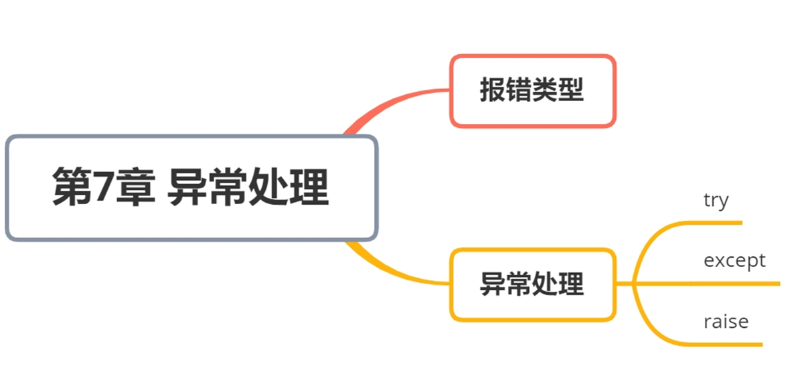

## 什么是异常

1.如果代码没有语法问题，可以运行，但会出运行时的错误，例如除零错误，下标越界等问题，这种在运行期间检测到的错误被称为*异常* 。

2.出现了异常必须处理否则程序会终止执行，用户体验会很差。

3.Phthon支持程序员自己处理检测到的异常。

4.可以使用try-except语句进行异常的检测和处理。

## python中常见的异常类型

| 报错类型          | 描述                                             |
| ----------------- | ------------------------------------------------ |
| AssertionError    | 当assert断言条件为假的时候抛出的异常。           |
| AttributeError    | 当访问的对象属性不存在的时候抛出的异常           |
| IndexError        | 超出对象索引的范围时抛出的异常。                 |
| KeyError          | 在字典中查找一个不存在的key抛出的异常            |
| NameError         | 访问一个不存在的变量时抛出的异常。               |
| OSError           | 操作系统产生的异常。                             |
| SyntaxError       | 语法错误时会抛出此异常。                         |
| TypeError         | 类型错误，通常是不同类型之间的操作会出现此异常。 |
| ZeroDivisionError | 进行数学运算时除数为0时会出现此异常。            |


## `try-except`语句

```python
try:
    【代码块A】  # 可能会出错误的代码 异常检测
except Exception1[ as e]:
    # 异常处理
    【代码块1】  # 异常处理代码
except Exception2[ as e]:
    # 异常处理
    【代码块2】  # 异常处理代码
...
except Exceptionn[ as e]:
    # 异常处理
    【代码块n】  # 异常处理代码
[else:]
    # 可选，如果没有引发异常会执行 处理语句
[finally:]
    # 无论如何都要执行的语句 处理语句
    【后续语句】
```

> 1、首先执行try中【代码块A】，如果出现异常，立即终止代码执行，转而到except块中进行异常处理
>
> 2、异常处理except模块可以多个，从上往下匹配，如果能够匹配成功，立即执行相应的异常处理代码块，执行完毕后，不在往下匹配，转到3执行
>
> 3、执行异常处理完毕后，如果有finally字句则执行finally字句，如果没有则执行【后续语句】
>
> 4、如果匹配不到异常，有finally则执行finally，然后则抛出错误，终止程序执行。
>
> 5、如果没有异常，如果有else字句则执行else字句，执行完else后，有finally字句则执行，没有则执行【后续语句】


```python
# 尝试执行可能引发异常的代码块
try:
    n = int(input('请输入一个数字'))
    n = 5 / n  # 将5除以用户输入的数字，如果输入为0，将引发ZeroDivisionError异常
    print(n)
except ZeroDivisionError as e:  # 捕获ZeroDivisionError异常
    print('除数不能为0')
    print('原始报错信息', e)  # 打印原始错误信息
    
except:  # 捕获其他所有类型的异常
    print('请输入一个数字')
    
else:  # 如果没有发生任何异常
    print('运行没有被except语句捕获，执行else模块')
    
finally:  # 无论是否发生异常，都会执行finally模块
    # 执行一些必要的清理工作或释放资源
    print('无论如何，都要执行finally模块')

```


## `raise`关键字

手动抛出一个指定类型的异常，无论是哪种异常类都可以带一个字符串参数，对异常进行描述。

•raise不带参数会把错误原样抛出

```python
try:
    pwd = input('请输入你的密码：')
    if len(pwd)<8:
        raise Exception('密码的长度不够，请输入一个8位以上的密码')
except Exception as e:
    print(e)
```

## PyCharm中的代码调试技巧

```python
# 1、运行，从错误信息中找到问题
print(11)

# 2、打印相关信息
for i in range(10):
    print('-'*30)
    print(i)
    # for i in range(5):
    #     print('内层循环')
    #     print(i)
    #     print('*'*i)
    
#3、注释部分代码定位出问题边界 
# 4、debug调试
```


## 本章总结

### 小结



### 单词

| 单词        | 释义        |
| ----------- | ----------- |
| bug         | 错误        |
| debug       | 调试        |
| error       | 错误        |
| NameError   | 名字错误    |
| raise       | 抛出，扔出  |
| stop        | 停止        |
| syntax      | 语法        |
| syntaxError | 语法错误    |
| type        | 类型        |
| except      | 除了...之外 |

### 小试牛刀

1. 下列Python保留字中，用于异常处理结构中用来捕获特定类型异常的是

A. def 

B. except 

C. while 

D. pass 

答案：B

2. python中用来抛出异常的关键字是（ ）

A. try 

B. except 

C. raise 

D. Finally

答案：C

3. 在异常处理中，如释放资源、关闭文件、关闭数据库等由( )来完成。

A. try字句 

B. catch子句 

C. finally子句 

D. raise子句

答案：C

4. 当方法遇到异常又不知如何处理时，下列哪种说法是正确的（ ）

A. 捕获异常 

B. 抛出异常 

C. 声明异常 

D. 嵌套异常

答案：B

5. 关于程序的异常处理，以下选项中描述错误的是

A. 程序异常发生经过妥善处理可以继续执行

B. 异常语句可以与 else 和 finally 保留字配合使用

C. 编程语言中的异常和错误是完全相同的概念

D. Python 通过 try、except 等保留字提供异常处理功能

答案：C

6. 关于python的异常处理语句说法错误的是（  ）

A.将可能发生异常的语句放在try子句里。

B.except子句用于捕捉并处理异常。

C.else子句里包含了不发生异常时要执行的语句，异常处理里必须包含else句。

D.finally子句包含了不管是否发生异常都要执行的语句。

答案：C


### 计算器

```python
while True:
    try:
        op = input('请输入一个四则运算算式（例如1+2）：')
        if '+' in op:#加法 14+256
            a = op.split('+')
            result = int(a[0]) + int(a[1])
            print(result)
        elif '-' in op:
            a = op.split('-')
            result = int(a[0]) - int(a[1])
            print(result)
        elif '*' in op:
            a = op.split('*')
            result = int(a[0]) * int(a[1])
            print(result)
        elif '/' in op:
            a = op.split('/')
            result = int(a[0]) / int(a[1])
            print(result)
        elif op=='C':
            print('感谢您使用本计算器！')
            break
        else:
            raise Exception('请按1+2这个格式输入算式！')
    except ZeroDivisionError:
        print('注意除法运算，除数不能为0！')
    except Exception as e:
        print(e)
```

