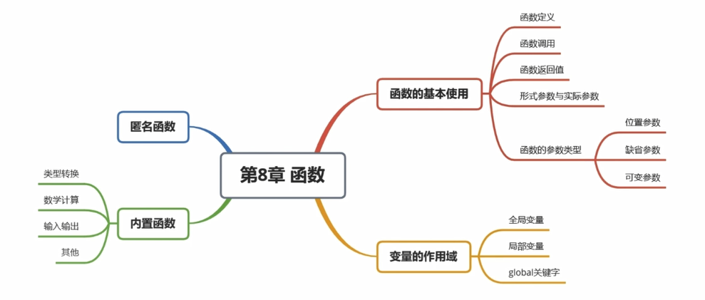

## 函数

### 函数的定义

- 函数也是一个对象
- 对象是内存中专门用来存储数据的一块区域
- 函数可以用来保存一些可执行的代码，并且可以在需要时，对这些语句进行多次的调用

### 定义一个函数

你可以定义一个由自己想要功能的函数，以下是简单的规则：

- 函数代码块以 **def** 关键词开头，后接函数标识符名称和圆括号 **()**。
- 任何传入参数和自变量必须放在圆括号中间，圆括号之间可以用于定义参数。
- 函数的第一行语句可以选择性地使用文档字符串—用于存放函数说明。
- 函数内容以冒号 **:** 起始，并且缩进。
- **return [表达式]** 结束函数，选择性地返回一个值给调用方，不带表达式的 return 相当于返回 None。


### 语法

Python 定义函数使用 def 关键字，一般格式如下：

```python
def 函数名（参数列表）:
    函数体
```


- 函数名必须要符号标识符的规范:（可以包含字母、数字、下划线、但是不能以数字开头）    

- 函数中保存的代码不会立即执行，需要调用函数代码才会执行
- 

### 调用函数：

定义一个函数：给了函数一个名称，指定了函数里包含的参数，和代码块结构。

这个函数的基本结构完成以后，你可以通过另一个函数调用执行

`函数对象()`

- 定义函数一般都是要实现某种功能的    

```python
# 定义一个函数
def fn() :
    print('这是我的第一个函数！')
    print('hello')
    print('今天天气真不错！')

# 打印fn
# print(fn) <function fn at 0x03D2B618>
# print(type(fn)) <class 'function'>

# fn是函数对象  fn()调用函数
# print是函数对象 print()调用函数
fn()
```


### 函数的参数

- 在定义函数时，可以在函数名后的()中定义数量不等的形参，多个形参之间使用,隔开
- 形参（形式参数），定义形参就相当于在函数内部声明了变量，但是并不赋值
- 实参（实际参数）
  - 如果函数定义时，指定了形参，那么在调用函数时也必须传递实参，实参将会赋值给对应的形参，简单来说，有几个形参就得传几个实参
  - 对于可变对象（如列表），函数内部的修改会影响外部对象，因为它指向的是同一个内存地址。对于不可变对象（如整数、字符串等），函数内的重新赋值不会影响到外部变量。

```python
# 定义函数时指定形参
def fn2(a , b) :
    # print('a =',a)
    # print('b =',b)
    print(a,"+",b,"=",a + b)

# 调用函数时，来传递实参
fn2(10,20)
fn2(123,456)


def fn4(a):
    # 在函数中对形参进行重新赋值，不会影响其他的变量
    # a = 20
    # a是一个列表，尝试修改列表中的元素
    # 如果形参执行的是一个对象，当我们通过形参去修改对象时
    #   会影响到所有指向该对象的变量
    a[0] = 30
    print('a =',a,id(a))

c = 10   
c = [1,2,3] 

# fn4(c)
# fn4(c.copy())
# fn4(c[:])

# print('c =',c,id(c))
```


### 参数传递

在 python 中，类型属于对象，对象有不同类型的区分，变量是没有类型的：

```python
a=[1,2,3]
a="Runoob"
```

以上代码中，**[1,2,3]** 是 List 类型，**"Runoob"** 是 String 类型，而变量 a 是没有类型，它仅仅是一个对象的引用（一个指针），可以是指向 List 类型对象，也可以是指向 String 类型对象。

**可更改(mutable)与不可更改(immutable)对象**

在 python 中，strings, tuples, 和 numbers 是不可更改的对象，而 list,dict 等则是可以修改的对象。

- **不可变类型：**变量赋值 **a=5** 后再赋值 **a=10**，这里实际是新生成一个 int 值对象 10，再让 a 指向它，而 5 被丢弃，不是改变 a 的值，相当于新生成了 a。
- **可变类型：**变量赋值 **la=[1,2,3,4]** 后再赋值 **la[2]=5** 则是将 list la 的第三个元素值更改，本身la没有动，只是其内部的一部分值被修改了。

python 函数的参数传递：

- **不可变类型：**类似 C++ 的值传递，如整数、字符串、元组。如 fun(a)，传递的只是 a 的值，没有影响 a 对象本身。如果在 fun(a) 内部修改 a 的值，则是新生成一个 a 的对象。
- **可变类型：**类似 C++ 的引用传递，如 列表，字典。如 fun(la)，则是将 la 真正的传过去，修改后 fun 外部的 la 也会受影响

python 中一切都是对象，严格意义我们不能说值传递还是引用传递，我们应该说传不可变对象和传可变对象。

#### 传不可变对象实例

通过 **id()** 函数来查看内存地址变化：

```python
def change(a):
    print(id(a))   # 指向的是同一个对象
    a=10
    print(id(a))   # 一个新对象
 
a=1
print(id(a))
change(a)
```


以上实例输出结果为：

```
4379369136
4379369136
4379369424
```

可以看见在调用函数前后，形参和实参指向的是同一个对象（对象 id 相同），在函数内部修改形参后，形参指向的是不同的 id。

#### 传可变对象实例

可变对象在函数里修改了参数，那么在调用这个函数的函数里，原始的参数也被改变了。例如：

```python
#!/usr/bin/python3
 
# 可写函数说明
def changeme( mylist ):
   "修改传入的列表"
   mylist.append([1,2,3,4])
   print ("函数内取值: ", mylist)
   return
 
# 调用changeme函数
mylist = [10,20,30]
changeme( mylist )
print ("函数外取值: ", mylist)
```


传入函数的和在末尾添加新内容的对象用的是同一个引用。故输出结果如下：

```
函数内取值:  [10, 20, 30, [1, 2, 3, 4]]
函数外取值:  [10, 20, 30, [1, 2, 3, 4]]
```


### 函数的返回值

返回值，返回值就是函数执行以后返回的结果

可以通过 `return` 来指定函数的返回值

可以直接使用函数的返回值，也可以通过一个变量来接收函数的返回值

```python
# return 后边跟什么值，函数就会返回什么值
# return 后边可以跟任意的对象，返回值甚至可以是一个函数
def fn():
    # return 'Hello'
    # return [1,2,3]
    # return {'k':'v'}
    def fn2() :
        print('hello')

    return fn2 # 返回值也可以是一个函数

r = fn() # 这个函数的执行结果就是它的返回值
# r()
# print(fn())
# print(r)

# 如果仅仅写一个return 或者 不写return，则相当于return None 
def fn2() :
    a = 10
    return 

# 在函数中，return后的代码都不会执行，return 一旦执行函数自动结束
def fn3():
    print('hello')
    return
    print('abc')
    
def fn5():
    return 10

# fn5 和 fn5()的区别
print(fn5) # fn5是函数对象，打印fn5实际是在打印函数对象 <function fn5 at 0x05771BB8>
print(fn5()) # fn5()是在调用函数，打印fn5()实际上是在打印fn5()函数的返回值 10

```


## 函数的参数类型

以下是调用函数时可使用的正式参数类型：

- 必需参数&位置参数:必需参数须以正确的顺序传入函数。调用时的数量必须和声明时的一样。
- 关键字参数
- 默认参数
- 不定长参数


### 必需参数 & 位置参数

必需参数须以正确的顺序传入函数。调用时的数量必须和声明时的一样。

调用 printme() 函数，你必须传入一个参数，不然会出现语法错误：

```python
#!/usr/bin/python3
 
#可写函数说明
def printme( str ):
   "打印任何传入的字符串"
   print (str)
   return
 
# 调用 printme 函数，不加参数会报错
printme()
```


以上实例输出结果：

```
Traceback (most recent call last):
  File "test.py", line 10, in <module>
    printme()
TypeError: printme() missing 1 required positional argument: 'str'
```

### 关键字参数

关键字参数和函数调用关系紧密，函数调用使用关键字参数来确定传入的参数值。

使用关键字参数允许函数调用时参数的顺序与声明时不一致，因为 Python 解释器能够用参数名匹配参数值。

以下实例在函数 printme() 调用时使用参数名：

```python
#!/usr/bin/python3
 
#可写函数说明
def printme( str ):
   "打印任何传入的字符串"
   print (str)
   return
 
#调用printme函数
printme( str = "菜鸟教程")
```


以上实例输出结果：

```
菜鸟教程
```

以下实例中演示了函数参数的使用不需要使用指定顺序：

```py
#!/usr/bin/python3
 
#可写函数说明
def printinfo( name, age ):
   "打印任何传入的字符串"
   print ("名字: ", name)
   print ("年龄: ", age)
   return
 
#调用printinfo函数
printinfo( age=50, name="runoob" )
```


以上实例输出结果：

```
名字:  runoob
年龄:  50
```


**实参的传递方式** 位置参数和关键字参数

```python
# 位置参数
# 位置参数就是将对应位置的实参复制给对应位置的形参
# 第一个实参赋值给第一个形参，第二个实参赋值给第二个形参 。。。
fn(1 , 2 , 3)

# 关键字参数
# 关键字参数，可以不按照形参定义的顺序去传递，而直接根据参数名去传递参数
fn(b=1 , c=2 , a=3)
print('hello' , end='')  # end表示结束符号参数，默认值为\n

# 位置参数和关键字参数可以混合使用
# 混合使用关键字和位置参数时，必须将位置参数写到前面
fn(1,c=30)
```


### 默认参数

调用函数时，如果没有传递参数，则会使用默认参数。以下实例中如果没有传入 age 参数，则使用默认值：

```python
#!/usr/bin/python3
 
#可写函数说明
def printinfo( name, age = 35 ):
   "打印任何传入的字符串"
   print ("名字: ", name)
   print ("年龄: ", age)
   return
 
#调用printinfo函数
printinfo( age=50, name="runoob" )
print ("------------------------")
printinfo( name="runoob" )
```


以上实例输出结果：

```
名字:  runoob
年龄:  50
------------------------
名字:  runoob
年龄:  35
```

```python
# 定义一个函数
# 定义形参时，可以为形参指定默认值
# 指定了默认值以后，如果用户传递了参数则默认值没有任何作用
#   如果用户没有传递，则默认值就会生效
def fn(a = 5 , b = 10 , c = 20):  #  b、c：默认参数，缺省参数
    print('a =',a)
    print('b =',b)
    print('c =',c)

fn(1 , 2 , 3)
fn(1 , 2)
fn()
```


### 不定长参数 & 可变参数

你可能需要一个函数能处理比当初声明时更多的参数。这些参数叫做不定长参数，和上述 2 种参数不同，声明时不会命名。基本语法如下：

```python
def functionname([formal_args,] *var_args_tuple ):
   "函数_文档字符串"
   function_suite
   return [expression]
```

加了星号 ***** 的参数会以元组(tuple)的形式导入，存放所有未命名的变量参数。

```python
#!/usr/bin/python3
  
# 可写函数说明
def printinfo( arg1, *vartuple ):
   "打印任何传入的参数"
   print ("输出: ")
   print (arg1)
   print (vartuple)
 
# 调用printinfo 函数
printinfo( 70, 60, 50 )
```

以上实例输出结果：

```
输出: 
70
(60, 50)
```


如果在函数调用时没有指定参数，它就是一个空元组。我们也可以不向函数传递未命名的变量。如下实例：

```python
#!/usr/bin/python3
 
# 可写函数说明
def printinfo( arg1, *vartuple ):
   "打印任何传入的参数"
   print ("输出: ")
   print (arg1)
   for var in vartuple:
      print (var)
   return
 
# 调用printinfo 函数
printinfo( 10 )
printinfo( 70, 60, 50 )
```


以上实例输出结果：

```
输出:
10
输出:
70
60
50
```

还有一种就是参数带两个星号 ***\***基本语法如下：

```python
def functionname([formal_args,] **var_args_dict ):
   "函数_文档字符串"
   function_suite
   return [expression]
```

加了两个星号 ***\*** 的参数会以字典的形式导入。

```python
#!/usr/bin/python3
  
# 可写函数说明
def printinfo( arg1, **vardict ):
   "打印任何传入的参数"
   print ("输出: ")
   print (arg1)
   print (vardict)
 
# 调用printinfo 函数
printinfo(1, a=2,b=3)
```


以上实例输出结果：

```
输出: 
1
{'a': 2, 'b': 3}
```

声明函数时，参数中星号 ***** 可以单独出现，例如:

```python
def f(a,b,*,c):
    return a+b+c
```

如果单独出现星号 *****，则星号 ***** 后的参数必须用关键字传入：

```python
>>> def f(a,b,*,c):
...     return a+b+c
... 
>>> f(1,2,3)   # 报错
Traceback (most recent call last):
  File "<stdin>", line 1, in <module>
TypeError: f() takes 2 positional arguments but 3 were given
>>> f(1,2,c=3) # 正常
6
>>>
```

#### 强制位置参数

Python3.8 新增了一个函数形参语法 `/` 用来指明函数形参必须使用指定位置参数，不能使用关键字参数的形式。

在以下的例子中，形参 a 和 b 必须使用指定位置参数，c 或 d 可以是位置形参或关键字形参，而 e 和 f 要求为关键字形参:

```python
def f(a, b, /, c, d, *, e, f):
    print(a, b, c, d, e, f)
```

以下使用方法是正确的:

```python
f(10, 20, 30, d=40, e=50, f=60)
```

以下使用方法会发生错误:

```python
f(10, b=20, c=30, d=40, e=50, f=60)   # b 不能使用关键字参数的形式
f(10, 20, 30, 40, 50, f=60)           # e 必须使用关键字参数的形式
```


### **可变参数**总结

#### 不定长参数
- **单星号(*)参数：** 可以接收任意数量的位置参数，并将它们打包成一个元组。例如，`def fn(*args):`可以接收任意数量的参数。
- **双星号(`**`)参数：** 用于接收关键字参数，并将它们打包成一个字典。例如，`def fn(**kwargs):`可以接收任意数量的关键字参数。

#### 参数解包（拆包）
- **位置参数解包：** 使用单星号(*)可以在调用函数时解包列表、元组等可迭代对象，将其元素作为独立的参数传递给函数。例如，`fn(*[1, 2, 3])`会将列表中的每个元素作为单独的参数传递给函数。
- **关键字参数解包：** 使用双星号(**)可以在调用函数时解包字典，将其键值对作为关键字参数传递给函数。例如，`fn(**{'a': 1, 'b': 2})`会将字典中的每个键值对作为关键字参数传递给函数。

#### 特殊情况
- 带有`*`的形参只能有一个，且它必须是最后一个能够接受额外位置参数的参数。
- 如果在形参列表前加上一个独立的`*`，则要求所有后续的参数都必须以关键字参数的形式传递。
- `**`形参只能有一个，并且必须写在所有参数的最后，用于接收额外的关键字参数。


```python
# 不定长的参数
# 定义一个函数，可以求任意个数字的和
def sum(*nums):
    # 定义一个变量，来保存结果
    result = 0
    # 遍历元组，并将元组中的数进行累加
    for n in nums :
        result += n
    print(result)

sum(123,456,789,10,20,30,40)


# 在定义函数时，可以在形参前边加上一个*，这样这个形参将会获取到所有的实参
# 它将会将所有的实参保存到一个元组中
# a,b,*c  调用 (1,2,3,4,5,6) 等价于 a = 1,b = 2,c = (3,4,5,6)

# *a会接受所有的位置实参，并且会将这些实参统一保存到一个元组中（装包）
def fn(*a):
    print("a =",a,type(a)) # a是一个元组


# 带星号的形参只能有一个
# 带星号的参数，可以和其他参数配合使用
# 第一个参数给a，第二个参数给b，剩下的都保存到c的元组中
def fn2(a,b,*c):
    print('a =',a)
    print('b =',b)
    print('c =',c)
fn(1,2,3,4,5) # a=1 b=2 c=(3,4,5)

# 可变参数不是必须写在最后，但是注意，带*的参数后的所有参数，必须以关键字参数的形式传递
# 第一个参数给a，剩下的位置参数给b的元组，c必须使用关键字参数
# def fn2(a,*b,c):
#     print('a =',a)
#     print('b =',b)
#     print('c =',c)

# 所有的位置参数都给a，b和c必须使用关键字参数
# def fn2(*a,b,c):
#     print('a =',a)
#     print('b =',b)
#     print('c =',c)

# 如果在形参的开头直接写一个*,则要求我们的所有的参数必须以关键字参数的形式传递
def fn2(*,a,b,c):
    print('a =',a)
    print('b =',b)
    print('c =',c)
fn2(a=3,b=4,c=5)

# *形参只能接收位置参数，而不能接收关键字参数
# def fn3(*a) :
#     print('a =',a)

# **形参可以接收其他的关键字参数，它会将这些参数统一保存到一个字典中
#   字典的key就是参数的名字，字典的value就是参数的值
# **形参只能有一个，并且必须写在所有参数的最后
def fn3(b,c,**a) :
    print('a =',a,type(a))
    print('b =',b)
    print('c =',c)

# fn3(b=1,d=2,c=3,e=10,f=20)

# 参数的解包（拆包）
def fn4(a,b,c):
    print('a =',a)
    print('b =',b)
    print('c =',c)

# 创建一个元组
t = (10,20,30)

# 传递实参时，也可以在序列类型的参数前添加*，这样他会自动将序列中的元素依次作为参数传递
# 这里要求序列中元素的个数必须和形参的个数的一致
fn4(*t)

# 创建一个字典
d = {'a':100,'b':200,'c':300}
# 通过 **来对一个字典进行解包操作
fn4(**d)
```


## 变量的作用域

### 作用域（Scope）

1. **全局作用域**：在程序执行时创建，在程序结束时销毁。**函数外部定义的所有变量属于全局变量**，可以在**程序的任何地方被访问**。

2. **函数作用域**：每次调用函数时都会创建一个新的函数作用域，并在函数调用结束后销毁。**函数内部定义的变量是局部变量，只能在函数内部访问**。

3. **变量查找规则**：当使用一个变量时，Python会首先在当前作用域中查找该变量。如果找不到，则向上一级作用域继续查找，直到找到全局作用域。如果全局作用域中也没有找到该变量，则抛出`NameError`异常。

### 修改全局变量

- 如果想在**函数内部修改全局变量**，需要使用`global`关键字声明该变量为全局变量。例如：
  
  ```python
  a = 20
  
  def fn3():
      # a = 10 # 在函数中为变量赋值时，默认都是为局部变量赋值
      # 如果希望在函数内部修改全局变量，则需要使用global关键字，来声明变量
      global a # 声明在函数内部的使用a是全局变量，此时再去修改a时，就是在修改全局的a
      a = 10 # 修改全局变量
      print('函数内部：','a =',a)
  ```

### 命名空间（Namespace）

- 每个作用域都有对应的命名空间，用于存储该作用域内的变量。
  
- 全局命名空间用来保存全局变量，函数命名空间用来保存函数内部的变量。
  
- 可以通过`locals()`函数获取当前作用域的命名空间（返回的是字典类型），通过`globals()`函数在任意位置获取全局命名空间。


```python
# 作用域（scope）
# 作用域指的是变量生效的区域
b = 20 # 全局变量

def fn():
    a = 10 # a定义在了函数内部，所以他的作用域就是函数内部，函数外部无法访问
    print('函数内部：','a =',a)
    print('函数内部：','b =',b)

# fn()    
  

# print('函数外部：','a =',a)
# print('函数外部：','b =',b)

# 在Python中一共有两种作用域
#  全局作用域
#   - 全局作用域在程序执行时创建，在程序执行结束时销毁
#   - 所有函数以外的区域都是全局作用域
#   - 在全局作用域中定义的变量，都属于全局变量，全局变量可以在程序的任意位置被访问
#   
#  函数作用域
#   - 函数作用域在函数调用时创建，在调用结束时销毁
#   - 函数每调用一次就会产生一个新的函数作用域
#   - 在函数作用域中定义的变量，都是局部变量，它只能在函数内部被访问
#   
#  变量的查找
#   - 当我们使用变量时，会优先在当前作用域中寻找该变量，如果有则使用，
#       如果没有则继续去上一级作用域中寻找，如果有则使用，
#       如果依然没有则继续去上一级作用域中寻找，以此类推
#       直到找到全局作用域，依然没有找到，则会抛出异常
#           NameError: name 'a' is not defined

def fn2():
    def fn3():
        print('fn3中:','a =',a)
    fn3()

# fn2()    

a = 20

def fn3():
    # a = 10 # 在函数中为变量赋值时，默认都是为局部变量赋值
    # 如果希望在函数内部修改全局变量，则需要使用global关键字，来声明变量
    global a # 声明在函数内部的使用a是全局变量，此时再去修改a时，就是在修改全局的a
    a = 10 # 修改全局变量
    print('函数内部：','a =',a)

# fn3()
# print('函数外部：','a =',a)


# 命名空间（namespace）
# 命名空间指的是变量存储的位置，每一个变量都需要存储到指定的命名空间当中
# 每一个作用域都会有一个它对应的命名空间
# 全局命名空间，用来保存全局变量。函数命名空间用来保存函数中的变量
# 命名空间实际上就是一个字典，是一个专门用来存储变量的字典

# locals()用来获取当前作用域的命名空间
# 如果在全局作用域中调用locals()则获取全局命名空间，如果在函数作用域中调用locals()则获取函数命名空间
# 返回的是一个字典
scope = locals() # 当前命名空间
print(type(scope))
# print(a)
# print(scope['a'])
# 向scope中添加一个key-value
scope['c'] = 1000 # 向字典中添加key-value就相当于在全局中创建了一个变量（一般不建议这么做）
# print(c)

def fn4():
    a = 10
    # scope = locals() # 在函数内部调用locals()会获取到函数的命名空间
    # scope['b'] = 20 # 可以通过scope来操作函数的命名空间，但是也是不建议这么做

    # globals() 函数可以用来在任意位置获取全局命名空间
    global_scope = globals()
    # print(global_scope['a'])
    global_scope['a'] = 30
    # print(scope)

fn4()    

```


## 文档字符串

```python
# help()是Python中的内置函数
# 通过help()函数可以查询python中的函数的用法
# 语法：help(函数对象)
# help(print) # 获取print()函数的使用说明

# 文档字符串（doc str）
# 在定义函数时，可以在函数内部编写文档字符串，文档字符串就是函数的说明
#   当我们编写了文档字符串时，就可以通过help()函数来查看函数的说明
#   文档字符串非常简单，其实直接在函数的第一行写一个字符串就是文档字符串
def fn(a:int,b:bool,c:str='hello') -> int:
    '''
    这是一个文档字符串的示例

    函数的作用：。。。。。
    函数的参数：
        a，作用，类型，默认值。。。。
        b，作用，类型，默认值。。。。
        c，作用，类型，默认值。。。。
    '''
    return 10

help(fn)

```


## lambda匿名函数&高阶函数


Python 使用 **lambda** 来创建匿名函数。

所谓匿名，意即不再使用 **def** 语句这样标准的形式定义一个函数。

- **lambda** 只是一个表达式，函数体比 **def** 简单很多。
- lambda 的主体是一个表达式，而不是一个代码块。仅仅能在 lambda 表达式中封装有限的逻辑进去。
- lambda 函数拥有自己的命名空间，且不能访问自己参数列表之外或全局命名空间里的参数。
- 虽然 lambda 函数看起来只能写一行，却不等同于 C 或 C++ 的内联函数，内联函数的目的是调用小函数时不占用栈内存从而减少函数调用的开销，提高代码的执行速度。

### 语法

lambda 函数的语法只包含一个语句，如下：

```python
lambda [arg1 [,arg2,.....argn]]:expression
```

> - `lambda`是 Python 的关键字，用于定义 lambda 函数。
> - `arguments` 是参数列表，可以包含零个或多个参数，但必须在冒号(`:`)前指定。
> - `expression` 是一个表达式，用于计算并返回函数的结果。

### 举例

以下的 lambda 函数没有参数：

```python
f = lambda: "Hello, world!"
print(f())  # 输出: Hello, world!
```

输出结果为：

```
Hello, world!
```


以下实例使用 lambda 创建匿名函数，设置一个函数参数 a，函数计算参数 a 加 10，并返回结果：

```python
x = lambda a : a + 10
print(x(5))
```

以上实例输出结果：

```
15
```


lambda 函数也可以设置多个参数，参数使用逗号 **,** 隔开：

以下实例使用 lambda 创建匿名函数，函数参数 a 与 b 相乘，并返回结果：

```python
x = lambda a, b : a * b
print(x(5, 6))
```

以上实例输出结果：

```
30
```


以下实例使用 lambda 创建匿名函数，函数参数 a、b 与 c 相加，并返回结果：

```python
x = lambda a, b, c : a + b + c
print(x(5, 6, 2))
```

输出结果为：

```
13
```


我们可以将匿名函数封装在一个函数内，这样可以使用同样的代码来创建多个匿名函数。

以下实例将匿名函数封装在 myfunc 函数中，通过传入不同的参数来创建不同的匿名函数：

```python
def myfunc(n):
  return lambda a : a * n
 
mydoubler = myfunc(2)
mytripler = myfunc(3)
 
print(mydoubler(11))
print(mytripler(11))
```

以上实例输出结果：

```
22
33
```


###  `lambda高阶用法`

lambda 函数通常与内置函数如 map()、filter() 和 reduce() 一起使用，以便在集合上执行操作

#### map()

```python
# map()
# map()函数可以对可跌倒对象中的所有元素做指定的操作，然后将其添加到一个新的对象中返回

numbers = [1, 2, 3, 4, 5]
squared = list(map(lambda x: x**2, numbers))
print(squared)  # 输出: [1, 4, 9, 16, 25]
```

输出结果为：

```
[1, 4, 9, 16, 25]
```

#### filter()

使用 lambda 函数与 filter() 一起，筛选偶数：

```python
# filter()
# filter()可以从序列中过滤出符合条件的元素，保存到一个新的序列中
# 参数：
#  1.函数，根据该函数来过滤序列（可迭代的结构）
#  2.需要过滤的序列（可迭代的结构）
# 返回值：
#   过滤后的新序列（可迭代的结构）

numbers = [1, 2, 3, 4, 5, 6, 7, 8]
even_numbers = list(filter(lambda x: x % 2 == 0, numbers))
print(even_numbers)  # 输出：[2, 4, 6, 8]
```


输出结果为：

```
[2, 4, 6, 8]
```


#### reduce()

下面是一个使用 reduce() 和 lambda 表达式演示如何计算一个序列的累积乘积：

```python
from functools import reduce
 
numbers = [1, 2, 3, 4, 5]
 
# 使用 reduce() 和 lambda 函数计算乘积
product = reduce(lambda x, y: x * y, numbers)
 
print(product)  # 输出：120
```


输出结果为：

```
120
```

在上面的实例中，reduce() 函数通过遍历 numbers 列表，并使用 lambda 函数将累积的结果不断更新，最终得到了 `1 * 2 * 3 * 4 * 5 = 120`的结果。

#### sort()

```python
# sort()
# 该方法用来对列表中的元素进行排序
# sort()方法默认是直接比较列表中的元素的大小
# 在sort()可以接收一个关键字参数 ， key
#   key需要一个函数作为参数，当设置了函数作为参数
#   每次都会以列表中的一个元素作为参数来调用函数，并且使用函数的返回值来比较元素的大小
l = ['bb','aaaa','c','ddddddddd','fff']
# l.sort(key=len)

l = [2,5,'1',3,'6','4']
l.sort(key=int)
# print(l)

# sorted()
# 这个函数和sort()的用法基本一致，但是sorted()可以对任意的序列进行排序
#   并且使用sorted()排序不会影响原来的对象，而是返回一个新对象

l = [2,5,'1',3,'6','4']
# l = "123765816742634781"

print('排序前:',l)
print(sorted(l,key=int))
print('排序后:',l)
```

## 内置函数

| 函数       | 用途                                                         |
| ---------- | ------------------------------------------------------------ |
| `abs()`    | 对传入参数取绝对值                                           |
| `bool()`   | 对传入参数取布尔值，None, 0, "", [], {}, ()这些参数传入bool后，返回False |
| all()      | 所有传入参数为真，才为真                                     |
| any()      | 任何一个传入参数为真，才为真                                 |
| ascii()    | 自动执行传入参数的_repr_method（将对象转换为字符串）         |
| `bin()`    | 接收一个十进制，转换成二进制                                 |
| `oct()`    | 接收一个十进制，转换成八进制                                 |
| `hex()`    | 接收一个十进制，转换成十六进制                               |
| bytes()    | 字符串转换成字节。第一个传入参数是要转换的字符串，第二个参数按什么编码转换为字节 |
| `str()`    | 字节转换成字符串。第一个传入参数是要转换的字节，第二个参数是按什么编码转换成字符串 |
| `chr(65)`  | 数字转字母，查看ASCII码表                                    |
| `ord('A')` | 字母转数字，查看ASCII码表                                    |
| compile()  | 接收.py文件或字符串作为传入参数，将其编译成python字节码      |
| `eval`()   | 执行python代码，并返回其执行结果                             |
| exec()     | 执行python代码（可以是编译过的，也可以是未编译的），没有返回结果（返回None） |
| `dir()`    | 接收对象作为参数，返回该对象的所有属性和方法                 |


| 函数               | 用途                                                                 |
|--------------------|----------------------------------------------------------------------|
| `help`()           | 接收对象作为参数，更详细地返回该对象的所有属性和方法                  |
| divmod(100, 10)    | 返回一个元组（10, 0），第一个元素的100/10的商，第二个元素的100/10的余数 |
| `enumerate()`      | 接收序列化类型的数据，返回一个迭代器（对象）.                        |
| `isinstance(object, class)` | 判断对象是否是某个类的实例.                                          |
| `filter()`         | 对可迭代对象中的每一个元素，将其作为实参传入函数（或lambda表达式），如果函数返回False，将该元素丢弃，如果函数返回True，将该元素添加到filter的返回值中。注意filter返回的是一个filter对象，实际应用中往往需要用list或tuple将其转换为列表或元组类型. |
| `map()`            | 对可迭代的每一个元素，将其作为实参传入函数，将每一次调用函数返回的结果都添加到map的返回值中。 |
| `format()`         | 字符串格式化                                                          |
| frozenset()        | 转换为不可变的集合                                                    |
| globals()          | 返回一个字典，包括所有的全局变量与它的值所组成的键值对                |
| locals()           | 返回一个字典，包括所有的局部变量与它的值所组成的键值对                |
| hash()             | 对传入参数取哈希值并返回                                              |
| `id()`             | 返回内存地址，可用于查看两个变量是否指向同一块内存地址                |
| input('please input:') | 提示用户输入，返回用户输入的内容（不论输入什么，都转换成字符串类型）   |
| issubclass(subclass, class) | 查看这个类是否是另一个类的派生类，如果是返回True，否则返回False       |

| 函数         | 用途                                                         |
| ------------ | ------------------------------------------------------------ |
| `len()`      | 返回长度                                                     |
| `max`()      | 接收序列化类型数据，返回其中值最大的元素                     |
| `min()`      | 返回其中值最小的元素                                         |
| memoryview() | 查看内存地址                                                 |
| next()       |                                                              |
| iter()       |                                                              |
| object()     |                                                              |
| `pow(x, y)`  | 求次方，返回x**y的结果                                       |
| pow(x, y, z) | 返回 x**y%z 的结果                                           |
| property()   | 获取对象的所有属性                                           |
| `range()`    | 获取随机数或随机字符 eg. range(10) 从0到10的随机数           |
| repr()       | 执行传入对象中的_repr_方法                                   |
| `reversed()` | 对序列化类型数据反向排序，返回一个新的对象。注意与对象的reverse方法区别，后者是就地改变对象 |
| `sorted()`   | 对序列化类型数据正向排序，返回一个新的对象。注意与对象的sort方法区别，后者是就地改变对象 |
| slice()      | 对序列化类型数据切片，返回一个新的对象。                     |


| 函数           | 用途                                                         |
| -------------- | ------------------------------------------------------------ |
| `round()`      | 返回四舍五入后的结果                                         |
| `int()`        | 转换为整型                                                   |
| `list()`       | 转换为列表类型                                               |
| `set()`        | 转换为集合类型                                               |
| `str()`        | 转换为字符串类型                                             |
| `tuple()`      | 转换为元组类型                                               |
| `type()`       | 返回对象类型                                                 |
| staticmethod() | 返回静态方法                                                 |
| super()        | 返回基类                                                     |
| vars()         | 返回当前模块中的所有变量                                     |
| `zip()`        | 接收多个序列化类型的数据，对各序列化数据中的元素，按索引位置分类成一个个元组。 |


## 递归函数

### 递归的过程

```
a. 写出临界条件
b. 找这一次和上一次的关系
c. 假设当前函数已经能用，调用自身计算上一次结果，再求出本次结果当参数满足一个条件时，函数不再执行
```

### 递归式的函数

```py
# 从前有座山，山里有座庙，庙里有个老和尚讲故事，讲的什么故事呢？
#   从前有座山，山里有座庙，庙里有个老和尚讲故事，讲的什么故事呢？....
# 递归简单理解就是自己去引用自己！
# 递归式函数，在函数中自己调用自己！

# 无穷递归，如果这个函数被调用，程序的内存会溢出，效果类似于死循环
# def fn():
#     fn()
# fn()

# 递归是解决问题的一种方式，它和循环很像
#   它的整体思想是，将一个大问题分解为一个个的小问题，直到问题无法分解时，再去解决问题
# 递归式函数的两个要件
#   1.基线条件
#       - 问题可以被分解为的最小问题，当满足基线条件时，递归就不在执行了
#   2.递归条件
#       - 将问题继续分解的条件
# 递归和循环类似，基本是可以互相代替的，
#   循环编写起来比较容易，阅读起来稍难
#   递归编写起来难，但是方便阅读
# 10! = 10 * 9!
# 9! = 9 * 8!
# 8! = 8 * 7!
# ...
# 1! = 1

def factorial(n):
    '''
        该函数用来求任意数的阶乘

        参数：
            n 要求阶乘的数字
    '''
    # 基线条件 判断n是否为1，如果为1则此时不能再继续递归
    if n == 1 :
        # 1的阶乘就是1，直接返回1
        return 1

    # 递归条件    
    return n * factorial(n-1)
```

### 上台阶

```python
# 10阶楼梯，每次上1个台阶或者上2个台阶，问一共有多少种走法
# 3
# 1 1 1
# 1 2
# 2 1
# f(n) = f(n-1) + f(n-2)
# n=0,f(n)=0
# n=1,f(n)=1
# n=2,f(n)=2
def f(n):  # 计算出n阶楼梯，一共有多少种走法
    if n == 0:
        return 0
    elif n == 1:
        return 1
    elif n == 2:
        return 2
    return f(n - 1) + f(n - 2)


print('楼梯有%d阶的时候，有%d种走法' % (5, f(5)))

# 递归效率太低，需要优化，优化为循环

a = [0, 1, 2]
for i in range(3, 11):
    a.append(a[i - 1] + a[i - 2])
    print('楼梯有%d阶的时候，有%d种走法' % (i, a[-1]))

```


## 闭包

### 闭包的基本结构（`fn()` 函数）

```python
# 将函数作为返回值返回，也是一种高阶函数
# 这种高阶函数我们也称为叫做闭包，通过闭包可以创建一些只有当前函数能访问的变量
#   可以将一些私有的数据藏到的闭包中

def fn():

    a = 10

    # 函数内部再定义一个函数
    def inner():
        print('我是fn2' , a)

    # 将内部函数 inner作为返回值返回   
    return inner

# r是一个函数，是调用fn()后返回的函数
# 这个函数实在fn()内部定义，并不是全局函数
# 所以这个函数总是能访问到fn()函数内的变量
r = fn()    
r()
```

- **作用**：`fn()` 返回内部函数 `inner`，而 `inner` 可以访问外部函数 `fn()` 中的变量 `a`。
- 闭包特性：
  - **函数嵌套**：`inner()` 在 `fn()` 内部定义。
  - **返回内部函数**：`return inner` 将 `inner` 作为返回值。
  - **引用外部变量**：`inner()` 使用了 `fn()` 中的变量 `a`。

### 闭包的实用案例

```python
# 求多个数的平均值
# nums = [50,30,20,10,77]

# sum()用来求一个列表中所有元素的和
# print(sum(nums)/len(nums))

# 形成闭包的要件
#   ① 函数嵌套
#   ② 将内部函数作为返回值返回
#   ③ 内部函数必须要使用到外部函数的变量
def make_averager():
    # 创建一个列表，用来保存数值
    nums = []

    # 创建一个函数，用来计算平均值
    def averager(n) :
        # 将n添加到列表中
        nums.append(n)
        # 求平均值
        return sum(nums)/len(nums)

    return averager

averager = make_averager()

print(averager(10))
print(averager(20))
print(averager(30))
print(averager(40))
```

### **闭包的优势与注意事项**

1. **优势**：
   - **状态封装**：外部无法直接修改 `nums` 列表，只能通过 `averager()` 接口操作。
   - **避免全局变量**：通过闭包维护状态，无需使用全局变量。
   - **灵活扩展**：可以创建多个独立的 `averager` 实例（每个实例有独立的 `nums` 列表）。
2. **注意事项**：
   - **内存占用**：闭包会保留外部变量的引用，可能导致内存泄漏（如 `nums` 列表无限增长）。
   - **可变对象**：如果外部变量是可变对象（如列表、字典），内部函数修改它会影响外部状态。


### **扩展思考**

1. **闭包 vs 类**：

   - 可以用类来实现类似功能：

     ```python
     class Averager:
         def __init__(self):
             self.nums = []
         def __call__(self, n):
             self.nums.append(n)
             return sum(self.nums)/len(self.nums)
     avg = Averager()
     print(avg(10))  # 10.0
     ```

   - **对比**：闭包更简洁，类更灵活（支持方法和属性）。

2. **闭包的生命周期**：

   - 外部函数 `make_averager()` 执行完毕后，`nums` 变量仍被 `averager` 引用，因此不会被垃圾回收。

## 装饰器

装饰器（decorators）是 Python 中的一种高级功能，它允许你动态地修改函数或类的行为。

装饰器是一种函数，它接受一个函数作为参数，并返回一个新的函数或修改原来的函数。

装饰器的语法使用 **@decorator_name** 来应用在函数或方法上。

Python 还提供了一些内置的装饰器，比如 **@staticmethod** 和 **@classmethod**，用于定义静态方法和类方法。

**装饰器的应用场景：**

- **日志记录**: 装饰器可用于记录函数的调用信息、参数和返回值。
- **性能分析**: 可以使用装饰器来测量函数的执行时间。
- **权限控制**: 装饰器可用于限制对某些函数的访问权限。
- **缓存**: 装饰器可用于实现函数结果的缓存，以提高性能。

### 基本语法

Python 装饰允许在不修改原有函数代码的基础上，动态地增加或修改函数的功能，装饰器本质上是一个接收函数作为输入并返回一个新的包装过后的函数的对象。

```python
def decorator_function(original_function):
    def wrapper(*args, **kwargs):
        # 这里是在调用原始函数前添加的新功能
        before_call_code()
        
        result = original_function(*args, **kwargs)
        
        # 这里是在调用原始函数后添加的新功能
        after_call_code()
        
        return result
    return wrapper

# 使用装饰器
@decorator_function
def target_function(arg1, arg2):
    pass  # 原始函数的实现
```


**解析：**decorator 是一个装饰器函数，它接受一个函数 func 作为参数，并返回一个内部函数 wrapper，在 wrapper 函数内部，你可以执行一些额外的操作，然后调用原始函数 func，并返回其结果。

- `decorator_function` 是装饰器，它接收一个函数 `original_function` 作为参数。
- `wrapper` 是内部函数，它是实际会被调用的新函数，它包裹了原始函数的调用，并在其前后增加了额外的行为。
- 当我们使用 `@decorator_function` 前缀在 `target_function` 定义前，Python会自动将 `target_function` 作为参数传递给 `decorator_function`，然后将返回的 `wrapper` 函数替换掉原来的 `target_function`。

### 使用装饰器

装饰器通过 **`@`** 符号应用在函数定义之前，例如：

```python
@time_logger
def target_function():
    pass
```

等同于：

```python
def target_function():
    pass
target_function = time_logger(target_function)
```

这会将 target_function 函数传递给 decorator 装饰器，并将返回的函数重新赋值给 target_function。从而，每次调用 target_function 时，实际上是调用了经过装饰器处理后的函数。

通过装饰器，开发者可以在保持代码整洁的同时，灵活且高效地扩展程序的功能。

### 带参数的装饰器

装饰器函数也可以接受参数，例如：

```python
def repeat(n):
    def decorator(func):
        def wrapper(*args, **kwargs):
            for _ in range(n):
                result = func(*args, **kwargs)
            return result
        return wrapper
    return decorator

@repeat(3)
def greet(name):
    print(f"Hello, {name}!")

greet("Alice")
```


以上代码中 repeat 函数是一个带参数的装饰器，它接受一个整数参数 n，然后返回一个装饰器函数。该装饰器函数内部定义了 wrapper 函数，在调用原始函数之前重复执行 n 次。因此，greet 函数在被 @repeat(3) 装饰后，会打印三次问候语。

### 类装饰器

除了函数装饰器，Python 还支持类装饰器。类装饰器是包含 **__call__** 方法的类，它接受一个函数作为参数，并返回一个新的函数。

```python
class DecoratorClass:
    def __init__(self, func):
        self.func = func
    
    def __call__(self, *args, **kwargs):
        # 在调用原始函数之前/之后执行的代码
        result = self.func(*args, **kwargs)
        # 在调用原始函数之后执行的代码
        return result

@DecoratorClass
def my_function():
    pass
```


### 课堂练习

```python
# 创建几个函数

def add(a , b):
    '''
        求任意两个数的和
    '''
    r = a + b
    return r


def mul(a , b):
    '''
        求任意两个数的积
    '''
    r = a * b
    return r    

# 希望函数可以在计算前，打印开始计算，计算结束后打印计算完毕
#  我们可以直接通过修改函数中的代码来完成这个需求，但是会产生以下一些问题
#   ① 如果要修改的函数过多，修改起来会比较麻烦
#   ② 并且不方便后期的维护
#   ③ 并且这样做会违反开闭原则（OCP）
#           程序的设计，要求开发对程序的扩展，要关闭对程序的修改


# r = add(123,456)
# print(r)

# 我们希望在不修改原函数的情况下，来对函数进行扩展
def fn():
    print('我是fn函数....')

# 只需要根据现有的函数，来创建一个新的函数
def fn2():
    print('函数开始执行~~~')
    fn()
    print('函数执行结束~~~')

# fn2()    

def new_add(a,b):
    print('计算开始~~~')
    r = add(a,b)
    print('计算结束~~~')
    return r

# r = new_add(111,222)    
# print(r)

# 上边的方式，已经可以在不修改源代码的情况下对函数进行扩展了
#   但是，这种方式要求我们每扩展一个函数就要手动创建一个新的函数，实在是太麻烦了
#   为了解决这个问题，我们创建一个函数，让这个函数可以自动的帮助我们生产函数

def begin_end(old):
    '''
        用来对其他函数进行扩展，使其他函数可以在执行前打印开始执行，执行后打印执行结束

        参数：
            old 要扩展的函数对象
    '''
    # 创建一个新函数
    def new_function(*args , **kwargs):
        print('开始执行~~~~')
        # 调用被扩展的函数
        result = old(*args , **kwargs)
        print('执行结束~~~~')
        # 返回函数的执行结果
        return result

    # 返回新函数        
    return new_function

f = begin_end(fn)
f2 = begin_end(add)
f3 = begin_end(mul)

# r = f()
# r = f2(123,456)
# r = f3(123,456)
# print(r)
# 向begin_end()这种函数我们就称它为装饰器
#   通过装饰器，可以在不修改原来函数的情况下来对函数进行扩展
#   在开发中，我们都是通过装饰器来扩展函数的功能的
# 在定义函数时，可以通过@装饰器，来使用指定的装饰器，来装饰当前的函数
#   可以同时为一个函数指定多个装饰器，这样函数将会安装从内向外的顺序被装饰 

def fn3(old):
    '''
        用来对其他函数进行扩展，使其他函数可以在执行前打印开始执行，执行后打印执行结束

        参数：
            old 要扩展的函数对象
    '''
    # 创建一个新函数
    def new_function(*args , **kwargs):
        print('fn3装饰~开始执行~~~~')
        # 调用被扩展的函数
        result = old(*args , **kwargs)
        print('fn3装饰~执行结束~~~~')
        # 返回函数的执行结果
        return result

    # 返回新函数        
    return new_function

@fn3
@begin_end
def say_hello():
    print('大家好~~~')

say_hello()

```


## 本章总结

