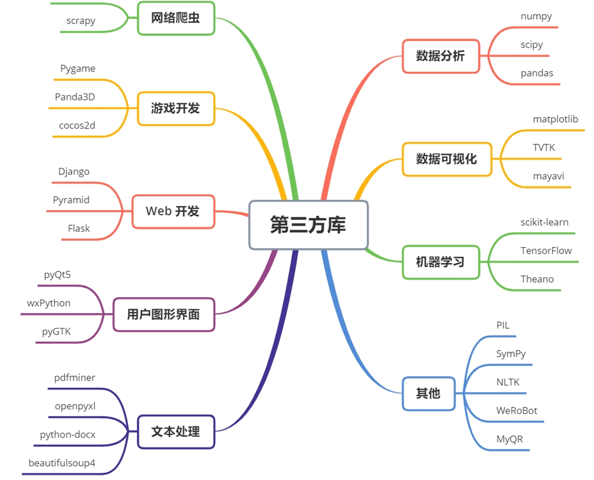
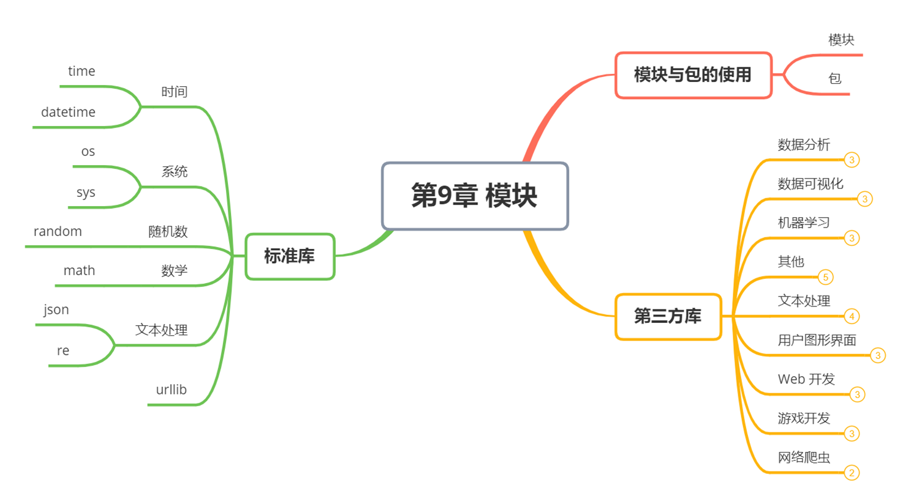

## 模块的导入与使用

### 模块的导入


如果你从 Python 解释器退出再进入，那么你定义的所有的方法和变量就都消失了。

为此 Python 提供了一个办法，把这些定义存放在文件中，为一些脚本或者交互式的解释器实例使用，这个文件被称为模块。

Python 中的模块（Module）是一个**包含 Python 定义和语句的文件，文件名就是模块名加上 .py 后缀。**

模块可以包含函数、类、变量以及可执行的代码。通过模块，我们可以将代码组织成可重用的单元，便于管理和维护。

```python
# 模块（module）
# 模块化，模块化指将一个完整的程序分解为一个一个小的模块
#   通过将模块组合，来搭建出一个完整的程序
# 不采用模块化，统一将所有的代码编写到一个文件中
# 采用模块化，将程序分别编写到多个文件中
#   模块化的有点：
#       ① 方便开发
#       ② 方便维护
#       ③ 模块可以复用！

# 在Python中一个py文件就是一个模块，要想创建模块，实际上就是创建一个python文件
# 注意：模块名要符号标识符的规范

# 在一个模块中引入外部模块
# ① import 模块名 （模块名，就是python文件的名字，注意不要py）
# ② import 模块名 as 模块别名
#   - 可以引入同一个模块多次，但是模块的实例只会创建一个
#   - import可以在程序的任意位置调用，但是一般情况下，import语句都会统一写在程序的开头
#   - 在每一个模块内部都有一个__name__属性，通过这个属性可以获取到模块的名字
#   - __name__属性值为 __main__的模块是主模块，一个程序中只会有一个主模块
#       主模块就是我们直接通过 python 执行的模块
import test_module as test

# print(test.__name__)
print(__name__)


# 访问模块中的变量：模块名.变量名
import m
print(m.a , m.b)
m.test2()
p = m.Person()
print(p.name)


# 也可以只引入模块中的部分内容
# 语法 from 模块名 import 变量,变量....
from m import Person
from m import test
from m import Person,test
from m import * # 引入到模块中所有内容，一般不会使用
# p1 = Person()
# print(p1)
# test()
# test2()

# 也可以为引入的变量使用别名
# 语法：from 模块名 import 变量 as 别名
# from m import test2 as new_test2

# test2()
# new_test2()

from m import *
# print(_c)

# import xxx
# import xxx as yyy
# from xxx import yyy , zzz , fff
# from xxx import *
# from xxx import yyy as zz


```


### 模块的作用

- **代码复用**：将常用的功能封装到模块中，可以在多个程序中重复使用。
- **命名空间管理**：模块可以避免命名冲突，不同模块中的同名函数或变量不会互相干扰。
- **代码组织**：将代码按功能划分到不同的模块中，使程序结构更清晰。

下面是一个使用 python 标准库中模块的例子。

```python
#!/usr/bin/python3
# 文件名: using_sys.py
 
import sys
 
print('命令行参数如下:')
for i in sys.argv:
   print(i)
 
print('\n\nPython 路径为：', sys.path, '\n')
```

> - 1、import sys 引入 python 标准库中的 sys.py 模块；这是引入某一模块的方法。
> - 2、sys.argv 是一个包含命令行参数的列表。
> - 3、sys.path 包含了一个 Python 解释器自动查找所需模块的路径的列表。

### import 语句

想使用 Python 源文件，只需在另一个源文件里执行 import 语句，语法如下：

```python
import module1[, module2[,... moduleN]
```

**当解释器遇到 import 语句，如果模块在当前的搜索路径就会被导入**。

搜索路径时一个解释器会先进行搜索的所有目录的列表。如想要导入模块 support，需要把命令放在脚本的顶端：

创建模块 support

```python
#!/usr/bin/python3
# Filename: support.py
 
def print_func( par ):
    print ("Hello : ", par)
    return
```

test.py 引入 support 模块：

```python
#!/usr/bin/python3
# Filename: test.py
 
# 导入模块
import support
 
# 现在可以调用模块里包含的函数了
support.print_func("Runoob")
```

一个模块只会被导入一次，不管你执行了多少次 **import**。这样可以防止导入模块被一遍又一遍地执行。

当我们使用 import 语句的时候，Python 解释器是怎样找到对应的文件的呢？

这就涉及到 Python 的搜索路径，搜索路径是由一系列目录名组成的，Python 解释器就依次从这些目录中去寻找所引入的模块。

### 模块的搜索路径

当导入一个模块时，Python 会按照以下顺序查找模块：

1. 当前目录。
2. 环境变量 `PYTHONPATH` 指定的目录。
3. Python 标准库目录。
4. `.pth` 文件中指定的目录。

搜索路径是在 Python 编译或安装的时候确定的，安装新的库应该也会修改。搜索路径被存储在 sys 模块中的 path 变量，做一个简单的实验，在交互式解释器中，输入以下代码：

```python
>>> import sys
>>> sys.path
['', '/usr/lib/python3.4', '/usr/lib/python3.4/plat-x86_64-linux-gnu', '/usr/lib/python3.4/lib-dynload', '/usr/local/lib/python3.4/dist-packages', '/usr/lib/python3/dist-packages']
>>> 

```

sys.path 输出是一个列表，其中第一项是空串 ''，代表当前目录（若是从一个脚本中打印出来的话，可以更清楚地看出是哪个目录），亦即我们执行 python 解释器的目录（对于脚本的话就是运行的脚本所在的目录）。

因此若像我一样在当前目录下存在与要引入模块同名的文件，就会把要引入的模块屏蔽掉。

了解了搜索路径的概念，就可以在脚本中修改 **sys.path** 来引入一些不在搜索路径中的模块。

现在，在解释器的当前目录或者 sys.path 中的一个目录里面来创建一个 fibo.py 的文件，代码如下：

```python
# 斐波那契(fibonacci)数列模块
 
def fib(n):    # 定义到 n 的斐波那契数列
    a, b = 0, 1
    while b < n:
        print(b, end=' ')
        a, b = b, a+b
    print()
 
def fib2(n): # 返回到 n 的斐波那契数列
    result = []
    a, b = 0, 1
    while b < n:
        result.append(b)
        a, b = b, a+b
    return result
```


然后进入Python解释器，使用下面的命令导入这个模块：

```python
>>> import fibo
```

这样做并没有把直接定义在fibo中的函数名称写入到当前符号表里，只是把模块fibo的名字写到了那里。

可以使用模块名称来访问函数：

```python
>>>fibo.fib(1000)
1 1 2 3 5 8 13 21 34 55 89 144 233 377 610 987
>>> fibo.fib2(100)
[1, 1, 2, 3, 5, 8, 13, 21, 34, 55, 89]
>>> fibo.__name__
'fibo'
```

如果你打算经常使用一个函数，你可以把它赋给一个本地的名称：

```python
>>> fib = fibo.fib
>>> fib(500)
1 1 2 3 5 8 13 21 34 55 89 144 233 377
```

### `from … import` 语句

Python 的 from 语句让你从模块中导入一个指定的部分到当前命名空间中，语法如下：

```python
from modname import name1[, name2[, ... nameN]]
```

例如，要导入模块 fibo 的 fib 函数，使用如下语句：

```python
>>> from fibo import fib, fib2
>>> fib(500)
1 1 2 3 5 8 13 21 34 55 89 144 233 377
```

这个声明不会把整个fibo模块导入到当前的命名空间中，它只会将fibo里的fib函数引入进来。

### 给模块起别名

使用 **as** 关键字为模块或函数起别名：

```python
import numpy as np  # 将 numpy 模块别名设置为 np
from math import sqrt as square_root  # 将 sqrt 函数别名设置为 square_root
```

### `from … import *` 语句

把一个模块的所有内容全都导入到当前的命名空间也是可行的，只需使用如下声明：

```python
from modname import *
```

这提供了一个简单的方法来导入一个模块中的所有项目。

**不推荐，容易引起命名冲突。**

### 深入模块

模块除了方法定义，还可以包括可执行的代码。这些代码一般用来初始化这个模块。这些代码只有在第一次被导入时才会被执行。

每个模块有各自独立的符号表，在模块内部为所有的函数当作全局符号表来使用。

所以，模块的作者可以放心大胆的在模块内部使用这些全局变量，而不用担心把其他用户的全局变量搞混。

从另一个方面，当你确实知道你在做什么的话，你也可以通过 `modname.itemname` 这样的表示法来访问模块内的函数。

模块是可以导入其他模块的。在一个模块（或者脚本，或者其他地方）的最前面使用 import 来导入一个模块，当然这只是一个惯例，而不是强制的。被导入的模块的名称将被放入当前操作的模块的符号表中。

还有一种导入的方法，可以使用 import 直接把模块内（函数，变量的）名称导入到当前操作模块。比如:

```python
>>> from fibo import fib, fib2
>>> fib(500)
1 1 2 3 5 8 13 21 34 55 89 144 233 377
```

这种导入的方法不会把被导入的模块的名称放在当前的字符表中（所以在这个例子里面，fibo 这个名称是没有定义的）。

这还有一种方法，可以一次性的把模块中的所有（函数，变量）名称都导入到当前模块的字符表:

```python
>>> from fibo import *
>>> fib(500)
1 1 2 3 5 8 13 21 34 55 89 144 233 377
```

这将把所有的名字都导入进来，但是那些由单一下划线（_）开头的名字不在此例。大多数情况， Python程序员不使用这种方法，因为引入的其它来源的命名，很可能覆盖了已有的定义。


#### `__name__` 属性

一个模块被另一个程序第一次引入时，其主程序将运行。

如果我们想在模块被引入时，模块中的某一程序块不执行，我们可以用 **__name__** 属性来使该程序块仅在该模块自身运行时执行。

```python
#!/usr/bin/python3
# Filename: using_name.py

if __name__ == '__main__':
   print('程序自身在运行')
else:
   print('我来自另一模块')
```

运行输出如下：

```python
$ python using_name.py
程序自身在运行
$ python
>>> import using_name
我来自另一模块
>>>
```

**说明：每个模块都有一个 __name__ 属性。**

- 如果模块是被直接运行，`__name__` 的值为 `__main__`。
- 如果模块是被导入的，`__name__` 的值为模块名。

说明：**__name__** 与 **__main__** 底下是双下划线， **`_ _`** 是这样去掉中间的那个空格。


#### `dir()` 函数

内置的函数 dir() 可以找到模块内定义的所有名称。以一个字符串列表的形式返回:

```python
>>> import fibo, sys
>>> dir(fibo)
['__name__', 'fib', 'fib2']
>>> dir(sys)  
['__displayhook__', '__doc__', '__excepthook__', '__loader__', '__name__',
 '__package__', '__stderr__', '__stdin__', '__stdout__',
 '_clear_type_cache', '_current_frames', '_debugmallocstats', '_getframe',
 '_home', '_mercurial', '_xoptions', 'abiflags', 'api_version', 'argv',
 'base_exec_prefix', 'base_prefix', 'builtin_module_names', 'byteorder',
 'call_tracing', 'callstats', 'copyright', 'displayhook',
 'dont_write_bytecode', 'exc_info', 'excepthook', 'exec_prefix',
 'executable', 'exit', 'flags', 'float_info', 'float_repr_style',
 'getcheckinterval', 'getdefaultencoding', 'getdlopenflags',
 'getfilesystemencoding', 'getobjects', 'getprofile', 'getrecursionlimit',
 'getrefcount', 'getsizeof', 'getswitchinterval', 'gettotalrefcount',
 'gettrace', 'hash_info', 'hexversion', 'implementation', 'int_info',
 'intern', 'maxsize', 'maxunicode', 'meta_path', 'modules', 'path',
 'path_hooks', 'path_importer_cache', 'platform', 'prefix', 'ps1',
 'setcheckinterval', 'setdlopenflags', 'setprofile', 'setrecursionlimit',
 'setswitchinterval', 'settrace', 'stderr', 'stdin', 'stdout',
 'thread_info', 'version', 'version_info', 'warnoptions']
```

如果没有给定参数，那么 dir() 函数会罗列出当前定义的所有名称:

```python
>>> a = [1, 2, 3, 4, 5]
>>> import fibo
>>> fib = fibo.fib
>>> dir() # 得到一个当前模块中定义的属性列表
['__builtins__', '__name__', 'a', 'fib', 'fibo', 'sys']
>>> a = 5 # 建立一个新的变量 'a'
>>> dir()
['__builtins__', '__doc__', '__name__', 'a', 'sys']
>>>
>>> del a # 删除变量名a
>>>
>>> dir()
['__builtins__', '__doc__', '__name__', 'sys']
>>>
```

------


## 包的使用

### 概念

包是Python模块的一种组织形式，将多个模块（py文件）组合在一起，形成一个大的Python工具库。包通常是一个拥有`__init__.py`文件的目录，它定义了包的属性和方法。

```python
import pack1.module1
from pack1 import module1
```

包是一种管理 Python 模块命名空间的形式，采用"点模块名称"。

比如一个模块的名称是 A.B， 那么他表示一个包 A中的子模块 B 。

就好像使用模块的时候，你不用担心不同模块之间的全局变量相互影响一样，采用点模块名称这种形式也不用担心不同库之间的模块重名的情况。

这样不同的作者都可以提供 NumPy 模块，或者是 Python 图形库。

不妨假设你想设计一套统一处理声音文件和数据的模块（或者称之为一个"包"）。

现存很多种不同的音频文件格式（基本上都是通过后缀名区分的，例如： .wav，:file:.aiff，:file:.au，），所以你需要有一组不断增加的模块，用来在不同的格式之间转换。

并且针对这些音频数据，还有很多不同的操作（比如混音，添加回声，增加均衡器功能，创建人造立体声效果），所以你还需要一组怎么也写不完的模块来处理这些操作。

这里给出了一种可能的包结构（在分层的文件系统中）:

```
sound/                          顶层包
      __init__.py               初始化 sound 包
      formats/                  文件格式转换子包
              __init__.py
              wavread.py
              wavwrite.py
              aiffread.py
              aiffwrite.py
              auread.py
              auwrite.py
              ...
      effects/                  声音效果子包
              __init__.py
              echo.py
              surround.py
              reverse.py
              ...
      filters/                  filters 子包
              __init__.py
              equalizer.py
              vocoder.py
              karaoke.py
              ...
```

在导入一个包的时候，Python 会根据 sys.path 中的目录来寻找这个包中包含的子目录。

目录只有包含一个叫做 `__init__.py` 的文件才会被认作是一个包，主要是为了避免一些滥俗的名字（比如叫做 string）不小心的影响搜索路径中的有效模块。

最简单的情况，放一个空的 `:file:__init__.py`就可以了。当然这个文件中也可以包含一些初始化代码或者为（将在后面介绍的） `__all__`变量赋值。

用户可以每次只导入一个包里面的特定模块，比如:

```python
import sound.effects.echo
```

这将会导入子模块:sound.effects.echo。 他必须使用全名去访问:

```python
sound.effects.echo.echofilter(input, output, delay=0.7, atten=4)
```

还有一种导入子模块的方法是:

```python
from sound.effects import echo
```

这同样会导入子模块: echo，并且他不需要那些冗长的前缀，所以他可以这样使用:

```python
echo.echofilter(input, output, delay=0.7, atten=4)
```

还有一种变化就是直接导入一个函数或者变量:

```python
from sound.effects.echo import echofilter
```

同样的，这种方法会导入子模块: echo，并且可以直接使用他的 echofilter() 函数:

```python
echofilter(input, output, delay=0.7, atten=4)
```

注意当使用 **`from package import item*`* 这种形式的时候，对应的 item 既可以是包里面的子模块（子包），或者包里面定义的其他名称，比如函数，类或者变量。

import 语法会首先把 item 当作一个包定义的名称，如果没找到，再试图按照一个模块去导入。如果还没找到，抛出一个 **:exc:ImportError** 异常。

反之，如果使用形如 **import item.subitem.subsubitem** 这种导入形式，除了最后一项，都必须是包，而最后一项则可以是模块或者是包，但是不可以是类，函数或者变量的名字。

------

### `从一个包中导入*`

如果我们使用 `from sound.effects import *` 会发生什么呢？

Python 会进入文件系统，找到这个包里面所有的子模块，然后一个一个的把它们都导入进来。

但这个方法在 Windows 平台上工作的就不是非常好，因为 Windows 是一个不区分大小写的系统。

在 Windows 平台上，我们无法确定一个叫做 ECHO.py 的文件导入为模块是 echo 还是 Echo，或者是 ECHO。

为了解决这个问题，我们只需要提供一个精确包的索引。

导入语句遵循如下规则：如果包定义文件 **`__init__.py`** 存在一个叫做 **`__all__`** 的列表变量，那么在使用 **from package import \*** 的时候就把这个列表中的所有名字作为包内容导入。


作为包的作者，可别忘了在更新包之后保证 **`__all__`** 也更新了啊。

以下实例在 `file:sounds/effects/__init__.py` 中包含如下代码:


```python
__all__ = ["echo", "surround", "reverse"]
```

这表示当你使用`from sound.effects import *`这种用法时，你只会导入包里面这三个子模块。

如果 **`__all__`** 真的没有定义，那么使用`from sound.effects import * `这种语法的时候，就不会导入包 sound.effects 里的任何子模块。他只是把包sound.effects和它里面定义的所有内容导入进来（可能运行__init__.py里定义的初始化代码）。

这会把 __init__.py 里面定义的所有名字导入进来。并且他不会破坏掉我们在这句话之前导入的所有明确指定的模块。看下这部分代码:

```python
import sound.effects.echo
import sound.effects.surround
from sound.effects import *
```

这个例子中，在执行 from...import 前，包 sound.effects 中的 echo 和 surround 模块都被导入到当前的命名空间中了。（当然如果定义了 `__all__` 就更没问题了）

通常我们并不主张使用 ***** 这种方法来导入模块，因为这种方法经常会导致代码的可读性降低。不过这样倒的确是可以省去不少敲键的功夫，而且一些模块都设计成了只能通过特定的方法导入。

记住，使用 **from Package import specific_submodule** 这种方法永远不会有错。事实上，这也是推荐的方法。除非是你要导入的子模块有可能和其他包的子模块重名。

如果在结构中包是一个子包（比如这个例子中对于包sound来说），而你又想导入兄弟包（同级别的包）你就得使用导入绝对的路径来导入。比如，如果模块sound.filters.vocoder 要使用包 sound.effects 中的模块 echo，你就要写成 from sound.effects import echo。

```python
from . import echo
from .. import formats
from ..filters import equalizer
```

无论是隐式的还是显式的相对导入都是从当前模块开始的。主模块的名字永远是"`__main__`"，一个Python应用程序的主模块，应当总是使用绝对路径引用。

包还提供一个额外的属性`__path__`。这是一个目录列表，里面每一个包含的目录都有为这个包服务的`__init__.py`，你得在其他`__init__.py`被执行前定义哦。可以修改这个变量，用来影响包含在包里面的模块和子包。

这个功能并不常用，一般用来扩展包里面的模块。


## 常见的标准库

| 模块     | 用途                                                         |
| -------- | ------------------------------------------------------------ |
| os       | os  模块提供了许多与操作系统交互的函数，例如创建、移动和删除文件和目录，以及访问环境变量等。 |
| sys      | sys  模块提供了与  Python  解释器和系统相关的功能，例如解释器的版本和路径，以及与  stdin、stdout  和  stderr  相关的信息。 |
| time     | time  模块提供了处理时间的函数，例如获取当前时间、格式化日期和时间、计时等。 |
| datetime | datetime  模块提供了更高级的日期和时间处理函数，例如处理时区、计算时间差、计算日期差等。 |
| random   | random  模块提供了生成随机数的函数，例如生成随机整数、浮点数、序列等。 |
| math     | math  模块提供了数学函数，例如三角函数、对数函数、指数函数、常数等。 |
| re       | re  模块提供了正则表达式处理函数，可以用于文本搜索、替换、分割等。 |
| json     | json  模块提供了  JSON  编码和解码函数，可以将  Python  对象转换为  JSON  格式，并从  JSON  格式中解析出  Python  对象。 |
| urllib   | urllib  模块提供了访问网页和处理  URL  的功能，包括下载文件、发送  POST  请求、处理  cookies  等。 |

### random

•获取随机数，需要引入random库

•`import random`

| 函数名                     | 函数说明                                                     |
| -------------------------- | ------------------------------------------------------------ |
| randrange(start,stop,step) | start  指定范围的起始值  包含本身，默认是0；stop  指定范围的结束值  不包含本身； step  步长，默认步长是1。该函数返回一个整数 |
| randint(start,end)         | 返回[start  end]之间的一个随机整数，start必须小于end         |
| random()                   | 返回一个[0.0,1.0)之间的随机小数                              |
| choice(seq)                | 返回一个序列（列表、元组，字符串）中返回一个随机元素         |
| shuffle(seq)               | 将序列元素随机排列（打乱顺序）                               |

```python
import random
# 生成随机小数
a = random.random()
print(a)
# 生成随机整数 [a, b],
a = random.randint(1,200)
print(a)

# 获取列表中的随机元素
list1 = [1,2,3,4,5,6]
print(list1[random.randint(0,len(list1)-1)])
print(random.choice(list1))
print(random.choice('hello'))
print(ord('A'),ord('Z'))


# 生成一个随机字母组成的列表
chars = []
for i in range(0, 20):
    v = random.randint(ord('A'), ord('Z'))
    chars.append(chr(v))

print(chars,sep='\t')


random.shuffle(list1) # 使用Fisher-Yates【随机洗牌】算法对列表进行原地随机重排序
print(list1)
```


### math

•操作数字的运算

•import math

| 函数名       | 函数的说明 | 示例                  |
| ------------ | ---------- | --------------------- |
| math.ceil()  | 向上取整   | math.ceil(18.1)  #19  |
| math.floor() | 向下取整   | math.floor(18.1)  #18 |
| math.sqrt    | 求平方根   | math.sqrt(100)        |

### re

•正则表达式处理

•可以用于文本搜索、替换、分割等

| **模式** | **描述**                                                     |
| -------- | ------------------------------------------------------------ |
| `\w`     | 匹配字母、数字及下划线                                       |
| `\W`     | 匹配非字母、数字、下划线                                     |
| `\s`     | 匹配任意空白字符，等价于 `[ \t\n\r\f ]`                      |
| `\S`     | 匹配任意非空字符                                             |
| `\d`     | 匹配任意数字，等价于 `[ 0-9 ]`                               |
| `\D`     | 匹配任意非数字                                               |
| `\A`     | 匹配字符串开始                                               |
| `\Z`     | 匹配字符串结束，如果是存在换行，只匹配到换行前的结束字符串   |
| `\z`     | 匹配字符串结束                                               |
| `\G`     | 匹配最后匹配完成的位置                                       |
| `\n`     | 匹配一个换行符                                               |
| `\t`     | 匹配一个制表符                                               |
| `^`      | 匹配字符串的开头                                             |
| `$`      | 匹配字符串的末尾                                             |
| `.`      | 匹配任意字符，除了换行符。当 `re.DOTALL` 标记被指定时，则可以匹配包括换行符的任意字符。 |
| `[...]`  | 用来表示一组字符，单独列出：`[amk]` 匹配 `'a'`, `'m'` 或 `'k'` |
| `[^...]` | 不在 `[...]` 中的字符：`[^abc]` 匹配除了 a, b, c 之外的字符。 |
| `*`      | 匹配 0 个或多个的表达式。                                    |
| `+`      | 匹配 1 个或多个的表达式。                                    |
| `?`      | 匹配 0 个或 1 个由前面的正则表达式定义的片段，非贪婪方式     |
| `{n}`    | 精确匹配 n 个前面的表达式。                                  |
| `{n, m}` | 匹配 n 到 m 次由前面的正则表达式定义的片段，贪婪方式         |
| `a|b`    | 匹配a或b                                                     |
| `()`     | 匹配括号内的表达式，也表示一个组                             |


```python
import re

# \d :数字
# 检测字符串是否为纯数字的字符串
result = re.match(r'\d+','1234234234')
print(result)
# \w:数字字母下划线
result = re.match(r'\w+','a*8')
print(result)
# \s:空白字符  \S 非空
result= re.match(r'^\s+$','    ')
print(result)
# . 任意字符
result = re.match(r'^code\d-\d-.+$','code5-2-random')
print(result)
# []区间，可选列表
result = re.match(r'^abc{2,5}$','abcccccc')
print(result)
# | 或者
result = re.match(r'^a|b|c$','d')
print(result)

# 身份证号
result = re.match(r'^\d{6}((20[012][01234])|(1[89]\d\d))\d{7}([\dX])$','12345619951234567X')
print(result)

result = re.match(r'^20[012][01234]$','2008')
print(result)

result = re.match(r'^1[89]\d\d$','1998')
print(result)

# 手机号码
result =re.match(r'^1\d{10}$','12345678391')
print(result)

from  my_package import  my_tools
print(my_tools.is_phone_number('12312312333'))
print(my_tools.is_id_number('4323451996445453456'))
```


### time

```py
import time

# 获取当前时间戳（自1970-01-01 00:00:00 UTC起经过的秒数）
t = time.time()
print(t)

# 获取本地结构化时间对象，包含年月日时分秒等字段
t = time.localtime()
print(t)

# 从结构化时间对象中提取年份字段并验证其数据类型
print(t.tm_year, type(t.tm_year))

# 将结构化时间对象格式化为标准日期时间字符串
# 参数说明：
# '%Y-%m-%d %H:%M:%S' - 格式化指令，分别对应年-月-日 时:分:秒
# t - 待格式化的时间对象
s = time.strftime('%Y-%m-%d %H:%M:%S', t)
print(s)
```


### turtle

•1969年诞生，Python语言的标准库之一，入门级的图形绘制函数库

•它提供了一个海龟，你可以把它理解为一个机器人，只听得懂有限的指令，海龟走过的轨迹绘制成了图形

| 方法                                     | 说明                                         |
| ---------------------------------------- | -------------------------------------------- |
| forward(d)/fd(d)                         | 向当前画笔方向移动d像素长度                  |
| backward(d)/back(d)/bk(d)                | 向当前画笔相反方向移动d像素长度              |
| goto(x,y)/setpos(x,y)/setposition(x,y)   | 将画笔移动到坐标为x,y的位置                  |
| setx(x)                                  | 设置海龟的横坐标为  x，纵坐标保持不变        |
| sety(y)                                  | 设置海龟的纵坐标为  y，横坐标保持不变        |
| penup()/up()                             | 提起笔移动，不绘制图形，用于另起一个地方绘制 |
| pendown()/down()                         | 放下笔，移动时绘制图形，缺省时也为绘制       |
| right(degree)/rt(degree)                 | 顺时针移动degree°                            |
| left(degree)/lt(degree)                  | 逆时针移动degree°                            |
| setheading(angle)/seth(angle)            | 设置海龟的朝向为  angle                      |
| circle(radius,  extent=None, steps=None) | 绘制圆弧                                     |
| dot(radius,colorstr)                     | 绘制一个指定直径和颜色的圆点                 |
| home()                                   | 设置当前画笔位置为原点，朝向东               |

```python
import turtle,time
from  my_package import my_tools
pen = turtle.Turtle()
pen.backward(100)
pen.speed(0)
while True:
    time.sleep(1)
    times = my_tools.get_time()
    pen.clear()
    pen.write(times,font=("Arial",40,"normal"))
input()
```


### Socket

code9-7-server.py

```python
import socket
# 创建socket对象
sk = socket.socket()
# 绑定ip和端口号
sk.bind(("0.0.0.0",8995))
# 设置监听
sk.listen(5)
# 等待客户端连接
conn,addr = sk.accept()

print(conn)
print(addr)

while True:
    accept_data = conn.recv(1024)
    print('收到客户端发送的消息：',accept_data.decode('utf8'))
    send_data = '收到！'
    conn.send(send_data.encode('utf8'))

```

code9-8-client.py

```python
import socket

# 创建socket对象
sk = socket.socket()
# 连接服务器
sk.connect(("127.0.0.1",8995))

while True:
    send_data = input('请输入你要发送的内容：')
    # 发送数据到服务器
    sk.send(send_data.encode('utf8'))
    # 等待服务器的响应
    accept_data = sk.recv(1024)
    # 打印服务器的响应
    print('接收到服务器的响应：',accept_data.decode('utf8'))


```


## 第三方库




### 第三方库安装pip

**包管理 (Managing Packages):**

- `pip install <package_name>`: 安装指定的包。
  - 例如：`pip install requests`
  - 可以指定版本：`pip install requests==2.26.0`
  - 安装 requirements.txt 文件中的所有依赖：`pip install -r requirements.txt`
- `pip uninstall <package_name>`: 卸载指定的包。
  - 例如：`pip uninstall requests`
- **`pip list`**: 列出当前环境中已安装的所有包。
- `pip show <package_name>`: 显示指定包的详细信息（版本、作者、依赖等）。
  - 例如：`pip show requests`
- `pip freeze`: 将当前环境中已安装的包及其版本输出到标准输出，通常用于生成 requirements.txt 文件。
  - 例如：`pip freeze > requirements.txt`
- **`pip check`**: 验证已安装的包是否存在依赖冲突。

**升级 (Upgrading):**

- `pip install --upgrade <package_name>` 或 `pip install -U <package_name>`: 升级指定的包到最新版本。
  - 例如：`pip install --upgrade requests`
- **`pip install --upgrade pip`**: 升级 `pip` 本身到最新版本。

**搜索 (Searching):**

- `pip search <query>`

  : 在 PyPI (Python Package Index) 上搜索与查询相关的包。

  - 例如：`pip search flask`

**其他常用命令:**

- **`pip help`**: 显示 `pip` 的帮助信息，列出所有可用的命令。

- `pip help <command>`

  : 显示特定命令的帮助信息。

  - 例如：`pip help install`

- `pip download <package_name>`

  : 下载指定的包，但不安装。

  - 可以使用 `--dest` 或 `-d` 参数指定下载目录：`pip download requests -d ./downloads`

- **`pip cache dir`**: 显示 `pip` 缓存目录的路径。

- **`pip cache purge`**: 清空 `pip` 的缓存。

**使用 requirements.txt 文件:**

`requirements.txt` 文件是一个文本文件，其中列出了项目所需的所有依赖包及其版本。

- **生成 `requirements.txt` 文件:** 在项目根目录下运行 `pip freeze > requirements.txt`。
- **安装 `requirements.txt` 文件中的依赖:** 在项目根目录下运行 `pip install -r requirements.txt`。

**切换阿里国内源**

+ `pip config set global.index-url https://mirrors.aliyun.com/pypi/simple`


**一些有用的选项:**

- **`-r <file>`**: 从指定的文件中读取包列表进行安装或卸载。
- **`-v` 或 `--verbose`**: 显示更详细的输出信息。
- **`-q` 或 `--quiet`**: 不显示任何输出信息。
- **`--proxy <[user:passwd@]proxy.server:port>`**: 使用代理服务器进行连接。
- **`--index-url <URL>`**: 指定要使用的 PyPI 镜像地址。

## 本章总结

### 思维导图



### 单词

| 单词      | 释义               |
| --------- | ------------------ |
| package   | 包                 |
| install   | 安装               |
| module    | 模块               |
| random    | 随机数             |
| math      | 数学               |
| pip       | 安装第三方库的工具 |
| uninstall | 卸载               |

### 小试牛刀

1. 在Python中，一个包（package）实际上是一个什么？

A.文件夹

B. 类

C. 函数

D. 模块

答案：A


2. 在Python中，如何导入一个名为my_module的模块？ 

A.import my_module 

B. from my_module import a 

C. import as my_module 

D. module my_module

答案：A


pip是什么？ 

A.Python的一个标准库

B. Python的包管理工具 

C. Python的集成开发环境 

D. Python的虚拟机

答案：B


以下哪个命令用于安装一个Python包？ 

A.pip install package_name 

B. install pip package_name 

C. package_name pip install 

D. install package_name pip

答案：A


以下哪个命令用于卸载一个Python包？ 

A.pip uninstall package_name 

B. remove pip package_name 

C. uninstall pip package_name 

D. pip delete package_name

答案：A


在Python中，相对导入和绝对导入的主要区别是什么？

 A. 导入速度不同

 B. 导入的模块路径不同

 C. 导入的模块内容不同

 D. 导入的模块类型不同

答案：B


如何查看已安装的Python包列表？

 A. pip list 

B. pip show 

C. pip installed 

D. pip packages

答案：A


在Python中，如何从一个包中导入一个名为submodule的子模块？ 

A. from package import submodule 

B. import package submodule 

C. import submodule from package 

D. package.import submodule

答案：A


pip命令的-U或--upgrade选项的作用是什么？ 

A.升级已安装的包

B. 卸载已安装的包 

C. 安装指定版本的包

D. 显示包的详细信息

答案：A


